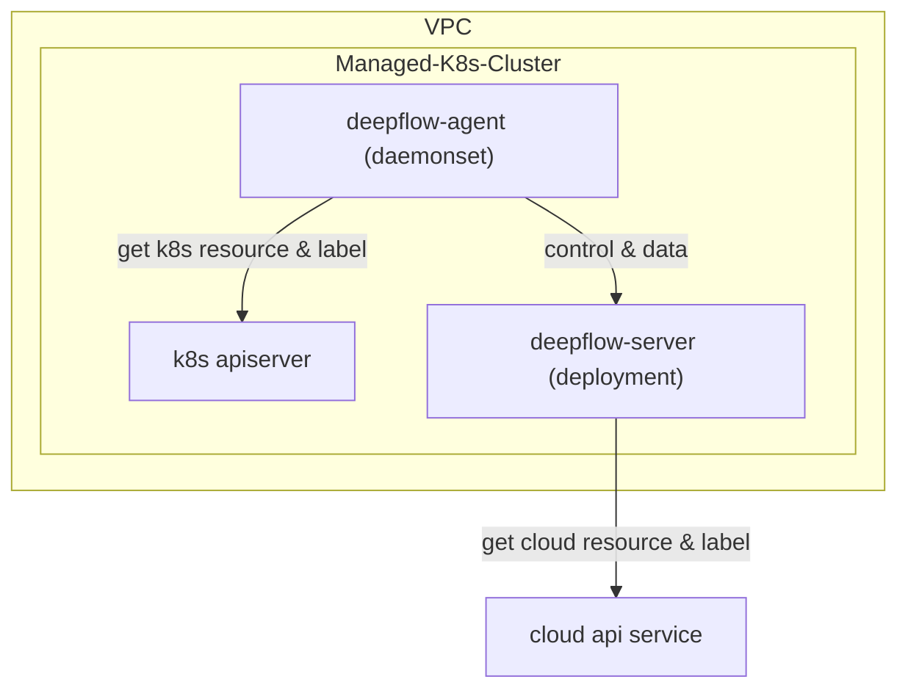

> This document was translated by ChatGPT

# Introduction

DeepFlow supports monitoring managed K8s clusters provided by cloud service providers. The only difference from [directly monitoring K8s clusters](./single-k8s/) is that by calling the cloud provider's API, tags of cloud resources can be automatically injected into the observability data (AutoTagging).

# Deployment Topology



# Configure DeepFlow Server

Create a YAML file `your-managed-k8s.yaml` locally:

```yaml
# Name
name: sub-domain-test
# Name of the cloud platform [required]
domain_name: example-domain-name
config:
  # VPC UUID to which the cluster belongs [required], can be queried via `deepflow-ctl vpc list`
  vpc_uuid: xxxxx-xxxx-xxxx-xxxx-xxxx
  # Maximum mask of POD subnet IPv4 address [optional]
  #pod_net_ipv4_cidr_max_mask: 16
  # Maximum mask of POD subnet IPv6 address [optional]
  #pod_net_ipv6_cidr_max_mask: 64
  # Enter regular expression to specify additional routing interfaces to connect [optional]
  #port_name_regex: ^(cni|flannel|vxlan.calico|tunl|en[ospx])
```

Create the managed cluster:

```bash
deepflow-ctl subdomain create -f your-managed-k8s.yaml
```

Query the ClusterID of the managed cluster generated by DeepFlow Server:

```bash
deepflow-ctl subdomain list
```

# Deploy DeepFlow Agent

Use the generated ClusterID to deploy DeepFlow Agent:

```bash
echo "deepflowK8sClusterID: "fffffff"  # FIXME: Generate by `deepflow-ctl  subdomain list`" >> values-custom.yaml
helm upgrade deepflow-agent -n deepflow deepflow/deepflow-agent  \
    -f values-custom.yaml
```

# Next Steps

- [Universal Service Map - Experience DeepFlow's AutoMetrics capability](../features/universal-map/auto-metrics/)
- [Distributed Tracing - Experience DeepFlow's AutoTracing capability](../features/distributed-tracing/auto-tracing/)
- [Eliminate Data Silos - Learn about DeepFlow's AutoTagging and SmartEncoding capabilities](../features/auto-tagging/eliminate-data-silos/)
- [Say Goodbye to High Overhead - Integrate metrics data from Prometheus, etc.](../integration/input/metrics/metrics-auto-tagging/)
- [Full-Stack Distributed Tracing - Integrate tracing data from OpenTelemetry, etc.](../integration/input/tracing/full-stack-distributed-tracing/)
