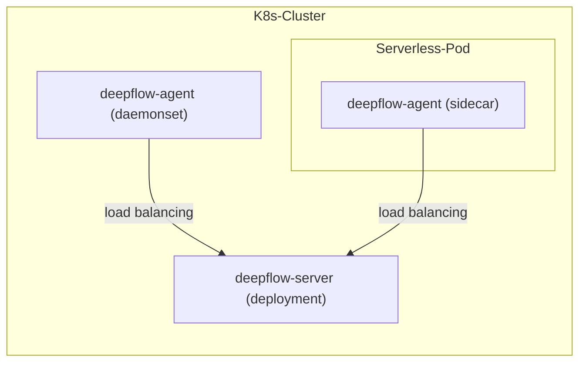

> This document was translated by ChatGPT

# Introduction

DeepFlow Agent can be deployed as a Sidecar within a Serverless Pod. Assuming you have already deployed DeepFlow Server in a K8s cluster, this chapter explains how to monitor applications within a Serverless Pod.

# Deployment Topology



# Deploy deepflow-agent

Modify the value file to deploy deepflow-agent as a daemonset and inject it as a sidecar, then obtain the `clusterNAME` through `deepflow-ctl domain list`.

```bash
cat << EOF > values-custom.yaml
deployComponent:
- "daemonset"
- "watcher"
tke_sidecar: true
clusterNAME: $clusterNAME  # FIXME: domain name
EOF

helm install deepflow-agent -n deepflow deepflow/deepflow-agent --create-namespace \
  -f values-custom.yaml
```

If you do not want the sidecar form of deepflow-agent to take on the role of list-watch apiserver, it is recommended to deploy a separate deepflow-agent deployment to synchronize K8s resources. For specific methods, refer to [Deploy DeepFlow Agent in Deployment Mode](../best-practice/special-environment-deployment/#部署-deployment-模式-deepflow-agent).

# Next Steps

- [Universal Service Map - Experience DeepFlow's AutoMetrics Capability](../features/universal-map/auto-metrics/)
- [Distributed Tracing - Experience DeepFlow's AutoTracing Capability](../features/distributed-tracing/auto-tracing/)
- [Eliminate Data Silos - Learn About DeepFlow's AutoTagging and SmartEncoding Capabilities](../features/auto-tagging/eliminate-data-silos/)
- [Say Goodbye to High Maintenance - Integrate Prometheus and Other Metric Data](../integration/input/metrics/metrics-auto-tagging/)
- [Full-Stack Distributed Tracing - Integrate OpenTelemetry and Other Tracing Data](../integration/input/tracing/full-stack-distributed-tracing/)
