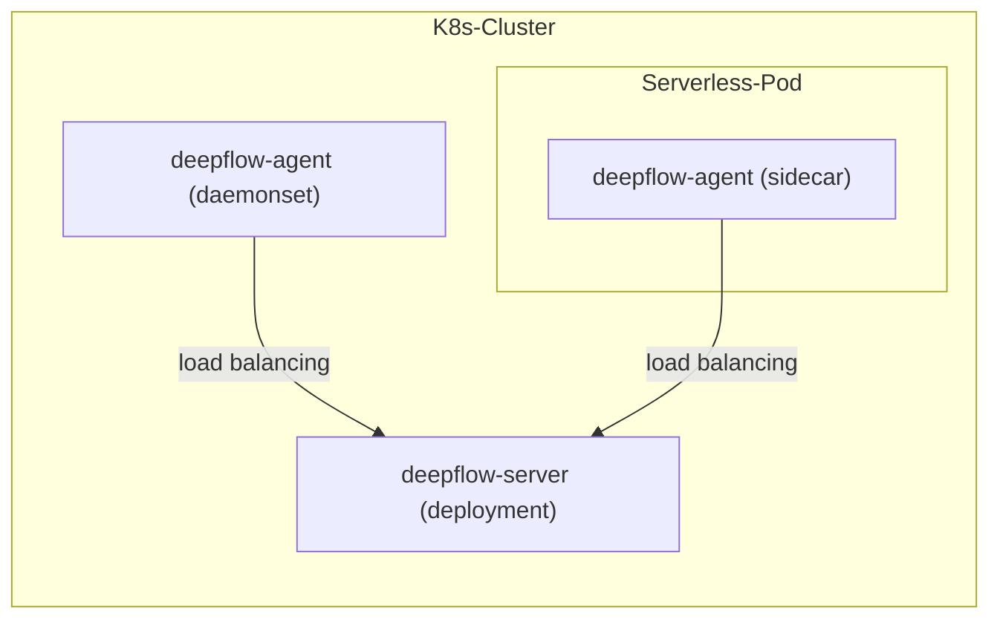

> This document was translated by GPT-4

# Introduction

The DeepFlow Agent can be deployed as a Sidecar in a Serverless Pod. Assuming you have successfully deployed the DeepFlow Server in a K8s cluster, this chapter will guide you on how to monitor applications inside the Serverless Pod.

# Deployment Topology



# Deploy deepflow-agent

Deploy deepflow-agent with daemonset and inject sidecar:

```bash
cat << EOF > values-custom.yaml
deployComponent:
- "daemonset"
- "watcher"
tke_sidecar: true
clusterNAME: process-example
EOF

helm install deepflow-agent -n deepflow deepflow/deepflow-agent --create-namespace \
  -f values-custom.yaml
```

If you do not wish the deepflow-agent in the form of a sidecar to assume the role of list-watch apiserver, we recommend deploying a separate deepflow-agent deployment to synchronize K8s resources. For the detailed method, please refer to [Deploy deployment mode DeepFlow Agent](../best-practice/special-environment-deployment/#Deploy-deployment-mode-DeepFlow-Agent).

# Next Steps

- [Universal Service Map - Experience DeepFlow's AutoMetrics capabilities](../features/universal-map/auto-metrics/)
- [Distributed Tracing - Experience DeepFlow's AutoTracing capabilities](../features/distributed-tracing/auto-tracing/)
- [Eliminate data silos - Learn about DeepFlow's AutoTagging and SmartEncoding capabilities](../features/auto-tagging/eliminate-data-silos/)
- [Say goodbye to high-base troubles - Integrate metrics data like Promethes](../integration/input/metrics/metrics-auto-tagging/)
- [Full-stack Distributed Tracing - Integrate tracing data like OpenTelemetry](../integration/input/tracing/full-stack-distributed-tracing/)
