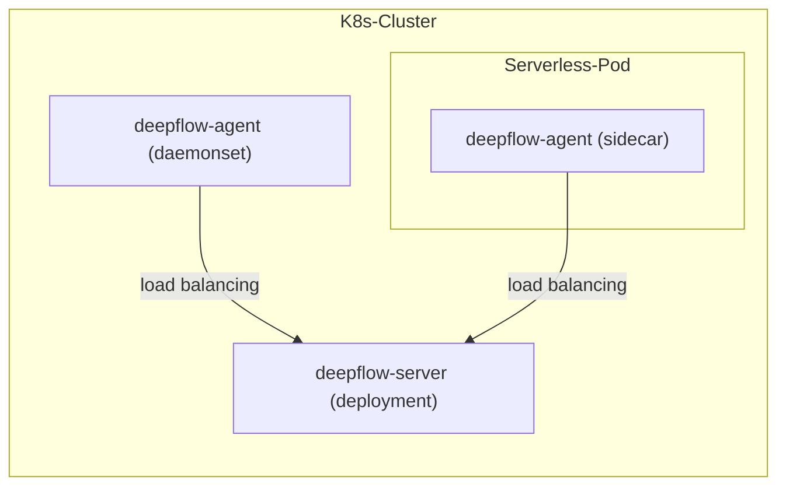

> This document was translated by ChatGPT

# Introduction

DeepFlow Agent can be deployed as a Sidecar inside a Serverless Pod. Assuming you have already deployed DeepFlow Server in a K8s cluster, this chapter describes how to monitor applications inside a Serverless Pod.

# Deployment Topology



# Deploy deepflow-agent

Modify the value file to deploy deepflow-agent as a daemonset and inject it as a sidecar, and obtain `clusterNAME` via `deepflow-ctl domain list`:

```bash
cat << EOF > values-custom.yaml
deployComponent:
- "watcher"
- "daemonset"
tkeSidecar: true
daemonsetWatchDisabled: true
clusterNAME: $clusterNAME  # FIXME: domain name
EOF

helm install deepflow-agent -n deepflow deepflow/deepflow-agent --version 6.6.018 --create-namespace -f values-custom.yaml
```

The above command will deploy two sets of deepflow-agent:

- watcher: A deepflow-agent deployment used to synchronize K8s resources.  
  - During deployment, the environment variable `K8S_WATCH_POLICY=watch-only` will be automatically injected. In this case, deepflow-agent will only synchronize K8s resources and will not collect observability data.
- daemonset: Injects deepflow-agent as a sidecar into each serverless pod to collect observability data.  
  - Note: When there is no watcher-type deepflow-agent running, deepflow-server will elect a daemonset-type deepflow-agent to synchronize K8s resources.  
  - Therefore, to ensure that such deepflow-agents do not consume more resources due to being elected for K8s resource synchronization, the environment variable `K8S_WATCH_POLICY=watch-disabled` is automatically injected for them.

# Next Steps

- [Universal Service Map - Experience DeepFlow's AutoMetrics capability](../features/universal-map/auto-metrics/)
- [Distributed Tracing - Experience DeepFlow's AutoTracing capability](../features/distributed-tracing/auto-tracing/)
- [Eliminate Data Silos - Learn about DeepFlow's AutoTagging and SmartEncoding capabilities](../features/auto-tagging/eliminate-data-silos/)
- [Say Goodbye to High Cardinality Issues - Integrate Prometheus and other metrics data](../integration/input/metrics/metrics-auto-tagging/)
- [Full-Stack Distributed Tracing - Integrate OpenTelemetry and other tracing data](../integration/input/tracing/full-stack-distributed-tracing/)