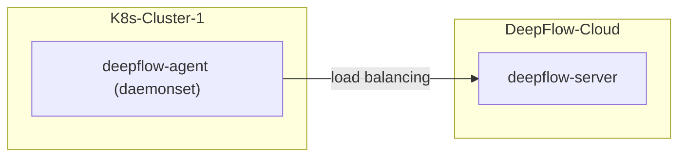

> This document was translated by ChatGPT

# Introduction

If you want to use DeepFlow to monitor a new K8s cluster.
DeepFlow can non-intrusively collect all observability signals (AutoMetrics, AutoTracing, AutoProfiling) from all Pods,
and automatically inject `K8s resources` and `K8s custom labels` tags (AutoTagging) into all observability data based on information obtained from the apiserver.

# Preparation

## Deployment Topology



## Obtain Necessary Information for Deploying DeepFlow Agent

Necessary information for connecting a new cluster Agent to DeepFlow Cloud:

1. Create a new collector group and obtain the agent-group-id, refer to the image below

   

2. Obtain the team-id, refer to the image below

   

3. Obtain the DeepFlow Agent image address and image tag:
   The latest image for version V6.5 is `hub.deepflow.yunshan.net/public/deepflow-agent:v6.5`, note that this repository is located in the Alibaba Cloud Beijing Region.

Modify the `agentGroupID`, `teamId`, and `clusterNAME` in the `values-custom.yaml` file below accordingly

```bash
cat << EOF > values-custom.yaml
deepflowServerNodeIPS:
- cloud.deepflow.yunshan.net
agentGroupID: "g-xxxxxxxxxx"  # FIXME: agent-group-id
teamId: "t-xxxxxxxxxx"  # FIXME: team-id
clusterNAME: "k8s-cluster-1" # FIXME: cluster name in the DeepFlow Cloud
image:
  repository: hub.deepflow.yunshan.net/public/deepflow-agent
  pullPolicy: Always
  tag: v6.5
EOF
```

## Deploy deepflow-agent

Install deepflow-agent using Helm:

```bash
helm repo add deepflow https://deepflowio.github.io/deepflow
helm repo update deepflow # use `helm repo update` when helm < 3.7.0
helm install deepflow-agent -n deepflow deepflow/deepflow-agent --create-namespace \
    -f values-custom.yaml
```

## Note

If you have already integrated a public cloud platform in DeepFlow Cloud and need to connect a K8s cluster on the public cloud, you need to specify `deepflowK8sClusterID` in the `values-custom.yaml` file and do not need to specify `clusterNAME`. This ID is the cluster ID on the public cloud platform and can also be obtained through `Resources` - `Resource Pool` - `Cloud Platform` - `Enter Subordinate Container Cluster`.
