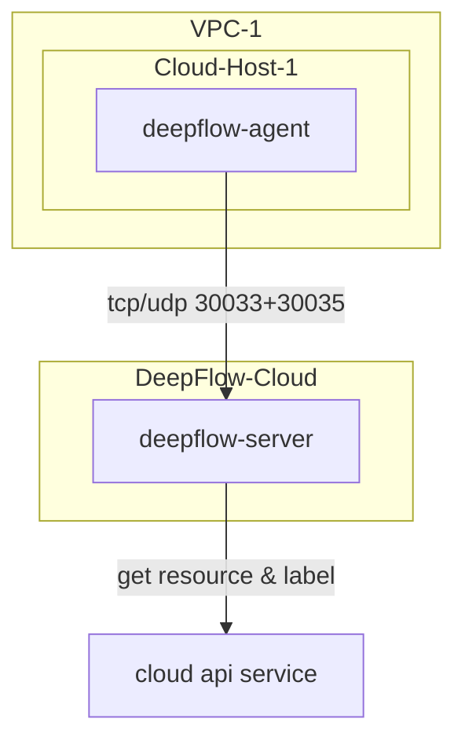

> This document was translated by ChatGPT

# Introduction

DeepFlow supports monitoring cloud servers and automatically injects cloud resource information into all observability data (AutoTagging) by calling cloud vendor APIs.

# Deployment Topology



# Creating a Public Cloud Domain

DeepFlow currently supports resource information synchronization for the following public clouds (marked as `TBD` are in the process of code organization):
| Cloud Provider (English) | Cloud Provider (Chinese) | Type Identifier Used in DeepFlow |
| ------------------------ | ------------------------ | ------------------------------- |
| AWS | AWS | aws |
| Aliyun | 阿里云 | aliyun |
| Baidu Cloud | 百度云 | baidu_bce |
| Huawei Cloud | 华为云 | huawei |
| Microsoft Azure | 微软云 | `TBD` |
| QingCloud | 青云 | qingcloud |
| Tencent Cloud | 腾讯云 | tencent |

## Obtaining the Collector Installation Package and Agent Group ID

When deploying DeepFlow Agent on public cloud servers, you need to obtain the installation package for traditional servers and the Agent Group ID from Yunshan Networks.

# Deploying DeepFlow Agent

::: code-tabs#shell

@tab rpm

```bash
unzip deepflow-agent-rpm.zip
yum -y localinstall x86_64/deepflow-agent-1.0*.rpm
```

@tab deb

```bash
unzip deepflow-agent-deb.zip
dpkg -i x86_64/deepflow-agent-1.0*.systemd.deb
```

@tab docker compose

```bash
touch /etc/deepflow-agent.yaml

cat << EOF > deepflow-agent-docker-compose.yaml
version: '3.2'
services:
  deepflow-agent:
    image: hub.deepflow.yunshan.net/public/deepflow-agent:v6.5
    container_name: deepflow-agent
    restart: always
    cap_add:
      - SYS_ADMIN
      - SYS_RESOURCE
      - SYS_PTRACE
      - NET_ADMIN
      - NET_RAW
      - IPC_LOCK
      - SYSLOG
    volumes:
      - /etc/deepflow-agent.yaml:/etc/deepflow-agent/deepflow-agent.yaml:ro
      - /sys/kernel/debug:/sys/kernel/debug:ro
      - /var/run/docker.sock:/var/run/docker.sock
    network_mode: "host"
    pid: "host"
EOF

docker compose -f deepflow-agent-docker-compose.yaml up -d
```

:::

Modify the configuration file of deepflow-agent `/etc/deepflow-agent.yaml`:

```yaml
controller-ips:
  - cloud.deepflow.yunshan.net
vtap-group-id-request: 'g-xxxxxxxxxx' # FIXME: agent-group ID
team-id: 't-xxxxxxxxxx' # FIXME: Team ID
```

Start the deepflow-agent:

```bash
systemctl enable deepflow-agent
systemctl restart deepflow-agent
```