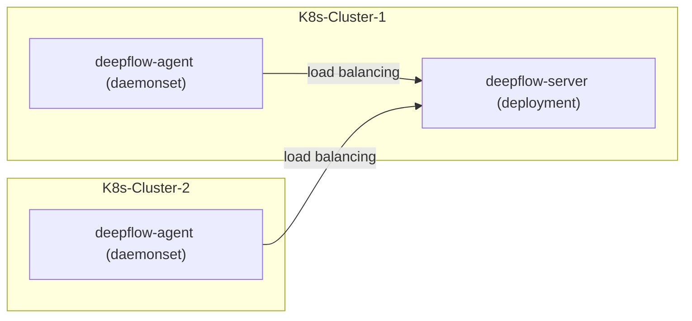

> This document was translated by ChatGPT

# Introduction

If you want to use DeepFlow to monitor a new K8s cluster.
DeepFlow can non-intrusively collect observability signals (AutoMetrics, AutoTracing, AutoProfiling) from all Pods,
and automatically inject `K8s resources` and `K8s custom labels` tags (AutoTagging) into all observability data based on information obtained from the apiserver.

# Preparation

## Deployment Topology



## Obtain K8s ClusterID from DeepFlow Platform

DeepFlow platform uses the cluster ID from the public cloud or generates a unique ID for each cluster randomly. Check the cluster ID to be deployed from "Resources - Resource Pool - Cloud Platform", which looks like "g-3aebEkS108".

## Obtain DeepFlow Agent Image

Get the DeepFlow Agent image address and image tag from Yunshan Networks.

The latest image for version V6.4 is `hub.deepflow.yunshan.net/public/deepflow-agent:v6.4`. Note that this repository is located in the Alibaba Cloud Beijing Region.

# Deploy deepflow-agent

Install deepflow-agent using Helm:

```bash
cat << EOF > values-custom.yaml
deepflowServerNodeIPS:
- 10.1.2.3  # FIXME: DeepFlow Server Node IPs
- 10.4.5.6  # FIXME: DeepFlow Server Node IPs
deepflowK8sClusterID: "fffffff"  # FIXME: K8s ClusterID
image:
  repository: hub.deepflow.yunshan.net/public/deepflow-agent
  pullPolicy: Always
  # Overrides the image tag whose default is the chart appVersion.
  tag: v6.4
EOF

helm repo add deepflow https://deepflowio.github.io/deepflow
helm repo update deepflow # use `helm repo update` when helm < 3.7.0
helm install deepflow-agent -n deepflow deepflow/deepflow-agent --create-namespace \
    -f values-custom.yaml
```

# Note

In the same K8s cluster, it is recommended to deploy collectors within the same collector group. If you must distribute them across different collector groups due to specific requirements, ensure that the CPU and memory limits of all related collector groups remain consistent. Additionally, be aware of the potential impact of remote operations. For example, modifying the CPU and memory limits of an agent by executing the `kubectl edit` command may cause agents in the same collector group to enter a continuous restart state.
