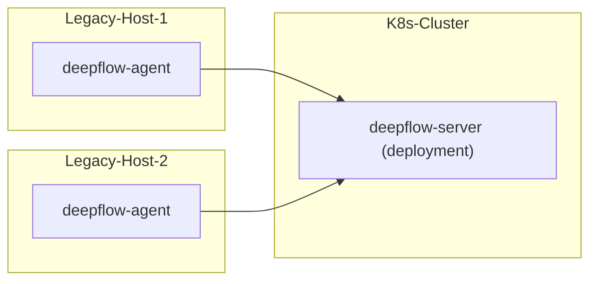

> This document was translated by ChatGPT

# Introduction

DeepFlow supports monitoring traditional servers.

# Deployment Topology



## Obtain the Collector Installation Package and Agent Group ID

When deploying DeepFlow Agent on traditional servers, you need to obtain the installation package and Agent Group ID for traditional servers from Yunshan Networks.

# Deploy DeepFlow Agent

::: code-tabs#shell

@tab rpm

```bash
unzip deepflow-agent-rpm.zip
yum -y localinstall x86_64/deepflow-agent-1.0*.rpm
```

@tab deb

```bash
unzip deepflow-agent-deb.zip
dpkg -i x86_64/deepflow-agent-1.0*.systemd.deb
```

@tab docker compose

```bash
touch /etc/deepflow-agent.yaml

cat << EOF > deepflow-agent-docker-compose.yaml
version: '3.2'
services:
  deepflow-agent:
    image: hub.deepflow.yunshan.net/public/deepflow-agent:v6.4
    container_name: deepflow-agent
    restart: always
    #privileged: true  ## Docker version below 20.10.10 requires the opening of the privileged mode, See https://github.com/moby/moby/pull/42836
    cap_add:
      - SYS_ADMIN
      - SYS_RESOURCE
      - SYS_PTRACE
      - NET_ADMIN
      - NET_RAW
      - IPC_LOCK
      - SYSLOG
    volumes:
      - /etc/deepflow-agent.yaml:/etc/deepflow-agent/deepflow-agent.yaml:ro
      - /sys/kernel/debug:/sys/kernel/debug:ro
      - /var/run/docker.sock:/var/run/docker.sock
    network_mode: "host"
    pid: "host"
EOF

docker compose -f deepflow-agent-docker-compose.yaml up -d
```

:::

Modify the configuration file of deepflow-agent `/etc/deepflow-agent.yaml`:

```yaml
controller-ips:
  - 10.1.2.3 # FIXME: DeepFlow Server Node IPs
vtap-group-id-request: 'g-fffffff' # FIXME: agent-group ID
```

Start deepflow-agent:

```bash
systemctl enable deepflow-agent
systemctl restart deepflow-agent
```