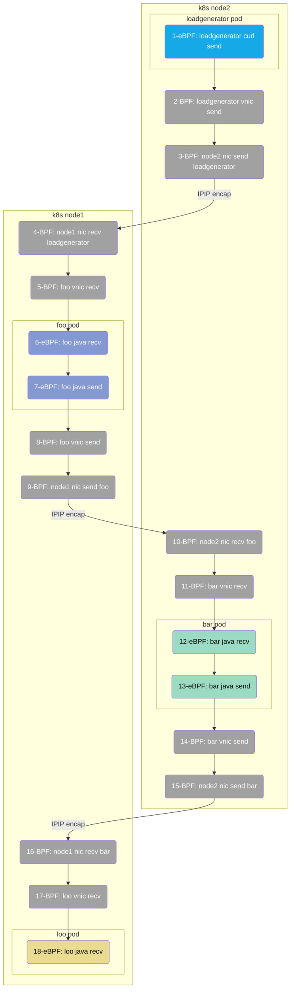

> This document was translated by GPT-4

# Introduction

This is an example of a microservice application developed using Spring Boot to illustrate the AutoTracing capability of DeepFlow.

# Deploying the Spring Boot Demo

The demo we used comes from [this GitHub repository](https://github.com/chanjarster/spring-boot-istio-jaeger-demo). It has a simple distribution tracing chain: `foo_svc -> bar_svc -> loo_svc`.

And this is the command to quickly deploy the Demo in K8s:

```bash
kubectl apply -f https://raw.githubusercontent.com/deepflowio/deepflow-demo/main/DeepFlow-EBPF-Sping-Demo/deepflow-ebpf-spring-demo.yaml
```

The original demo in the GitHub repository used Jaeger for primary tracing. In order to demonstrate AutoTracing capabilities, we removed Jaeger from the deployment script mentioned above.

# Exploring Distributed Tracing

You can proceed to Grafana and open the `Distributed Tracing` Dashboard by selecting `namespace = deepflow-ebpf-spring-demo`. Then, choose an invocation to trace. Here's how it looks:


The tracing data in DeepFlow includes three types of Spans that track the entire trajectory of a request:

- N: Spans extracted from network traffic using BPF
- S: Spans extracted from system or application function calls using eBPF
- A: Spans collected internally from the application using OTel

The image above shows the first two types. The third one can be displayed upon [integrating OpenTelemetry](../../integration/input/tracing/opentelemetry/).

You can also view the effect of tracing by [visiting DeepFlow Online Demo](https://ce-demo.deepflow.yunshan.net/d/Distributed_Tracing/distributed-tracing?var-namespace=deepflow-ebpf-spring-demo&from=deepflow-doc). The corresponding topology diagram of the call chain flame graph in the image above is as follows:



To summarize this Demo,

- Zero code injection: No manual code injection is required for the entire tracing process, nor is there a need for any TraceID/SpanID injection into the HTTP Header.
- Multilingual: Supports tracing of Java applications and C (curl) basic services.
- Full-link: Utilizes eBPF and BPF to automatically trace 18 Spans in this Trace, including 6 eBPF Spans and 12 BPF Spans.
- Full stack: Supports tracing of network paths between two Pods on different K8s Nodes, even if the path goes through tunnel encapsulations, such as Span 2-5 (IPIP tunnel encapsulation).
