> This document was translated by GPT-4

# Introduction

In this chapter, we demonstrate DeepFlow's AutoTracing capability in a multi-language microservice application, which includes the implementation of Java, Python, Ruby, and Node.js in an Istio service mesh.

# Deploying Istio Bookinfo Demo

## Deploying Istio

You can refer to the [official Istio documentation](https://istio.io/latest/zh/docs/setup/getting-started/) for Istio deployment. Alternatively, you can quickly deploy it using the commands below:

```bash
curl -L https://istio.io/downloadIstio | sh -
cd istio-*
export PATH=$PWD/bin:$PATH
istioctl install --set profile=demo -y
```

DeepFlow currently supports HTTPS collection capability for Golang applications, and support for other languages is still under development. In this Demo, we first turned off Istio mTLS using the following command:

```bash
kubectl apply -f - <<EOF
apiVersion: security.istio.io/v1beta1
kind: PeerAuthentication
metadata:
  name: "default"
  namespace: "istio-system"
spec:
  mtls:
    mode: DISABLE
EOF
```

## Deploying Bookinfo Demo

The Demo we're using is derived from [this GitHub repository](https://github.com/istio/istio/tree/master/samples/bookinfo), and its application architecture is as follows:


You can quickly deploy the Demo in K8s with the following command:

```bash
kubectl apply -f https://raw.githubusercontent.com/deepflowio/deepflow-demo/main/Istio-Bookinfo/bookinfo.yaml
```

The original GitHub code repository uses Jaeger for active tracing. To demonstrate AutoTracing capability, we have purposefully removed Jaeger in the deployment script above.

# Exploring distributed tracing

Navigate to Grafana, open the `Distributed Tracing` Dashboard, select `namespace = deepflow-ebpf-istio-demo`, and then select a call for tracing. The effect is shown in the figure below:


You can also explore the tracing effect by [visiting DeepFlow Online Demo](https://ce-demo.deepflow.yunshan.net/d/Distributed_Tracing/distributed-tracing?var-namespace=deepflow-ebpf-istio-demo&from=deepflow-doc).
The topology diagram corresponding to the flame chart of the call chain in the image above is as follows:

```mermaid
flowchart TD

loadgenerator_curl_send(1-eBPF: loadgenerator curl send):::loadgenerator
loadgenerator_envoy_egress_recv(2-eBPF: loadgenerator envoy egress recv):::loadgenerator
loadgenerator_envoy_egress_send(3-eBPF: loadgenerator envoy egress send):::loadgenerator
loadgenerator_vnic_send(4-BPF: loadgenerator vnic send):::nic

productpage_vnic_recv(5-BPF: productpage vnic recv):::nic
productpage_envoy_ingress_recv(6-eBPF: productpage envoy ingress recv):::productpage_1
productpage_envoy_ingress_send(7-eBPF: productpage envoy ingress send):::productpage_1
productpage_python_recv(8-eBPF: productpage python recv):::productpage_2
productpage_python_send_d("9-eBPF: productpage python send ->details"):::productpage_2
productpage_envoy_egress_recv_d("10-eBPF: productpage envoy egress recv ->details"):::productpage_2
productpage_envoy_egress_send_d("11-eBPF: productpage envoy egress send ->details"):::productpage_2
productpage_vnic_send_d("12-BPF: productpage vnic send ->details"):::nic
node2_nic_send_pd("13-BPF: node2 nic send prod->details"):::nic
node1_nic_recv_pd("14-BPF: node1 nic recv prod->details"):::nic

details_vnic_recv(15-BPF: details vnic recv):::nic
details_envoy_ingress_recv(16-eBPF: details envoy ingress recv):::details_1
details_envoy_ingress_send(17-eBPF: details envoy ingress send):::details_1
details_ruby_recv(18-eBPF: details ruby recv):::details_2

productpage_python_send_r("19-eBPF: productpage python send prod->review"):::productpage_2
productpage_envoy_egress_recv_r("20-eBPF: productpage envoy egress recv prod->review"):::productpage_2
productpage_envoy_egress_send_r("21-eBPF: productpage envoy egress send prod->review"):::productpage_2
productpage_vnic_send_r("22-BPF: productpage vnic send prod->review"):::nic
node2_nic_send_pr("23-BPF: node2 nic send prod->review"):::nic
node1_nic_recv_pr("24-BPF: node1 nic recv prod->review"):::nic

reviews_vnic_recv(25-BPF: reviews vnic recv):::nic
reviews_envoy_ingress_recv(26-eBPF: reviews envoy ingress recv):::reviews_1
reviews_envoy_ingress_send(27-eBPF: reviews envoy ingress send):::reviews_1
reviews_java_recv(28-eBPF: reviews java recv):::reviews_2
reviews_java_send(29-eBPF: reviews java send):::reviews_2
reviews_envoy_egress_recv(30-eBPF: reviews envoy egress recv):::reviews_2
reviews_envoy_egress_send(31-eBPF: reviews envoy egress send):::reviews_2
reviews_vnic_send(32-BPF: reviews vnic send):::nic
node1_nic_send_rr("33-BPF: node1 nic send reviews->ratings"):::nic
node2_nic_recv_rr("34-BPF: node2 nic recv reviews->ratings"):::nic

ratings_vnic_recv(35-BPF: ratings vnic recv):::nic
ratings_envoy_ingress_recv(36-eBPF: ratings envoy ingress recv):::ratings_1
ratings_envoy_ingress_send(37-eBPF: ratings envoy ingress send):::ratings_1
ratings_nodejs_recv(38-eBPF: ratings node.js recv):::ratings_2

subgraph node2-1 [k8s node2]
    subgraph loadgenerator pod
        subgraph loadgenerator curl container
            loadgenerator_curl_send
        end
        subgraph loadgenerator envoy container
            loadgenerator_envoy_egress_recv
            loadgenerator_envoy_egress_send
        end
    end

    loadgenerator_vnic_send
    productpage_vnic_recv

    subgraph productpage pod
        subgraph productpage envoy container
            productpage_envoy_ingress_recv
            productpage_envoy_ingress_send
            productpage_envoy_egress_recv_d
            productpage_envoy_egress_send_d
            productpage_envoy_egress_recv_r
            productpage_envoy_egress_send_r
        end
        subgraph productpage python container
            productpage_python_recv
            productpage_python_send_d
            productpage_python_send_r
        end
    end

    productpage_vnic_send_d
    productpage_vnic_send_r
    node2_nic_send_pd
    node2_nic_send_pr
end

subgraph node2-2 [k8s node2]
    node2_nic_recv_rr
    ratings_vnic_recv

    subgraph ratings pod
        subgraph ratings envoy container
            ratings_envoy_ingress_recv
            ratings_envoy_ingress_send
        end
        subgraph ratings nodejs container
            ratings_nodejs_recv
        end
    end
end

subgraph k8s node1
    node1_nic_recv_pd
    node1_nic_recv_pr
    details_vnic_recv
    reviews_vnic_recv

    subgraph details pod
        subgraph details envoy container
            details_envoy_ingress_recv
            details_envoy_ingress_send
        end
        subgraph details ruby container
            details_ruby_recv
        end
    end
    subgraph reviews pod
        subgraph reviews envoy container
            reviews_envoy_ingress_recv
            reviews_envoy_ingress_send
            reviews_envoy_egress_recv
            reviews_envoy_egress_send
        end
        subgraph reviews java container
            reviews_java_recv
            reviews_java_send
        end
    end

    reviews_vnic_send
    node1_nic_send_rr
end

loadgenerator_curl_send --> loadgenerator_envoy_egress_recv --> loadgenerator_envoy_egress_send --> loadgenerator_vnic_send --> productpage_vnic_recv

productpage_vnic_recv --> productpage_envoy_ingress_recv --> productpage_envoy_ingress_send --> productpage_python_recv
productpage_python_recv --> productpage_python_send_d --> productpage_envoy_egress_recv_d --> productpage_envoy_egress_send_d --> productpage_vnic_send_d --> node2_nic_send_pd -->|IPIP encap| node1_nic_recv_pd --> details_vnic_recv
productpage_python_recv --> productpage_python_send_r --> productpage_envoy_egress_recv_r --> productpage_envoy_egress_send_r --> productpage_vnic_send_r --> node2_nic_send_pr -->|IPIP encap| node1_nic_recv_pr --> reviews_vnic_recv

details_vnic_recv --> details_envoy_ingress_recv --> details_envoy_ingress_send --> details_ruby_recv

reviews_vnic_recv --> reviews_envoy_ingress_recv --> reviews_envoy_ingress_send --> reviews_java_recv
reviews_java_recv --> reviews_java_send --> reviews_envoy_egress_recv --> reviews_envoy_egress_send --> reviews_vnic_send --> node1_nic_send_rr -->|IPIP encap| node2_nic_recv_rr --> ratings_vnic_recv

ratings_vnic_recv --> ratings_envoy_ingress_recv --> ratings_envoy_ingress_send --> ratings_nodejs_recv

classDef loadgenerator fill:#8498d1,color:white;
classDef nic fill:#a1a1a1,color:white;
classDef productpage_1 fill:#9cdbc3,color:black;
classDef productpage_2 fill:#eadb92,color:black;
classDef details_1 fill:#16a9e8,color:white;
classDef details_2 fill:#b38ebc,color:white;
classDef reviews_1 fill:#49b292,color:white;
classDef reviews_2 fill:#ceb961,color:black;
classDef ratings_1 fill:#6aaec6,color:black;
classDef ratings_2 fill:#aa48bc,color:black;
```



Let's summarize this tracing Demo:

- Zero-code injection: The entire tracing process does not require manual insertion of any tracing code, nor does it require the injection of any TraceID/SpanID into the HTTP Header.
- Multi-language: Supports tracing of Java, Python, Ruby, NodeJS language applications, and C/C++ (curl/envoy) language-based services.
- Trace all links: Using eBPF and BPF, automatically traced 38 Spans of this Trace, including 24 eBPF Spans and 14 BPF Spans.
- Full-stack: Supports tracing of the network path between two Pods on the same K8s Node, such as Span 4-5, etc.
- Full-stack: Supports tracing of the network path between two Pods on different K8s Nodes, even if they are encapsulated by a tunnel, such as Span 12-15, etc. (IPIP tunnel encapsulation)
- Full-stack: Supports tracing the entire process within a Pod from Envoy Ingress, service process, to Envoy Egress, such as Span 6-11, etc.
