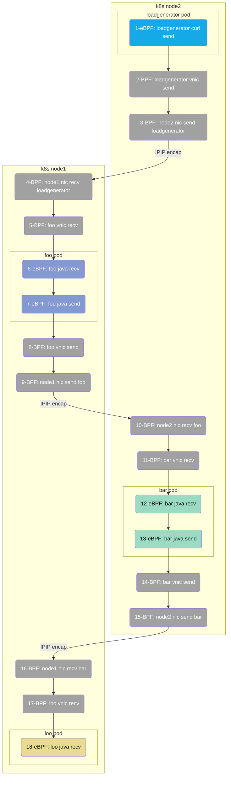

> This document was translated by ChatGPT

# Introduction

This chapter uses a microservice application developed with Spring Boot as an example to demonstrate DeepFlow's AutoTracing capabilities.

# Deploying the Spring Boot Demo

The demo we use is sourced from [this GitHub repository](https://github.com/chanjarster/spring-boot-istio-jaeger-demo), and its call chain is relatively simple: `foo_svc -> bar_svc -> loo_svc`.

You can quickly deploy the demo in K8s using the following command:

```bash
kubectl apply -f https://raw.githubusercontent.com/deepflowio/deepflow-demo/main/DeepFlow-EBPF-Sping-Demo/deepflow-ebpf-spring-demo.yaml
```

The original GitHub code repository for this demo uses Jaeger for active tracing. To demonstrate AutoTracing capabilities, we have specifically removed Jaeger in the above deployment script.

# Viewing Distributed Tracing

Go to Grafana, open the `Distributed Tracing` Dashboard, select `namespace = deepflow-ebpf-spring-demo`, and then choose a call to trace. The effect is shown in the figure below:


DeepFlow's tracing data contains three types of Spans, tracking the entire trajectory of a request:

- N: Spans extracted from network traffic via BPF
- S: Spans extracted from system or application function calls via eBPF
- A: Spans collected from within the application via OTel

The figure above shows the first two types, and the third type can be displayed by [integrating OpenTelemetry](../../integration/input/tracing/opentelemetry/).

[Visit DeepFlow Online Demo](https://ce-demo.deepflow.yunshan.net/d/Distributed_Tracing/distributed-tracing?var-namespace=deepflow-ebpf-spring-demo&from=deepflow-doc) to also view the tracing effect. The topology corresponding to the call chain flame graph in the figure above is as follows.



To summarize this tracing demo:

- Zero Instrumentation: The entire tracing process does not require manually inserting any tracing code or injecting any TraceID/SpanID into the HTTP Header.
- Multi-language: Supports tracing for Java applications and C (curl) language basic services.
- Full Link: Utilizing eBPF and BPF, it automatically traces 18 Spans for this trace, including 6 eBPF Spans and 12 BPF Spans.
- Full Stack: Supports tracing the network path between two Pods across K8s Nodes, even if it passes through tunnel encapsulation in the middle, such as Spans 2-5 (IPIP tunnel encapsulation).