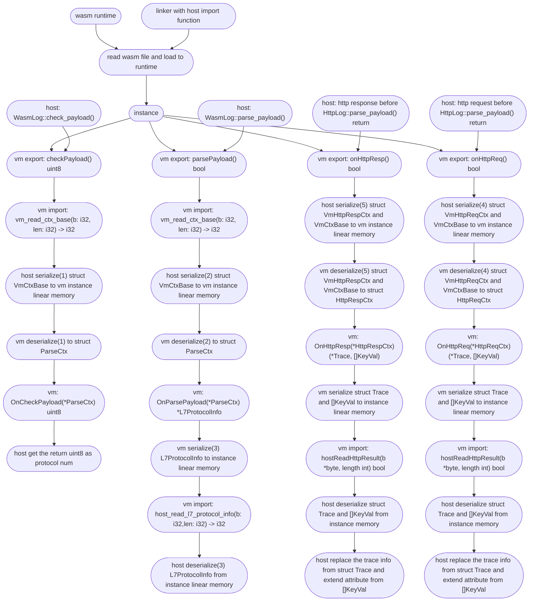

> This document was translated by ChatGPT

# About the Wasm Plugin System

The Wasm plugin system implements some user-defined functions by calling the Wasi Export Function at fixed points. We provide some examples in [this repository](https://github.com/deepflowio/deepflow-wasm-go-sdk/tree/main/example), through which you can see what functionalities the current DeepFlow Wasm Plugin can achieve:

| Category       | Directory           | Description                       |
| -------------- | ------------------- | --------------------------------- |
| Enhance Known Protocols | http                | Parse JSON over HTTP               |
|                | http_status_rewrite | Parse JSON over HTTP               |
|                | dubbo               | Parse JSON over Dubbo              |
|                | nats                | Parse Protobuf (nRPC) over NATS    |
|                | zmtp                | Parse Protobuf over ZMTP           |
| As New Protocol Parsing | krpc                | Parse Protobuf over TCP            |
|                | go_http2_uprobe     | Parse Protobuf over HTTP2          |
|                | dns                 | Demonstrate how to parse DNS as a new protocol |

For the development of Wasm Plugin, you can also refer to this blog post: [使用 DeepFlow Wasm 插件实现业务可观测性](https://deepflow.io/blog/035-deepflow-enabling-zero-code-observability-for-applications-by-webAssembly/).

# Golang SDK Instructions

Currently, only the Golang SDK is provided, with more languages to be supported in the future. The Golang SDK requires tinygo for compilation. Below is a brief explanation of how to quickly develop a plugin using Golang.

```go
package main

import (
	"github.com/deepflowio/deepflow-wasm-go-sdk/sdk"
	_ "github.com/wasilibs/nottinygc" // Use nottinygc as an alternative memory allocator for TinyGo compiling WASI, as the default allocator has performance issues in large data scenarios
)

// Define a structure that needs to implement the sdk.Parser interface
type plugin struct {
}

/*
    The returned array here indicates the hook points where the agent needs to call the corresponding Export function of the plugin. Currently, there are 3 hook points:
        HOOK_POINT_HTTP_REQ       Indicates before the HTTP request parsing is completed and returned
        HOOK_POINT_HTTP_RESP      Indicates before the HTTP response parsing is completed and returned
        HOOK_POINT_PAYLOAD_PARSE  Indicates protocol judgment and parsing
*/
func (p plugin) HookIn() []sdk.HookBitmap {
	return []sdk.HookBitmap{
		sdk.HOOK_POINT_HTTP_REQ,
		sdk.HOOK_POINT_HTTP_RESP,
        sdk.HOOK_POINT_PAYLOAD_PARSE,
	}
}

// When HookIn() includes HOOK_POINT_HTTP_REQ, it will be called before the HTTP request parsing is completed and returned.
// HttpReqCtx contains BaseCtx and some already parsed HTTP headers
func (p plugin) OnHttpReq(ctx *sdk.HttpReqCtx) sdk.Action {
    // baseCtx includes some information like ip, port, layer 4 protocol, packet direction, etc.
    baseCtx := &ctx.BaseCtx

    // Optional filtering by port and path
	if baseCtx.DstPort != 8080 || !strings.HasPrefix(ctx.Path, "/user_info?") {
		return sdk.ActionNext()
	}

    // payload is the application layer data, which may be truncated
	payload, err := baseCtx.GetPayload()
    if err != nil {
		return sdk.ActionAbortWithErr(err)
	}

    var(
        trace = &sdk.Trace{}
        attr = []sdk.KeyVal{}
    )

    // some logic here
    //...

    // Return result
    return sdk.HttpReqActionAbortWithResult(nil, trace, attr)
}


/*
    When HookIn() includes HOOK_POINT_HTTP_RESP, it will be called before the HTTP response parsing is completed and returned.
    HttpRespCtx contains BaseCtx and response code
    The rest of the processing is basically the same as OnHttpReq
*/
func (p plugin) OnHttpResp(ctx *sdk.HttpRespCtx) sdk.Action {
    return sdk.ActionNext()
}

/*
    When HookIn() includes HOOK_POINT_PAYLOAD_PARSE, it will be called during protocol judgment.
    It needs to return a unique protocol number and protocol name, returning 0 indicates failure
*/
func (p plugin) OnCheckPayload(baseCtx *sdk.ParseCtx) (uint8, string) {
	return 0, ""
}

func (p plugin) OnParsePayload(baseCtx *sdk.ParseCtx) sdk.ParseAction {
    // ctx.L7 is the protocol number returned by OnCheckPayload, you can filter based on layer 4 protocol or protocol number first.
    if ctx.L4 != sdk.TCP || ctx.L7 != 1 {
		return sdk.ActionNext()
	}

	payload, err := ctx.GetPayload()
	if err != nil {
		return sdk.ActionAbortWithErr(err)
	}
    // the parse logic here
    // ...

    /*
        About the L7ProtocolInfo structure:
            type L7ProtocolInfo struct {
                ReqLen    *int       // Request length, e.g., content-length in HTTP
                RespLen   *int       // Response length, e.g., content-length in HTTP
                RequestID *uint32    // Substream ID, e.g., stream ID in HTTP2, transaction ID in DNS
                Req       *Request
                Resp      *Response
                Trace     *Trace     // Tracing information
                Kv        []KeyVal   // Corresponding attribute
            }

            type Request struct {
                ReqType  string  // Corresponding request type
                Domain   string  // Corresponding request domain
                Resource string  // Corresponding request resource
                Endpoint string  // Corresponding endpoint
            }

            type Response struct {
                Status    RespStatus // Corresponding response status
                Code      *int32     // Corresponding response code
                Result    string     // Corresponding response result
                Exception string     // Corresponding response exception
            }
    */
    return sdk.ParseActionAbortWithL7Info([]*sdk.L7ProtocolInfo{})
}


// main needs to register the parser
func main() {
    sdk.SetParser(plugin{})
	sdk.Warn("xxx wasm plugin registered")
}
// About return values
/*
    The agent can load multiple wasm plugins, and the agent will traverse all plugins to call the corresponding Export functions, but the traversal behavior can be controlled by the return values

    The return values are as follows:
        sdk.ActionNext()                 Stop the current plugin and directly execute the next plugin
        sdk.ActionAbort()                Stop the current plugin and stop traversal
        sdk.ActionAbortWithErr(err)      Stop the current plugin, print error log, and stop traversal

        sdk.HttpActionAbortWithResult()
        sdk.ParseActionAbortWithL7Info()  The agent stops traversal and extracts the corresponding return result
*/
```

# Compiling and Loading Plugins

## Compiling Plugins

Use the following command to compile the Wasm program

```sh
# Using nottinygc to replace TinyGo's original memory allocator requires adding compilation parameters: -gc=custom and -tags=custommalloc
tinygo build -o wasm.wasm -gc=custom -tags=custommalloc -target=wasi -panic=trap -scheduler=none -no-debug ./main.go
```

## Uploading Plugins

Upload the wasm file to the corresponding node and execute

```sh
deepflow-ctl plugin create  --type wasm --image wasm.wasm --name wasm
```

## Loading Plugins

Add the following in the [agent-group configuration](../../best-practice/agent-advanced-config/#agent-group-config-常用操作)

```
wasm-plugins:
  - wasm // Corresponds to the name of the plugin uploaded by deepflow-ctl
```

# Related Issues and Limitations

- Cannot use go func(), you can remove the -scheduler=none parameter to let the compilation pass but it will not achieve the desired effect
- Cannot use time.Sleep(), this will cause the Wasm plugin to fail to load
- If the plugin execution time is too long, it will block the agent's execution for a long time. If it enters an infinite loop, the agent will be continuously blocked
- Tinygo has certain limitations on Go's standard library and third-party libraries, not all Go code or libraries can be used. For the standard library, you can refer to [tinygo package supported](https://tinygo.org/docs/reference/lang-support/stdlib/) for the support status. Note that this list is for reference only, "Passes tests" showing "no" does not mean it cannot be used at all, for example, fmt.Sprintf() can be used but fmt.Println() cannot.
- Since Go 1.21 version supports wasi, if you need to use built-in serialization-related libraries (json, yaml, xml, etc.), you need to use Go version not lower than 1.21 and tinygo version not lower than 0.29.
- The structures returned from Parser (L7ProtocolInfo, Trace, []KeyVal) will be serialized to linear memory. Currently, the memory allocated for serialization of each structure is fixed at 1 page (65536 bytes). If the returned structure is too large, it will cause serialization failure.
- The agent determines the application layer protocol of a stream by traversing all supported protocols. The current order is HTTP -> Wasm Hook -> DNS -> ..., with Wasm having a priority just below HTTP. Therefore, user-defined protocol judgment and parsing can override the agent's existing protocol judgment and parsing (except for HTTP/HTTP2). For example, in [this example](https://github.com/deepflowio/deepflow-wasm-go-sdk/blob/5393818adf94f2f9b296de82e20f614ba3b2336a/example/dns/dns.go), DNS parsing can be overridden, and the agent will not execute the default DNS parsing logic.
- Due to the complexity of network environments and protocols, it is possible to receive incomplete application layer data frames, such as IP fragmentation caused by MTU limitations, TCP peer receive window or flow control congestion window shrinkage, MSS being too small, etc., resulting in incomplete application layer data frames. Currently, transport layer connection tracking has not been implemented. Additionally, application layer data that is too long will also be truncated.

# Wasm Plugin Execution Flow

Before understanding the execution flow of the Wasm plugin, you need to have a general understanding of DeepFlow's protocol parsing. You can refer to [DeepFlow Protocol Development Documentation](https://github.com/deepflowio/deepflow/blob/main/docs/HOW_TO_SUPPORT_YOUR_PROTOCOL_CN.MD).

The execution flow of the Wasm plugin is as follows:



Among them, there are 6 structures for serialization/deserialization:

- VmCtxBase
  - Currently, in all Export function calls, the host will serialize VmCtxBase to linear memory. The serialization format can be referenced [here](https://github.com/deepflowio/deepflow/blob/0da738106f710cad9bbce6632384105b1b868e59/agent/src/plugin/wasm/vm.rs#L199)
  - Similarly, the instance will also deserialize it. The specific code can be referenced [here](https://github.com/deepflowio/deepflow-wasm-go-sdk/blob/5393818adf94f2f9b296de82e20f614ba3b2336a/sdk/serde.go#L73).
- L7ProtocolInfo
  - At the end of the Export function parse_payload, the instance will serialize L7ProtocolInfo to linear memory. The serialization format and code can be referenced [here](https://github.com/deepflowio/deepflow-wasm-go-sdk/blob/5393818adf94f2f9b296de82e20f614ba3b2336a/sdk/serde.go#L335)
  - The host will also deserialize it. The code can be referenced [here](https://github.com/deepflowio/deepflow/blob/0da738106f710cad9bbce6632384105b1b868e59/agent/src/plugin/mod.rs#L152).
- VmHttpReqCtx
  - Before the HTTP request parsing is completed and returned, the Export function on_http_req will be called. The host will serialize VmCtxBase and VmHttpReqCtx to the instance's linear memory
  - The serialization code and format of VmHttpReqCtx can be referenced [here](https://github.com/deepflowio/deepflow/blob/0da738106f710cad9bbce6632384105b1b868e59/agent/src/plugin/wasm/vm.rs#L328)
  - The instance deserialization code can be referenced [here](https://github.com/deepflowio/deepflow-wasm-go-sdk/blob/5393818adf94f2f9b296de82e20f614ba3b2336a/sdk/serde.go#L173).
- VmHttpRespCtx
  - Before the HTTP response parsing is completed and returned, the Export function on_http_resp will be called. The host will serialize VmCtxBase and VmHttpRespCtx to the instance's linear memory
  - The serialization format of VmHttpRespCtx can be referenced [here](https://github.com/deepflowio/deepflow/blob/0da738106f710cad9bbce6632384105b1b868e59/agent/src/plugin/wasm/vm.rs#L395)
  - The instance deserialization code can be referenced [here](https://github.com/deepflowio/deepflow-wasm-go-sdk/blob/5393818adf94f2f9b296de82e20f614ba3b2336a/sdk/serde.go#L232).
- Trace, []KeyVal
  - Before the Export function on_http_req/on_http_resp returns, the instance will serialize Trace and []KeyVal to linear memory
  - The serialization code can be referenced [here](https://github.com/deepflowio/deepflow-wasm-go-sdk/blob/5393818adf94f2f9b296de82e20f614ba3b2336a/sdk/serde.go#L515)
  - The deserialization code and format can be referenced [here](https://github.com/deepflowio/deepflow/blob/0da738106f710cad9bbce6632384105b1b868e59/agent/src/plugin/wasm/abi_import.rs#L376).