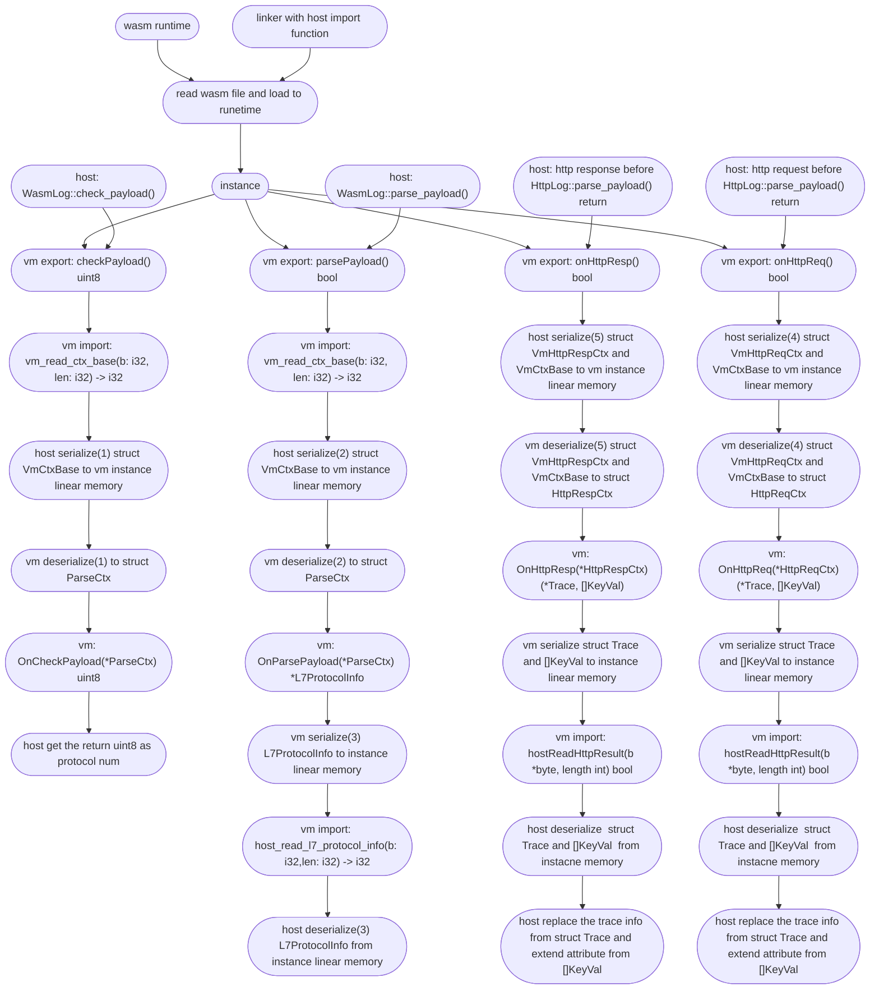

> This document was translated by GPT-4

# About Wasm Plugin System

The Wasm plugin system realizes several user-defined functionally by invoking the Wasi Export Function at designated locations. Current features include:

- Parsing of customized protocols, an example can be found [here](https://github.com/deepflowio/deepflow-wasm-go-sdk/blob/5393818adf94f2f9b296de82e20f614ba3b2336a/example/dns/dns.go)
- Enhancements of HTTPv1 protocol, an example can be found [here](https://github.com/deepflowio/deepflow-wasm-go-sdk/blob/5393818adf94f2f9b296de82e20f614ba3b2336a/example/http/http.go)

For developing a Wasm Plugin, you may refer to this blog post: [Enabling Zero-Code Observability for Applications by WebAssembly with DeepFlow Wasm Plugin](https://deepflow.io/blog/035-deepflow-enabling-zero-code-observability-for-applications-by-webAssembly/).

# Instruction for Golang SDK

Only Golang SDK is provided at present, but more language support will come in the future. The compiling of Golang SDK requires tinygo. Below is a brief guideline about how to build a plugin with Golang quickly.

```go
package main

import (
	"github.com/deepflowio/deepflow-wasm-go-sdk/sdk"
)

// Define structure which needs to implement sdk.Parser interface
type plugin struct {
}

/*
    The returned array indicates where the agent needs to drop the plugin's corresponding Export function, currently there are 3 hook points：
        HOOK_POINT_HTTP_REQ       represents before the return of http request parsing
        HOOK_POINT_HTTP_RESP      represents before the return of http response parsing
        HOOK_POINT_PAYLOAD_PARSE  represents the judgement and parsing of the protocol
*/
func (p plugin) HookIn() []sdk.HookBitmap {
	return []sdk.HookBitmap{
		sdk.HOOK_POINT_HTTP_REQ,
		sdk.HOOK_POINT_HTTP_RESP,
        sdk.HOOK_POINT_PAYLOAD_PARSE,
	}
}

// HookIn() contains HOOK_POINT_HTTP_REQ. It will be invoked before the return of http request parsing.
// HttpReqCtx contains BaseCtx and some parsed http headers
func (p plugin) OnHttpReq(ctx *sdk.HttpReqCtx) sdk.Action {
    // BaseCtx includes some information such as ip, port, Layer-4 protocol, packet direction etc.
    baseCtx := &ctx.BaseCtx

    // Optional port and path filtering
	if baseCtx.DstPort != 8080 || !strings.HasPrefix(ctx.Path, "/user_info?") {
		return sdk.ActionNext()
	}

    // payload is application data which might be truncated
	payload, err := baseCtx.GetPayload()
    if err != nil {
		return sdk.ActionAbortWithErr(err)
	}

    var(
        trace = &sdk.Trace{}
        attr = []sdk.KeyVal{}
    )

    // some logic here
    //...

    // return result
    return sdk.HttpReqActionAbortWithResult(nil, trace, attr)
}

/*
    HookIn() contains HOOK_POINT_HTTP_RESP. It will be invoked before the return of http response parsing.
    HttpRespCtx contains BaseCtx and response code
    The rest of handle process is similar to OnHttpReq
*/
func (p plugin) OnHttpResp(ctx *sdk.HttpRespCtx) sdk.Action {
    return sdk.ActionNext()
}

/*
    HookIn() contains HOOK_POINT_PAYLOAD_PARSE. It will be invoked during the judgement of the protocol
    A unique protocol number and protocol name need to be returned. Returning protocol number 0 represents failure
*/
func (p plugin) OnCheckPayload(baseCtx *sdk.ParseCtx) (uint8, string) {
	return 0, ""
}

func (p plugin) OnParsePayload(baseCtx *sdk.ParseCtx) sdk.ParseAction {
    // ctx.L7 is the protocol number returned by OnCheckPayload. It can be filtered first according to Layer-4 protocol or protocol number.
    if ctx.L4 != sdk.TCP || ctx.L7 != 1 {
		return sdk.ActionNext()
	}

	payload, err := ctx.GetPayload()
	if err != nil {
		return sdk.ActionAbortWithErr(err)
	}
    // the parse logic here
    // ...

    /*
        About L7ProtocolInfo struct:
            type L7ProtocolInfo struct {
                ReqLen    *int       // Request length, for example, content-length of http
                RespLen   *int       // Response length, for example content-length of http
                RequestID *uint32    // ID identifier of substream, for example, stream id of http2, transaction id of dns
                Req       *Request
                Resp      *Response
                Trace     *Trace     // Tracing information
                Kv        []KeyVal   // Corresponding attribute
            }

            type Request struct {
                ReqType  string  // Corresponding request type
                Domain   string  // Corresponding request domain
                Resource string  // Corresponding request resource
                Endpoint string  // Corresponding endpoint
            }

            type Response struct {
                Status    RespStatus // Corresponding response status
                Code      *int32     // Corresponding response code
                Result    string     // Corresponding response result
                Exception string     // Corresponding response exception
            }
    */
    return sdk.ParseActionAbortWithL7Info([]*sdk.L7ProtocolInfo{})
}


// main needs to register the parser
func main() {
    sdk.SetParser(plugin{})
	sdk.Warn("xxx wasm plugin registered")
}
// about return value
/*
    agent can load multiple wasm plugins. The agent will traverse all plugins and then call the corresponding Export function, but the traversal behavior can be controlled by return value.

    There are several kinds of return values：
        sdk.ActionNext()                 Stop the current plugin and proceed to the next plugin directly
        sdk.ActionAbort()                Stop the current plugin and also stop the traversal
        sdk.ActionAbortWithErr(err)      Stop the current plugin, print error logs and stop the traversal

        sdk.HttpActionAbortWithResult()
        sdk.ParseActionAbortWithL7Info()  agent stops the traversal and extracts appropriate return results
*/
```

# Compilation and Loading of Plugins

## Compile Plugin

Use the command below to compile the Wasm program

```sh
tinygo  build -o wasm.wasm  -target wasi  -panic=trap -scheduler=none -no-debug ./main.go
```

## Upload Plugin

Upload the wasm file to the corresponding node and execute

```sh
deepflow-ctl plugin create  --type wasm --image wasm.wasm --name wasm
```

## Load Plugin

Add to static_config

```
static_config:
  wasm-plugins:
    - wasm // Corresponding to the name of uploaded plugin in deepflow-ctl
```

# Related Issues and Limitations

- You can't use go func(). Though removing -scheduler=none parameter could pass the compilation, it won't work as expected.
- Using time.Sleep() will cause the Wasm plugin to fail to load.
- If the plugin runs for too long, it will block the execution of the agent for a long time. If it runs an endless loop, the agent will be blocked indefinitely.
- Tinygo has certain restrictions on go's standard library and third-party libraries. Not all the go codes or libraries can be used. For the standard library, you can check what tinygo supports [here](https://tinygo.org/docs/reference/lang-support/stdlib/). It's worth mentioning that the list here is just for reference. If "Passes tests" shows "no", it doesn't mean that it can't be used at all. For example, fmt.Sprintf() can be used but fmt.Println() can't.
- Since wasi works from go version 1.21, if you want to use builtin's serialization related library (json, yaml, xml, etc.), you need to use a version of go not less than 1.21 and tinygo not less than 0.29.
- The structures returned by Parser (L7ProtocolInfo, Trace, []KeyVal) will be serialized into linear memory. At present, the memory applied for each structure's serialization is fixed to be 1 page (65536 bytes). If the returned structure is too large, it will result in a serialization failure.
- The agent determines the application layer protocol of a flow by traversing all supported protocols. The current order is HTTP -> Wasm Hook -> DNS -> ... , The priority of Wasm is second only to HTTP, so the user-defined protocol judgment and parsing can rewrite the agent's existing protocol judgment and parsing (excluding HTTP/HTTP2), such as [this example](https://github.com/deepflowio/deepflow-wasm-go-sdk/blob/5393818adf94f2f9b296de82e20f614ba3b2336a/example/dns/dns.go), which can rewrite DNS parsing. The Agent will not execute the default DNS parsing logic.
- Due to the complexity of network environment and protocols, it is possible to receive incomplete application layer data frames. For example, IP fragmentation caused by MTU limits, shrinking of TCP peer receiving window or flow congestion window, too small MSS and other reasons can lead to incomplete application layer data frames. There is currently no implementation of transport layer connection tracking. In addition, if the application layer data is too long, it will also be truncated.

# Execution Process of Wasm Plugin

Before understanding the execution process of Wasm plugin, you need to have a general knowledge of the protocol analysis of deepflow, which can refer to [DeepFlow Protocol Development Document](https://github.com/deepflowio/deepflow/blob/main/docs/HOW_TO_SUPPORT_YOUR_PROTOCOL_EN.MD).

The execution process of Wasm plugin is as follows



There are six structures that need to be serialized/deserialized:

- VmCtxBase
  - Currently, when calling any Export function, the host will serialize VmCtxBase into linear memory. The serialization format is referenced from [here](https://github.com/deepflowio/deepflow/blob/0da738106f710cad9bbce6632384105b1b868e59/agent/src/plugin/wasm/vm.rs#L199).
  - Similarly, the instance will also deserialize it. The code can be referred from [here](https://github.com/deepflowio/deepflow-wasm-go-sdk/blob/5393818adf94f2f9b296de82e20f614ba3b2336a/sdk/serde.go#L73).
- L7ProtocolInfo
  - At the end of the Export function parse_payload, the instance will serialize L7ProtocolInfo into linear memory. The serialization format and code can be referred from [here](https://github.com/deepflowio/deepflow-wasm-go-sdk/blob/5393818adf94f2f9b296de82e20f614ba3b2336a/sdk/serde.go#L335).
  - The host will also deserialize it. The code can be referred from [here](https://github.com/deepflowio/deepflow/blob/0da738106f710cad9bbce6632384105b1b868e59/agent/src/plugin/mod.rs#L152).
- VmHttpReqCtx
  - Before the return of http request parsing, the Export function on_http_req will be called, and the host will serialize VmCtxBase and VmHttpReqCtx into the linear memory of the instance.
  - The serialization code and format of VmHttpReqCtx can be referred from [here](https://github.com/deepflowio/deepflow/blob/0da738106f710cad9bbce6632384105b1b868e59/agent/src/plugin/wasm/vm.rs#L328).
  - The instance deserialization code can be referred from [here](https://github.com/deepflowio/deepflow-wasm-go-sdk/blob/5393818adf94f2f9b296de82e20f614ba3b2336a/sdk/serde.go#L173).
- VmHttpRespCtx
  - Before the return of http response parsing, the Export function on_http_resp will be called, and the host will serialize VmCtxBase and VmHttpRespCtx into the instance's linear memory.
  - The serialization format of VmHttpRespCtx can be referred from [here](https://github.com/deepflowio/deepflow/blob/0da738106f710cad9bbce6632384105b1b868e59/agent/src/plugin/wasm/vm.rs#L395).
  - The instance deserialization code can be referred from [here](https://github.com/deepflowio/deepflow-wasm-go-sdk/blob/5393818adf94f2f9b296de82e20f614ba3b2336a/sdk/serde.go#L232).
- Trace, []KeyVal
  - Before the return of Export function on_http_req/on_http_resp, the instance will serialize Trace and []KeyVal into linear memory.
  - The serialization code and can be referred from [here](https://github.com/deepflowio/deepflow-wasm-go-sdk/blob/5393818adf94f2f9b296de82e20f614ba3b2336a/sdk/serde.go#L515).
  - The deserialization code and format can be referred from [here](https://github.com/deepflowio/deepflow/blob/0da738106f710cad9bbce6632384105b1b868e59/agent/src/plugin/wasm/abi_import.rs#L376).
