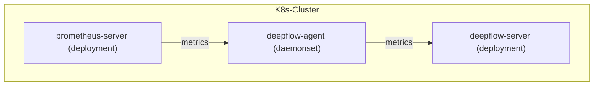

> This document was translated by ChatGPT

# Data Flow



# Configuring Prometheus

## Installing Prometheus

You can learn the relevant background knowledge in the [Prometheus documentation](https://prometheus.io/docs/introduction/overview/).
If your cluster does not have Prometheus, you can quickly deploy a Prometheus in the `deepflow-prometheus-demo` namespace using the following steps:

```bash
# add helm chart
helm repo add prometheus-community https://prometheus-community.github.io/helm-charts
helm repo update

# install prometheus
helm install prometheus prometheus-community/prometheus -n deepflow-prometheus-demo --create-namespace
```

## Configuring remote_write

We need to configure Prometheus `remote_write` to send data to the DeepFlow Agent.

First, determine the address of the data listening service started by the DeepFlow Agent. After [installing the DeepFlow Agent](../../../ce-install/single-k8s/), the DeepFlow Agent Service address will be displayed. Its default value is `deepflow-agent.default`. Please fill in the actual service name and namespace in the configuration.

Execute the following command to modify the default configuration of Prometheus (assuming it is in `deepflow-prometheus-demo`):

```bash
kubectl edit cm -n deepflow-prometheus-demo prometheus-server
```

Configure the `remote_write` address (please change `DEEPFLOW_AGENT_SVC` to the service name of deepflow-agent):

```yaml
remote_write:
  - url: http://${DEEPFLOW_AGENT_SVC}/api/v1/prometheus
```

## Configuring remote_read

If you want Prometheus to query data from DeepFlow, you need to configure Prometheus `remote_read` (please change `DEEPFLOW_SERVER_SVC` to the service name of deepflow-server):

```yaml
remote_read:
  - url: http://${DEEPFLOW_SERVER_SVC}/api/v1/prom/read
    read_recent: true
```

# Configuring DeepFlow

Please refer to the section [Configuring DeepFlow](../tracing/opentelemetry/#配置-deepflow) and add the configuration for the `prometheus targets api` address (not required for versions v6.2 and earlier) to complete the DeepFlow Agent configuration. The purpose is to synchronize prometheus activeTargets.labels and config to deepflow-server to improve storage and query performance.

Add the following configuration to the Group where the Agent is located (please modify `PROMETHEUS_HTTP_API_ADDRESSES`):

```yaml
prometheus_http_api_addresses: # Required when integrating Prometheus metrics
  - { PROMETHEUS_HTTP_API_ADDRESSES }
```

# Viewing Prometheus Data

The metrics in Prometheus will be stored in the `prometheus` database of DeepFlow.
The original labels of Prometheus can be referenced through tag.XXX, and the metric values can be referenced through value.
At the same time, DeepFlow will automatically inject a large number of Meta Tags and Custom Tags, allowing the data collected by Prometheus to be seamlessly associated with other data sources.

Using Grafana, select the `DeepFlow` data source to display the chart as shown below:


# Notes

1. When calculating the `Derivative` operator through the DeepFlow data source, you must select an outer operator (such as `Avg`).
2. When calculating the `Derivative` operator, since the calculation process first calculates the `Derivative` operator for multiple time series of the same metric, and then calculates the outer operator, if the query interval is less than the data collection interval, using relative time queries like now-xx, if multiple time series of the same metric are continuously writing new data, the results of multiple queries may be inconsistent.