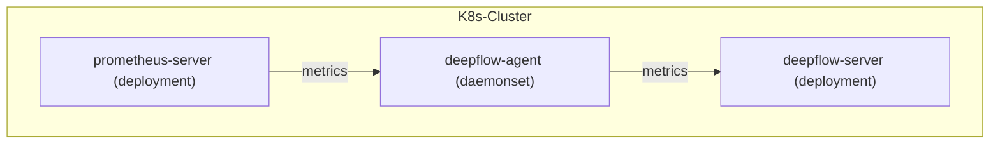

> This document was translated by GPT-4

# Data Flow



# Configure Prometheus

## Install Prometheus

You can learn about the related background knowledge in the [Prometheus documentation](https://prometheus.io/docs/introduction/overview/).
If your cluster does not have Prometheus, you can quickly deploy a Prometheus in the `deepflow-prometheus-demo` namespace with the following steps:

```bash
# add helm chart
helm repo add prometheus-community https://prometheus-community.github.io/helm-charts
helm repo update

# install prometheus
helm install prometheus prometheus-community/prometheus -n deepflow-prometheus-demo --create-namespace
```

## Configure remote_write

We need to configure Prometheus `remote_write` to send data to DeepFlow Agent.

First, determine the address of the data listening service started by the DeepFlow Agent. After [installing DeepFlow Agent](../../../ce-install/single-k8s/), the DeepFlow Agent Service address will be displayed, its default value is `deepflow-agent.default`, please fill in the configuration according to the actual service name and namespace.

The following command can modify the default configuration of Prometheus (assuming it is in `deepflow-prometheus-demo`):

```bash
kubectl edit cm -n deepflow-prometheus-demo prometheus-server
```

Configure `remote_write` address (please modify `DEEPFLOW_AGENT_SVC` to the service name of deepflow-agent):

```yaml
remote_write:
  - url: http://${DEEPFLOW_AGENT_SVC}/api/v1/prometheus
```

## Configure remote_read

If you want Prometheus to query data from DeepFlow, you need to configure Prometheus's `remote_read` (please modify `DEEPFLOW_SERVER_SVC` to the service name of deepflow-server):

```yaml
remote_read:
  - url: http://${DEEPFLOW_SERVER_SVC}/api/v1/prom/read
    read_recent: true
```

# Configure DeepFlow

Please refer to the content of [Configure DeepFlow](../tracing/opentelemetry/#configure-deepflow) and add configuration `prometheus targets api` address (v6.2 and earlier versions do not need to be configured) to complete the DeepFlow Agent configuration. The goal is to synchronize prometheus activeTargets.labels and config to deepflow-server, to improve storage and query performance.

Add the following configuration to the Group where the Agent is located (please modify `PROMETHEUS_HTTP_API_ADDRESSES`):

```yaml
prometheus_http_api_addresses: # This item should be filled in when integrating Prometheus metrics
  - { PROMETHEUS_HTTP_API_ADDRESSES }
```

# View Prometheus Data

Metrics in Prometheus will be stored in DeepFlow's `prometheus` database.
The original labels of Prometheus can be referenced through tag.XXX, and the metric values can be referenced through value.
At the same time, DeepFlow will also automatically inject a lot of Meta Tag and Custom Tag, so that the data collected by Prometheus can be seamlessly associated with other data sources.

When using Grafana and selecting the `DeepFlow` data source for search, the display is as follows:


