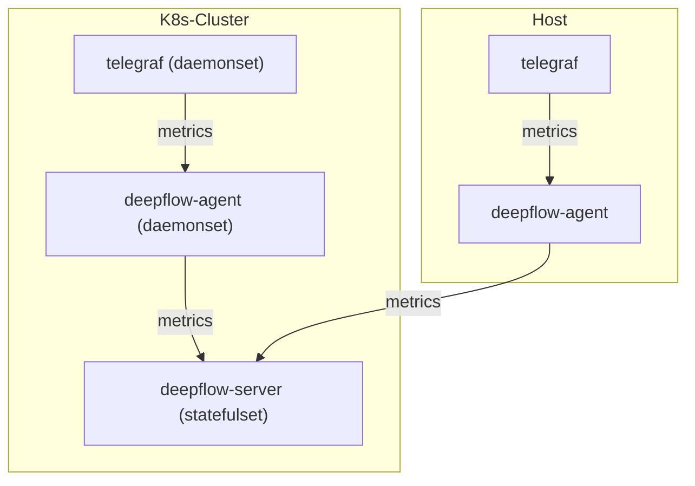

> This document was translated by ChatGPT

# Data Flow



# Configuring Telegraf

## Installing Telegraf

You can learn about the relevant background knowledge in the [Telegraf documentation](https://www.influxdata.com/time-series-platform/telegraf/).
If you do not have Telegraf in your cluster, you can quickly deploy Telegraf as a DaemonSet using the following steps:

```bash
# add helm chart
helm repo add influxdata https://helm.influxdata.com/

# install telegraf
helm upgrade --install telegraf influxdata/telegraf -n deepflow-telegraf-demo --create-namespace

# switch from deployment to daemonset
kubectl apply -f https://raw.githubusercontent.com/deepflowio/deepflow-demo/main/DeepFlow-Telegraf-Demo/deepflow-telegraf-demo.yaml
```

## Configuring Telegraf Data Output

We need to modify the Telegraf configuration so that Telegraf sends data to the DeepFlow Agent.

First, we need to determine the address of the data listening service launched by DeepFlow Agent. After [installing DeepFlow Agent](../../../ce-install/single-k8s/),
the DeepFlow Agent Service address will be displayed, the default value is `deepflow-agent.default`.
If you have modified it, please fill in according to the actual service name and namespace.

Next, modify the default configuration of Telegraf (assuming it is in the `deepflow-telegraf-demo` namespace):

```bash
kubectl edit cm -n deepflow-telegraf-demo telegraf
```

Add the following configuration in `telegraf.conf` (please modify `DEEPFLOW_AGENT_SVC` to the service name of deepflow-agent):

```toml
[[outputs.http]]
  url = "http://${DEEPFLOW_AGENT_SVC}/api/v1/telegraf"
  data_format = "influx"
```

# Configuring DeepFlow

Please refer to [Configuring DeepFlow](../tracing/opentelemetry/#configuring-deepflow) section to complete the DeepFlow Agent configuration.

# Viewing Telegraf Data

The metrics in Telegraf will be stored in DeepFlow's `ext_metrics` database.
To reduce the number of tables, DeepFlow will store all Measurements in one ClickHouse Table,
and users will still see a series of data tables corresponding to the original Telegraf Measurement when they use it.
The original tags of Telegraf metrics can be referenced through tag.XXX, and the metric values can be referenced through metrics.YYY.
At the same time, DeepFlow will also automatically inject a large number of Meta Tags and Custom Tags, allowing data collected by Telegraf to seamlessly connect with other data sources.

When using Grafana, select the `DeepFlow` data source for search, the presentation figure is as follows:


