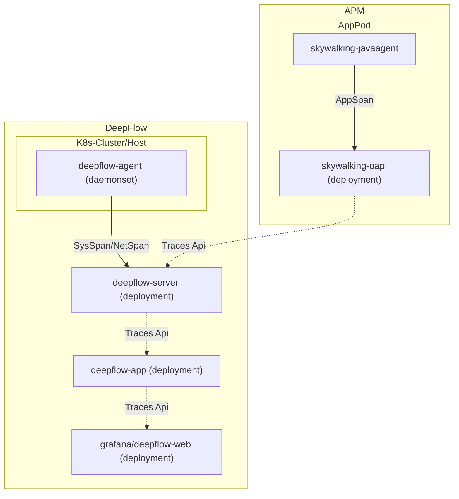

> This document was translated by ChatGPT

# Introduction

DeepFlow has the capability to obtain APP Spans from external APMs and associate these APP Spans with the tracing data collected by DeepFlow. Currently, only SkyWalking is supported as the external APM storage. Applications do not need any modifications; you only need to change the DeepFlow configuration to achieve DeepFlow's full-link, zero-instrumentation tracing capability.

# Data Flow



# Configuration

Modify the [configuration](https://github.com/deepflowio/deepflow/blob/main/server/server.yaml) of the DeepFlow Server by adding the following content:

```yaml
querier:
  external-apm:
    - name: skywalking
      addr: 127.0.0.1:12800 # FIXME: Replace this with the address of the SkyWalking OAP Server, port 12800 is the default port for HTTP service
```

At the same time, you need to modify the [configuration](https://github.com/deepflowio/deepflow-app/blob/main/app/app.yaml) of the DeepFlow App by setting the following value to `true`:

```yaml
app:
  spec:
    call_apm_api_to_supplement_trace: true
```