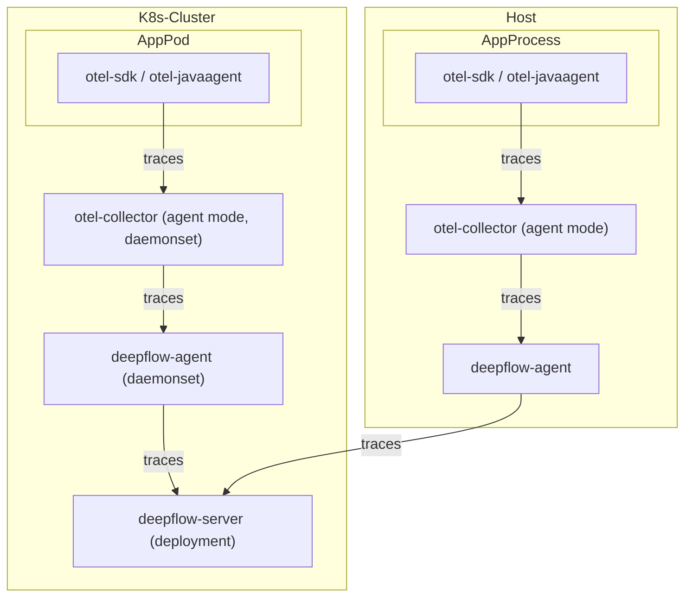
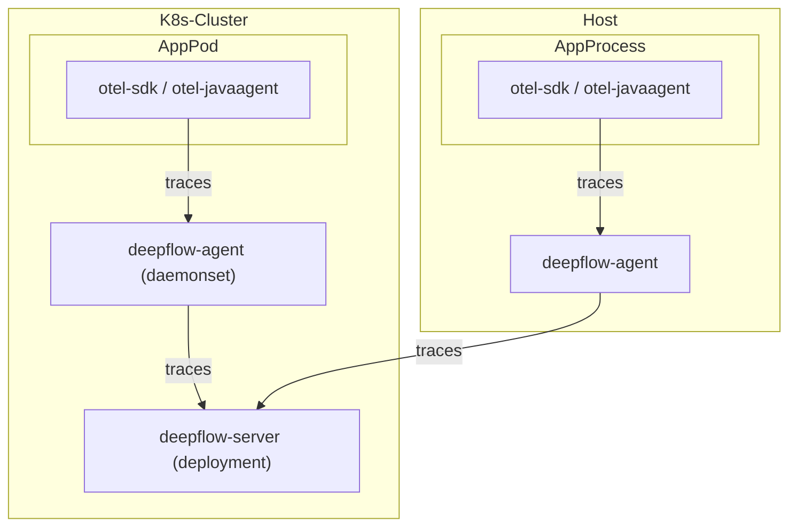
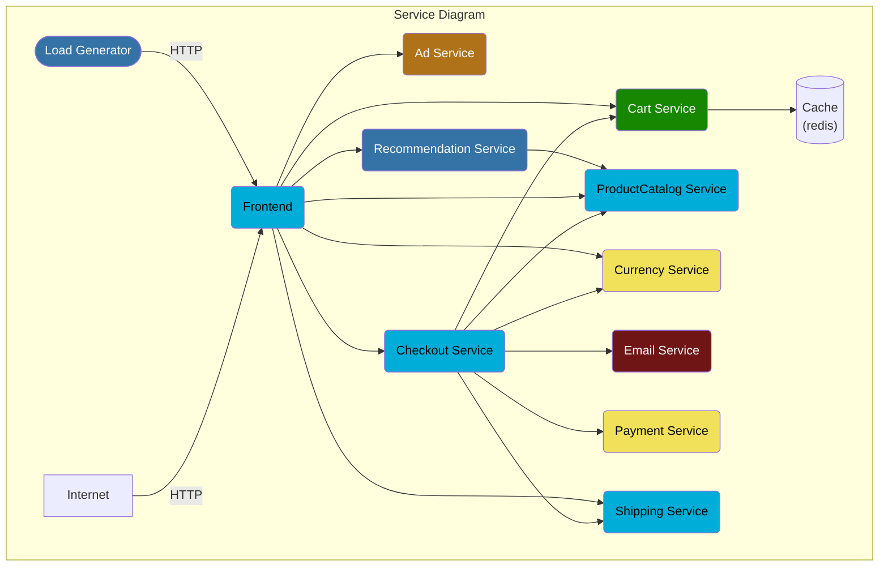

> This document was translated by GPT-4

# Data Flow

Send to deepflow-agent via otel-collector:



Directly send to deepflow-agent:



# Configuring OpenTelemetry

We recommend sending trace data to deepflow-agent using otel-collector in agent mode to avoid data transmission across K8s nodes.
However, using otel-collector in gateway mode is also perfectly viable. The following document describes deployment and configuration methods using otel-agent as an example.

## Installing otel-agent

Check [OpenTelemetry Documents](https://opentelemetry.io/docs/) for background information.
If OpenTelemetry is not already setup in your environment, you can quickly deploy an otel-agent DaesmonSet in the `open-telemetry` namespace using the following command:

```bash
kubectl apply -n open-telemetry -f https://raw.githubusercontent.com/deepflowio/deepflow-demo/main/open-telemetry/open-telemetry.yaml
```

Once installed, you can view a list of components within your environment:

```bash
kubectl get all -n open-telemetry
```

| Type      | Component  |
| --------- | ---------- |
| Daemonset | otel-agent |
| Service   | otel-agent |
| ConfigMap | otel-agent |

If you need to use other versions or updated opentelemetry-collector-contrib,
please find the image version you want in the [otel-docker](https://hub.docker.com/r/otel/opentelemetry-collector-contrib/tags) repository,
then update the image using the following command:

```bash
LATEST_TAG="xxx"  # FIXME

kubectl set image -n open-telemetry daemonset/otel-agent otel-agent=otel/opentelemetry-collector-contrib:${LATEST_TAG}
```

## Configuring otel-agent

We need to configure `otel-agent-config.exporters.otlphttp` in otel-agent ConfigMap to send traces to DeepFlow. First, query the current configuration:

```bash
kubectl get cm -n open-telemetry otel-agent-conf -o custom-columns=DATA:.data | \
    grep -A 5 otlphttp:
```

The deepflow-agent uses ClusterIP Service to receive traces, modify the otel-agent configuration as follows:

```yaml
otlphttp:
  traces_endpoint: 'http://deepflow-agent.deepflow/api/v1/otel/trace'
  tls:
    insecure: true
  retry_on_failure:
    enabled: true
```

In addition, to ensure the IP of the Span sender is passed on to DeepFlow, we need to add the following configuration:

```yaml
processors:
  k8sattributes:
  resource:
    attributes:
      - key: app.host.ip
        from_attribute: k8s.pod.ip
        action: insert
```

Finally, in the service.pipeline, add the following to the `traces` section:

```yaml
service:
  pipelines:
    traces:
      processors: [k8sattributes, resource] # Ensure the k8sattributes processor is processed first
      exporters: [otlphttp]
```
# Configuring DeepFlow

Next, we need to start the data receiving service of the deepflow-agent.

Firstly, we confirm the collector group ID of deepflow-agent, which is usually the ID of a group called 'default':

```bash
deepflow-ctl agent-group list
```

Check if the collector group has a configuration:

```bash
deepflow-ctl agent-group-config list
```

If there is a configuration, export it to a yaml file for modification:

```bash
deepflow-ctl agent-group-config list <your-agent-group-id> -o yaml > your-agent-group-config.yaml
```

Modify the yaml file to ensure the following configuration items are present:

```bash
vtap_group_id: <your-agent-group-id>
external_agent_http_proxy_enabled: 1   # required
external_agent_http_proxy_port: 38086  # optional, default 38086
```

Update the configuration of the collector group:

```
deepflow-ctl agent-group-config update <your-agent-group-id> -f your-agent-group-config.yaml
```

If the collector group does not have a configuration, the following command can be used to create a new configuration based on the your-agent-group-config.yaml file:

```bash
deepflow-ctl agent-group-config create -f your-agent-group-config.yaml
```

# Experience based on the Spring Boot Demo

## Deploying the Demo

This demo is from [this GitHub repository](https://github.com/liuzhibin-cn/my-demo). It is a WebShop application composed of five microservices written in Spring Boot. Its architecture is as follows:


The following command can be used to deploy this demo in one click:

```bash
kubectl apply -n deepflow-otel-spring-demo -f https://raw.githubusercontent.com/deepflowio/deepflow-demo/main/DeepFlow-Otel-Spring-Demo/deepflow-otel-spring-demo.yaml
```

## Viewing Tracing Data

Go to Grafana, open the `Distributed Tracing` Dashboard, after selecting `namespace = deepflow-otel-spring-demo`, you can select a call to trace. DeepFlow can associate and display the trace data obtained from OpenTelemetry, eBPF, and BPF in a flame graph of Trace, covering the full-stack call path of a Spring Boot application, from business code, system functions, and network interfaces, achieving real distributed tracing. The effect is as follows:


You can also visit [DeepFlow Online Demo](https://ce-demo.deepflow.yunshan.net/d/Distributed_Tracing/distributed-tracing?var-namespace=deepflow-otel-spring-demo&from=deepflow-doc) to see the effect. The topology corresponding to the call chain flame graph in the picture above is as follows.

```mermaid
flowchart TD

loadgenerator_locust_send(1-eBPF: loadgenerator locust send):::loadgenerator
loadgenerator_vnic_send(2-BPF: loadgenerator vnic send):::nic
node1_nic_send_lw("3-BPF: node1 nic send loadgen->webshop"):::nic
node0_nic_recv_lw("4-BPF: node0 nic recv loadgen->webshop"):::nic

webshop_vnic_recv(5-BPF: web-shop vnic recv):::nic
webshop_java_recv(6-eBPF: web-shop java recv):::webshop_1
webshop_otel_span_fulltest_1(7-OTel: web-shop otel span full-test-1):::webshop_2
webshop_otel_span_fulltest_2(8-OTel: web-shop otel span full-test-2):::webshop_2
webshop_otel_span_register_1(9-OTel: web-shop otel span register-1):::webshop_2
webshop_otel_span_register_2(10-OTel: web-shop otel span register-2):::webshop_1
webshop_otel_span_register_3(11-OTel: web-shop otel span register-3):::webshop_1
webshop_java_send_register(12-eBPF: web-shop java send register):::webshop_1
webshop_vnic_send_register(13-BPF: web-shop vnic send register):::nic
node0_nic_send_register(14-BPF: node0 nic send register):::nic
node1_nic_recv_register(15-BPF: node1 nic recv register):::nic
svcuser_vnic_recv_register(16-BPF: svc-user vnic recv register):::nic
svcuser_java_recv_register(17-eBPF: svc-user java recv register):::svcuser
svcuser_otel_span_register_1(18-OTel: svc-user otel span register-1):::svcuser
svcuser_otel_span_register_2(19-OTel: svc-user otel span register-2):::svcuser
svcuser_otel_span_register_3(20-OTel: svc-user otel span register-3):::svcuser
svcuser_otel_span_register_sql_1(21-OTel: svc-user otel span register sql-1):::svcuser
svcuser_otel_span_register_sql_2(22-OTel: svc-user otel span register sql-2):::svcuser
svcuser_otel_span_register_sql_3(23-OTel: svc-user otel span register sql-3):::svcuser

webshop_otel_span_login_1(24-OTel: web-shop otel span login-1):::webshop_2
webshop_otel_span_login_2(25-OTel: web-shop otel span login-2):::webshop_1
webshop_otel_span_login_3(26-OTel: web-shop otel span login-3):::webshop_1
webshop_java_send_login(27-eBPF: web-shop java send login):::webshop_1
webshop_vnic_send_login(28-BPF: web-shop vnic send login):::nic
node0_nic_send_login(29-BPF: node0 nic send login):::nic
node1_nic_recv_login(30-BPF: node1 nic recv login):::nic
svcuser_vnic_recv_login(31-BPF: svc-user vnic recv login):::nic
svcuser_java_recv_login(32-eBPF: svc-user java recv login):::svcuser
svcuser_otel_span_login_1(33-OTel: svc-user otel span login-1):::svcuser
svcuser_otel_span_login_2(34-OTel: svc-user otel span login-2):::svcuser
svcuser_otel_span_login_3(35-OTel: svc-user otel span login-3):::svcuser
svcuser_otel_span_login_sql_1(36-OTel: svc-user otel span login sql-1):::svcuser
svcuser_otel_span_login_sql_2(37-OTel: svc-user otel span login sql-2):::svcuser

webshop_otel_span_finditem_1(38-OTel: web-shop otel span finditem-1):::webshop_2
webshop_otel_span_finditem_2(39-OTel: web-shop otel span finditem-2):::webshop_1
webshop_otel_span_finditem_3(40-OTel: web-shop otel span finditem-3):::webshop_1
webshop_java_send_finditem(41-eBPF: web-shop java send finditem):::webshop_1
webshop_vnic_send_finditem(42-BPF: web-shop vnic send finditem):::nic
node0_nic_send_finditem(43-BPF: node0 nic send finditem):::nic
node1_nic_recv_finditem(44-BPF: node1 nic recv finditem):::nic
svcitem_vnic_recv_finditem(45-BPF: svc-item vnic recv finditem):::nic
svcitem_java_recv_finditem(46-eBPF: svc-item java recv finditem):::svcitem
svcitem_otel_span_finditem_1(47-OTel: svc-item otel span finditem-1):::svcitem
svcitem_otel_span_finditem_2(48-OTel: svc-item otel span finditem-2):::svcitem
svcitem_otel_span_finditem_3(49-OTel: svc-item otel span finditem-3):::svcitem

webshop_otel_span_createorder_1(50-OTel: web-shop otel span createorder-1):::webshop_2
webshop_otel_span_createorder_2(51-OTel: web-shop otel span createorder-2):::webshop_1
webshop_otel_span_createorder_3(52-OTel: web-shop otel span createorder-3):::webshop_1
webshop_java_send_createorder(53-eBPF: web-shop java send createorder):::webshop_1
webshop_vnic_send_createorder(54-BPF: web-shop vnic send createorder):::nic
node0_nic_send_createorder(55-BPF: node0 nic send createorder):::nic
node2_nic_recv_createorder(56-BPF: node2 nic recv createorder):::nic
svcorder_vnic_recv_createorder(57-BPF: svc-order vnic recv createorder):::nic
svcorder_java_recv_createorder(58-eBPF: svc-order java recv createorder):::svcorder
svcorder_otel_span_createorder_1(59-OTel: svc-order otel span createorder-1):::svcorder
svcorder_otel_span_createorder_2(60-OTel: svc-order otel span createorder-2):::svcorder
svcorder_otel_span_createorder_3(61-OTel: svc-order otel span createorder-3):::svcorder

svcorder_otel_span_getitem_1(62-OTel: svc-order otel span getitem-1):::svcorder
svcorder_otel_span_getitem_2(63-OTel: svc-order otel span getitem-2):::svcorder
svcorder_java_send_sql_1(64-eBPF: svc-order java send sql-1):::svcorder
svcorder_vnic_send_sql_1(65-BPF: svc-order vnic send sql-1):::nic
dbdemo_vnic_recv_sql_1(66-BPF: db-demo vnic recv sql-1):::nic
dbdemo_mysql_recv_sql_1(67-eBPF: db-demo mysql recv sql-1):::dbdemo

svcorder_java_send_getitem(68-eBPF: svc-order java send getitem):::svcorder
svcorder_vnic_send_getitem(69-BPF: svc-order vnic send getitem):::nic
node2_nic_send_getitem(70-BPF: node2 nic send getitem):::nic
node1_nic_recv_getitem(71-BPF: node0 nic recv getitem):::nic
svcitem_vnic_recv_getitem(72-BPF: svc-item vnic recv getitem):::nic
svcitem_java_recv_getitem(73-eBPF: svc-item java recv getitem):::svcitem
svcitem_otel_span_getitem_1(74-OTel: svc-item otel span getitem-1):::svcitem
svcitem_otel_span_getitem_2(75-OTel: svc-item otel span getitem-2):::svcitem
svcitem_otel_span_getitem_3(76-OTel: svc-item otel span getitem-3):::svcitem

svcorder_otel_span_getitem_3(77-OTel: svc-order otel span getitem-3):::svcorder
svcorder_otel_span_getitem_4(78-OTel: svc-order otel span getitem-4):::svcorder
svcorder_java_send_getitem_2(79-eBPF: svc-order java send getitem-2):::svcorder
svcorder_vnic_send_getitem_2(80-BPF: svc-order vnic send getitem-2):::nic
node2_nic_send_getitem_2(81-BPF: node2 nic send getitem-2):::nic
node1_nic_recv_getitem_2(82-BPF: node0 nic recv getitem-2):::nic
svcitem_vnic_recv_getitem_2(83-BPF: svc-item vnic recv getitem-2):::nic
svcitem_java_recv_getitem_2(84-eBPF: svc-item java recv getitem-2):::svcitem
svcitem_otel_span_getitem_4(85-OTel: svc-item otel span getitem-4):::svcitem
svcitem_otel_span_getitem_5(86-OTel: svc-item otel span getitem-5):::svcitem
svcitem_otel_span_getitem_6(87-OTel: svc-item otel span getitem-6):::svcitem

svcorder_otel_span_getstock_1(88-OTel: svc-order otel span getstock-1):::svcorder
svcorder_otel_span_getstock_2(89-OTel: svc-order otel span getstock-2):::svcorder
svcorder_java_send_getstock(90-eBPF: svc-order java send getstock):::svcorder
svcorder_vnic_send_getstock(91-BPF: svc-order vnic send getstock):::nic
svcstock_vnic_recv_getstock(92-BPF: svc-stock vnic recv getstock):::nic
svcstock_java_recv_getstock(93-eBPF: svc-stock java recv getstock):::svcstock
svcstock_otel_span_getstock_1(94-OTel: svc-stock otel span getstock-1):::svcstock
svcstock_otel_span_getstock_2(95-OTel: svc-stock otel span getstock-2):::svcstock
svcstock_otel_span_getstock_3(96-OTel: svc-stock otel span getstock-3):::svcstock

svcorder_java_send_sql_2(97-eBPF: svc-order java send sql-2):::svcorder
svcorder_vnic_send_sql_2(98-BPF: svc-order vnic send sql-2):::nic
dbdemo_vnic_recv_sql_2(99-BPF: db-demo vnic recv sql-2):::nic
dbdemo_mysql_recv_sql_2(100-eBPF: db-demo mysql recv sql-2):::dbdemo

subgraph node1-1 [k8s node1]
    subgraph loadgenerator pod
        loadgenerator_locust_send
    end

    loadgenerator_vnic_send
    node1_nic_send_lw
end

subgraph k8s node0
    node0_nic_recv_lw
    webshop_vnic_recv

    subgraph web-shop pod
        webshop_java_recv

        webshop_otel_span_fulltest_1
        webshop_otel_span_fulltest_2
        webshop_otel_span_register_1
        webshop_otel_span_register_2
        webshop_otel_span_register_3
        webshop_java_send_register

        webshop_otel_span_login_1
        webshop_otel_span_login_2
        webshop_otel_span_login_3
        webshop_java_send_login

        webshop_otel_span_finditem_1
        webshop_otel_span_finditem_2
        webshop_otel_span_finditem_3
        webshop_java_send_finditem

        webshop_otel_span_createorder_1
        webshop_otel_span_createorder_2
        webshop_otel_span_createorder_3
        webshop_java_send_createorder
    end

    webshop_vnic_send_register
    webshop_vnic_send_login
    webshop_vnic_send_finditem
    webshop_vnic_send_createorder

    node0_nic_send_register
    node0_nic_send_login
    node0_nic_send_finditem
    node0_nic_send_createorder
end

subgraph node1-2 [k8s node1]
    node1_nic_recv_register
    node1_nic_recv_login
    node1_nic_recv_finditem

    svcuser_vnic_recv_register
    svcuser_vnic_recv_login
    svcitem_vnic_recv_finditem

    subgraph svc-user pod
        svcuser_java_recv_register
        svcuser_otel_span_register_1
        svcuser_otel_span_register_2
        svcuser_otel_span_register_3
        svcuser_otel_span_register_sql_1
        svcuser_otel_span_register_sql_2
        svcuser_otel_span_register_sql_3

        svcuser_java_recv_login
        svcuser_otel_span_login_1
        svcuser_otel_span_login_2
        svcuser_otel_span_login_3
        svcuser_otel_span_login_sql_1
        svcuser_otel_span_login_sql_2
    end

    subgraph svc-item pod
        svcitem_java_recv_finditem
        svcitem_otel_span_finditem_1
        svcitem_otel_span_finditem_2
        svcitem_otel_span_finditem_3

        svcitem_java_recv_getitem
        svcitem_otel_span_getitem_1
        svcitem_otel_span_getitem_2
        svcitem_otel_span_getitem_3

        svcitem_java_recv_getitem_2
        svcitem_otel_span_getitem_4
        svcitem_otel_span_getitem_5
        svcitem_otel_span_getitem_6
    end

    node1_nic_recv_getitem
    node1_nic_recv_getitem_2
    svcitem_vnic_recv_getitem
    svcitem_vnic_recv_getitem_2
end

subgraph k8s node2
    node2_nic_recv_createorder
    svcorder_vnic_recv_createorder

    subgraph svc-order pod
        svcorder_java_recv_createorder
        svcorder_otel_span_createorder_1
        svcorder_otel_span_createorder_2
        svcorder_otel_span_createorder_3

        svcorder_otel_span_getitem_1
        svcorder_otel_span_getitem_2

        svcorder_java_send_sql_1
        svcorder_java_send_getitem

        svcorder_otel_span_getitem_3
        svcorder_otel_span_getitem_4
        svcorder_java_send_getitem_2

        svcorder_otel_span_getstock_1
        svcorder_otel_span_getstock_2
        svcorder_java_send_getstock

        svcorder_java_send_sql_2
    end

    svcorder_vnic_send_getitem
    svcorder_vnic_send_getitem_2
    svcorder_vnic_send_getstock

    svcstock_vnic_recv_getstock

    subgraph svc-stock pod
        svcstock_java_recv_getstock
        svcstock_otel_span_getstock_1
        svcstock_otel_span_getstock_2
        svcstock_otel_span_getstock_3
    end

    svcorder_vnic_send_sql_1
    dbdemo_vnic_recv_sql_1
    svcorder_vnic_send_sql_2
    dbdemo_vnic_recv_sql_2

    subgraph db-demo-pod-1 [db-demo pod]
        dbdemo_mysql_recv_sql_1
    end

    subgraph db-demo-pod-2 [db-demo pod]
        dbdemo_mysql_recv_sql_2
    end

    node2_nic_send_getitem
    node2_nic_send_getitem_2
end

loadgenerator_locust_send --> loadgenerator_vnic_send --> node1_nic_send_lw -->|IPIP encap| node0_nic_recv_lw --> webshop_vnic_recv --> webshop_java_recv --> webshop_otel_span_fulltest_1 --> webshop_otel_span_fulltest_2

webshop_otel_span_fulltest_2 --> webshop_otel_span_register_1 --> webshop_otel_span_register_2 --> webshop_otel_span_register_3 --> webshop_java_send_register --> webshop_vnic_send_register --> node0_nic_send_register -->|IPIP encap| node1_nic_recv_register --> svcuser_vnic_recv_register

svcuser_vnic_recv_register --> svcuser_java_recv_register --> svcuser_otel_span_register_1 --> svcuser_otel_span_register_2 --> svcuser_otel_span_register_3 --> svcuser_otel_span_register_sql_1
svcuser_otel_span_register_3 --> svcuser_otel_span_register_sql_2
svcuser_otel_span_register_3 --> svcuser_otel_span_register_sql_3

webshop_otel_span_fulltest_2 --> webshop_otel_span_login_1 --> webshop_otel_span_login_2 --> webshop_otel_span_login_3 --> webshop_java_send_login --> webshop_vnic_send_login --> node0_nic_send_login -->|IPIP encap| node1_nic_recv_login --> svcuser_vnic_recv_login

svcuser_vnic_recv_login --> svcuser_java_recv_login --> svcuser_otel_span_login_1 --> svcuser_otel_span_login_2 --> svcuser_otel_span_login_3 --> svcuser_otel_span_login_sql_1
svcuser_otel_span_login_3 --> svcuser_otel_span_login_sql_2

webshop_otel_span_fulltest_2 --> webshop_otel_span_finditem_1 --> webshop_otel_span_finditem_2 --> webshop_otel_span_finditem_3 --> webshop_java_send_finditem --> webshop_vnic_send_finditem --> node0_nic_send_finditem -->|IPIP encap| node1_nic_recv_finditem --> svcitem_vnic_recv_finditem

svcitem_vnic_recv_finditem --> svcitem_java_recv_finditem --> svcitem_otel_span_finditem_1 --> svcitem_otel_span_finditem_2 --> svcitem_otel_span_finditem_3

webshop_otel_span_fulltest_2 --> webshop_otel_span_createorder_1 --> webshop_otel_span_createorder_2 --> webshop_otel_span_createorder_3 --> webshop_java_send_createorder --> webshop_vnic_send_createorder --> node0_nic_send_createorder -->|IPIP encap| node2_nic_recv_createorder --> svcorder_vnic_recv_createorder

svcorder_vnic_recv_createorder --> svcorder_java_recv_createorder --> svcorder_otel_span_createorder_1 --> svcorder_otel_span_createorder_2 --> svcorder_otel_span_createorder_3

svcorder_otel_span_createorder_3--> svcorder_otel_span_getitem_1 --> svcorder_otel_span_getitem_2 --> svcorder_java_send_sql_1 --> svcorder_vnic_send_sql_1 --> dbdemo_vnic_recv_sql_1 --> dbdemo_mysql_recv_sql_1

svcorder_otel_span_getitem_2 --> svcorder_java_send_getitem --> svcorder_vnic_send_getitem --> node2_nic_send_getitem -->|IPIP encap| node1_nic_recv_getitem --> svcitem_vnic_recv_getitem

svcitem_vnic_recv_getitem --> svcitem_java_recv_getitem --> svcitem_otel_span_getitem_1 --> svcitem_otel_span_getitem_2 --> svcitem_otel_span_getitem_3

svcorder_otel_span_createorder_3--> svcorder_otel_span_getitem_3 --> svcorder_otel_span_getitem_4 --> svcorder_java_send_getitem_2 --> svcorder_vnic_send_getitem_2 --> node2_nic_send_getitem_2 -->|IPIP encap| node1_nic_recv_getitem_2 --> svcitem_vnic_recv_getitem_2

svcitem_vnic_recv_getitem_2 --> svcitem_java_recv_getitem_2 --> svcitem_otel_span_getitem_4 --> svcitem_otel_span_getitem_5 --> svcitem_otel_span_getitem_6

svcorder_otel_span_createorder_3--> svcorder_otel_span_getstock_1 --> svcorder_otel_span_getstock_2 --> svcorder_java_send_getstock --> svcorder_vnic_send_getstock --> svcstock_vnic_recv_getstock

svcstock_vnic_recv_getstock  --> svcstock_java_recv_getstock --> svcstock_otel_span_getstock_1 --> svcstock_otel_span_getstock_2 --> svcstock_otel_span_getstock_3

svcorder_otel_span_getstock_2 --> svcorder_java_send_sql_2 --> svcorder_vnic_send_sql_2 --> dbdemo_vnic_recv_sql_2 --> dbdemo_mysql_recv_sql_2

classDef loadgenerator fill:#ceb961,color:black;
classDef nic fill:#a1a1a1,color:white;
classDef webshop_1 fill:#8498d1,color:white;
classDef webshop_2 fill:#45b0d6,color:white;
classDef svcuser fill:#9cdbc3,color:black;
classDef svcorder fill:#16a9e8,color:white;
classDef svcitem fill:#eadb92,color:black;
classDef svcstock fill:#49b292,color:white;
classDef dbdemo fill:#aa48bc,color:black;
```



Summarizing this tracing demo, we conclude:

- Full link: Integrated OTel, eBPF, and BPF, the Trace automatically traced 100 spans, including 20 eBPF spans and 34 BPF spans.
- Full link: For uninstrumentable OTel services, it supports eBPF-based automatic tracing and supplementation, such as span 1-6 (loadgenerator), etc.
- Full link: For services that cannot be instrumented by OTel, it supports eBPF-based automatic tracing and supplementation, such as span 67, 100's eBPF span depicting the start and end of the MySQL transaction (SET autocommit, commit).
- Full stack: Supports tracing of the network path between two pods on the same K8s Node, such as spans 91-92, etc.
- Full stack: Supports tracing of the network path between two pods across K8s Nodes, even if the tunnel encapsulation is passed through in the middle, such as spans 2-5, etc. (IPIP tunnel encapsulation).
- Full Stack: eBPF and BPF spans are interspersed between OTel spans, connecting applications, systems, and networks. The significant time difference between eBPF span 12,27,41,53 and their parent span (OTel) can be used to determine the real performance bottleneck, avoiding confusion in the upstream and downstream application development teams.

# Experience based on OpenTelemetry WebStore Demo

## Deploying the Demo

This demo is from [opentelemetry-webstore-demo](https://github.com/open-telemetry/opentelemetry-demo-webstore), a demo made up of a dozen microservices implemented in languages like Go, C#, Node.js, Python, Java, among others. Its application architecture is as follows:



Use the following command to deploy this demo in one click:

```bash
kubectl apply -n deepflow-otel-grpc-demo -f https://raw.githubusercontent.com/deepflowio/deepflow-demo/main/DeepFlow-Otel-Grpc-Demo/deepflow-otel-grpc-demo.yaml
```

## Viewing Tracing Data

Go to Grafana, open the `Distributed Tracing` Dashboard, after selecting `namespace = deepflow-otel-grpc-demo`, you can select a call to trace. DeepFlow can associate and display the trace data obtained from OpenTelemetry, eBPF, and BPF in a flame graph of Trace, covering a multilanguage application from business code, system functions, and network interfaces, achieving real distributed tracing. The effect is as follows:


You can also visit [DeepFlow Online Demo](https://ce-demo.deepflow.yunshan.net/d/Distributed_Tracing/distributed-tracing?var-namespace=deepflow-otel-grpc-demo&var-request_resource=*Order*&from=deepflow-doc) to see the effect.

