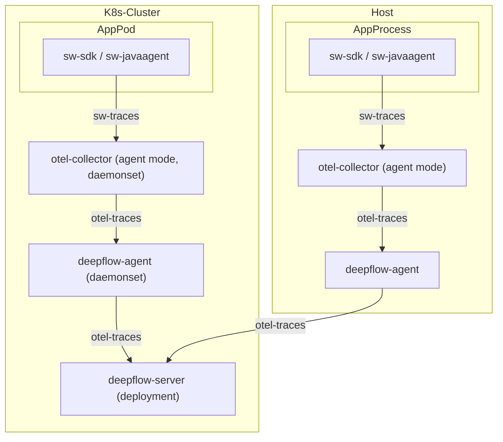

> This document was translated by GPT-4

# Data Flow



# Configure OpenTelemetry SkyWalking Receiver

## Background Information

You can check the [OpenTelemetry documentation](https://opentelemetry.io/docs/) for background knowledge on OpenTelemetry. You can also read the previous section on the [OpenTelemetry installation](../tracing/opentelemetry/#configure-opentelemetry) for a quick installation.

You can refer to the [SkyWalking documentation](https://skywalking.apache.org/docs/) for background information on SkyWalking. This Demo does not require a full SkyWalking installation. Instead, we will use OpenTelemetry to integrate SkyWalking Trace data.

## Check OpenTelemetry Version

First, you need to enable OpenTelemetry's SkyWalking data receiving capabilities. The data will be processed by the OpenTelemetry standard protocol and passed to DeepFlow Agent.

There are bugs in OpenTelemetry receiving SkyWalking data. We have recently made fixes in [#11562](https://github.com/open-telemetry/opentelemetry-collector-contrib/pull/11562) and [#12651](https://github.com/open-telemetry/opentelemetry-collector-contrib/pull/12651). For the following demonstration, we need the [Collector mirror](https://hub.docker.com/r/otel/opentelemetry-collector-contrib) version of OpenTelemetry `>= 0.57.0`. Please check the image version of otel-agent in your environment and make sure it meets the requirements. You can refer to the previous section on [OpenTelemetry installation](../tracing/opentelemetry/#configure-otel-agent) to update the otel-agent version in your environment.

## Configure OpenTelemetry to Receive SkyWalking Data

After installing OpenTelemetry as described in the [Background Information](#Background-Information) section, we can proceed with the following steps to configure OpenTelemetry to receive SkyWalking data:

Assuming the namespace where OpenTelemetry resides is `open-telemetry`, and the ConfigMap used by the otel-agent is named `otel-agent-conf`, use the command below to modify the otel-agent configuration.

```bash
kubectl -n open-telemetry edit cm otel-agent-conf
```

Add the following content in the `receivers` section:

```yaml
receivers:
  # add the following config
  skywalking:
    protocols:
      grpc:
        endpoint: 0.0.0.0:11800
      http:
        endpoint: 0.0.0.0:12800
```

In the `service.pipelines.traces` section, add the following:

```yaml
service:
  pipelines:
    traces:
      # add receiver `skywalking`
      receivers: [skywalking]
```

Ensure that `otel-agent-conf` has finished the corresponding configuration according to the section on [configuring otel-agent](../tracing/opentelemetry/#configure-otel-agent).

Next, use the command below to modify otel-agent Service and open the corresponding port:

```bash
kubectl -n open-telemetry patch service otel-agent -p '{"spec":{"ports":[{"name":"sw-http","port":12800,"protocol":"TCP","targetPort":12800},{"name":"sw-grpc","port":11800,"protocol":"TCP","targetPort":11800}]}}'
```

Check the address of the [SkyWalking OAP Server](https://skywalking.apache.org/docs/main/next/en/setup/backend/backend-setup/#requirements-and-default-settings) configured in your application and modify it to the Otel Agent's Service address: `otel-agent.open-telemetry`. Make sure that the environment variable `SW_AGENT_COLLECTOR_BACKEND_SERVICES=oap-server:11800` is modified to `SW_AGENT_COLLECTOR_BACKEND_SERVICES=otel-agent.open-telemetry:11800`.

The reporting address configured by your application may take various forms, so please modify it according to the actual startup command of your application. For `Java` applications, you just need to make sure that you can modify the injected address in the startup command, such as `-Dskywalking.collector.backend_service=otel-agent.open-telemetry:11800`.

Finally, restart otel-agent to complete otel-agent update:

```bash
kubectl rollout restart -n open-telemetry daemonset/otel-agent
```

# Configure DeepFlow

Please refer to the [Configure DeepFlow](../tracing/opentelemetry/#configure-deepflow) section to complete the configuration of the DeepFlow Agent.

# Experience Based on the WebShop Demo

## Deployment of the Demo

This demo is sourced from [this GitHub repository](https://github.com/liuzhibin-cn/my-demo). It is a WebShop application composed of five microservices written based on Spring Boot. The architecture is as follows:


Use the following command to deploy this demo with one click. The address for reporting has been configured for this demo, so no further modifications are needed.

```bash
kubectl apply -f https://raw.githubusercontent.com/deepflowio/deepflow-demo/main/DeepFlow-Otel-SkyWalking-Demo/deepflow-otel-skywalking-demo.yaml
```

## View Tracing Data

Go to Grafana, open the `Distributed Tracing` Dashboard, select `namespace = deepflow-otel-skywalking-demo`, and then select a call for tracing.
DeepFlow is capable of displaying the tracing data obtained from SkyWalking, eBPF, and BPF in a single Trace flame graph, covering the full-stack call path of a Spring Boot application from business code, system functions, to network interfaces, thereby achieving true full-link distributed tracing. The effect is as follows:


You can also visit the [DeepFlow Online Demo](https://ce-demo.deepflow.yunshan.net/d/Distributed_Tracing/distributed-tracing?var-namespace=deepflow-otel-skywalking-demo&from=deepflow-doc) to see the effect.
