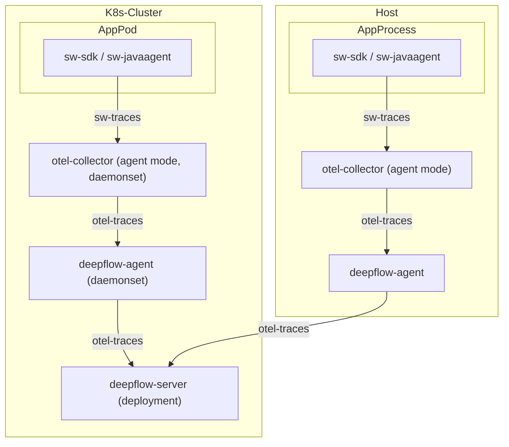

> This document was translated by ChatGPT

# Data Flow



# Configure OpenTelemetry SkyWalking Receiver

## Background Knowledge

You can refer to the [OpenTelemetry documentation](https://opentelemetry.io/docs/) to understand the background knowledge of OpenTelemetry and refer to the previous section [OpenTelemetry Installation](../tracing/opentelemetry/#配置-opentelemetry) for quick installation of OpenTelemetry.

You can refer to the [SkyWalking documentation](https://skywalking.apache.org/docs/) to understand the background knowledge of SkyWalking. This demo does not require a full installation of SkyWalking; we will use OpenTelemetry to integrate SkyWalking's trace data.

## Confirm OpenTelemetry Version

First, you need to enable OpenTelemetry's ability to receive SkyWalking data, process the data through the OpenTelemetry standard protocol, and send it to the DeepFlow Agent.

There is a bug in OpenTelemetry receiving SkyWalking data, which we have recently fixed in these two PRs [#11562](https://github.com/open-telemetry/opentelemetry-collector-contrib/pull/11562) and [#12651](https://github.com/open-telemetry/opentelemetry-collector-contrib/pull/12651). For the following demo, we need the OpenTelemetry [Collector image](https://hub.docker.com/r/otel/opentelemetry-collector-contrib) version `>= 0.57.0`. Please check the image version of the otel-agent in your environment and ensure it meets the requirements. Refer to the previous section [OpenTelemetry Installation](../tracing/opentelemetry/#配置-otel-agent) to update the otel-agent version in your environment.

## Configure OpenTelemetry to Receive SkyWalking Data

After installing OpenTelemetry as described in the [Background Knowledge](#背景知识) section, we can configure OpenTelemetry to receive SkyWalking data using the following steps:

Assuming the namespace where OpenTelemetry is located is `open-telemetry` and the ConfigMap used by otel-agent is named `otel-agent-conf`, use the following command to modify the otel-agent configuration:

```bash
kubectl -n open-telemetry edit cm otel-agent-conf
```

In the `receivers` section, add the following content:

```yaml
receivers:
  # add the following config
  skywalking:
    protocols:
      grpc:
        endpoint: 0.0.0.0:11800
      http:
        endpoint: 0.0.0.0:12800
```

In the `service.pipelines.traces` section, add the following content:

```yaml
service:
  pipelines:
    traces:
      # add receiver `skywalking`
      receivers: [skywalking]
```

At the same time, ensure that the `otel-agent-conf` has completed the corresponding configuration as described in the section [Configure otel-agent](../tracing/opentelemetry/#配置-otel-agent).

Next, use the following command to modify the otel-agent Service to open the corresponding ports:

```bash
kubectl -n open-telemetry patch service otel-agent -p '{"spec":{"ports":[{"name":"sw-http","port":12800,"protocol":"TCP","targetPort":12800},{"name":"sw-grpc","port":11800,"protocol":"TCP","targetPort":11800}]}}'
```

Then, check the connection address configured in the application for the [SkyWalking OAP Server](https://skywalking.apache.org/docs/main/next/en/setup/backend/backend-setup/#requirements-and-default-settings) and modify it to the Service address of the Otel Agent: `otel-agent.open-telemetry`. For example, change the environment variable `SW_AGENT_COLLECTOR_BACKEND_SERVICES=oap-server:11800` to `SW_AGENT_COLLECTOR_BACKEND_SERVICES=otel-agent.open-telemetry:11800`.

Of course, the reporting address configured in the application may take various forms. Please modify it according to the actual startup command of the application. For `Java` applications, just ensure that the address injected in the startup command can be modified, such as: `-Dskywalking.collector.backend_service=otel-agent.open-telemetry:11800`.

Finally, restart the otel-agent to complete the update:

```bash
kubectl rollout restart -n open-telemetry daemonset/otel-agent
```

# Configure DeepFlow

Please refer to the section [Configure DeepFlow](../tracing/opentelemetry/#配置-deepflow) to complete the configuration of the DeepFlow Agent.

# Experience Based on WebShop Demo

## Deploy Demo

This demo comes from [this GitHub repository](https://github.com/liuzhibin-cn/my-demo). It is a WebShop application composed of five microservices written in Spring Boot. Its architecture is as follows:


You can deploy this demo with one click using the following command. This demo has already configured the reporting address, so no additional modifications are needed.

```bash
kubectl apply -f https://raw.githubusercontent.com/deepflowio/deepflow-demo/main/DeepFlow-Otel-SkyWalking-Demo/deepflow-otel-skywalking-demo.yaml
```

## View Tracing Data

Go to Grafana, open the `Distributed Tracing` Dashboard, select `namespace = deepflow-otel-skywalking-demo`, and then you can choose a call to trace.
DeepFlow can correlate and display the tracing data obtained from SkyWalking, eBPF, and BPF in a single trace flame graph,
covering the full-stack call path of a Spring Boot application from business code, system functions, to network interfaces, achieving true full-link distributed tracing, as shown below:


You can also visit the [DeepFlow Online Demo](https://ce-demo.deepflow.yunshan.net/d/Distributed_Tracing/distributed-tracing?var-namespace=deepflow-otel-skywalking-demo&from=deepflow-doc) to see the effect.
