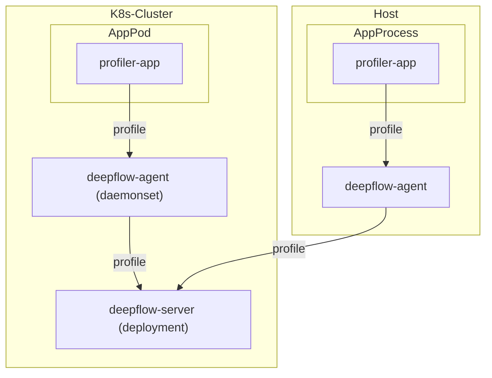

> This document was translated by ChatGPT

# Data Flow



# Configure Application

Currently, DeepFlow supports Profile data (continuous profiling data) integration based on [Pyroscope](https://github.com/grafana/pyroscope) and Golang pprof, Java Jfr.

## Based on Pyroscope SDK

DeepFlow currently supports the integration of Profile data sent using the Pyroscope SDK. You can find the supported language SDKs in the [Pyroscope SDKs](https://grafana.com/docs/pyroscope/latest/configure-client/#pyroscope-sdks-sdk-instrumentation) documentation and complete the instrumentation in your code.

After modifying the code, change the target sending address to DeepFlow Agent via environment variables in the application's runtime environment. For example, in a K8S deployment, add the following environment variables to the deployment file:

```yaml
env:
  - name: PYROSCOPE_SERVER_ADDRESS
    value: http://deepflow-agent.deepflow/api/v1/profile
```

Additionally, to identify different data sources in DeepFlow, explicitly label the application name by adding the following environment variable:

```yaml
env:
  - name: PYROSCOPE_APPLICATION_NAME
    value: application-demo # FIXME: your application name
```

## Based on Golang pprof

Profile data collected based on Golang pprof can also be sent to DeepFlow, but you need to manually add the code logic for active reporting. You can collect Profile data using ["net/http/pprof"](https://pkg.go.dev/net/http/pprof) and expose the data download service. The client requests the `/debug/pprof/profile` interface to get the target pprof data and then sends it to DeepFlow.

Here is a reference code snippet for building the reporting logic:

```go
func main() {
  // Note, the actual URL used here is `/api/v1/profile/ingest`
  deepflowAgentAddress = "http://deepflow-agent.deepflow/api/v1/profile/ingest"
  var pprof io.Reader // FIXME: This is an example, please first get the pprof data from `/debug/pprof/profile`
 err = sendProfileData(pprof, deepflowAgentAddress)
 if err != nil {
  fmt.Println(err)
 }
}

// Build the request
func sendProfileData(pprof io.Reader, remoteURL string) error {
 bodyBuf := &bytes.Buffer{}
 bodyWriter := multipart.NewWriter(bodyBuf)
 pprofWriter, err := bodyWriter.CreateFormFile("profile", "profile.pprof")
 if err != nil {
  return err
 }

 _, err = io.Copy(pprofWriter, pprof)
 if err != nil {
  return err
 }

 err = bodyWriter.Close()
 if err != nil {
  return err
 }

 u, err := url.Parse(remoteURL)
 if err != nil {
  return err
 }

 q := u.Query()
 q.Set("spyName", "gospy")                            // hardcode, no need to modify
 q.Set("name", "application-demo")                    // FIXME: your application name
 q.Set("unit", "samples");                            // FIXME: unit of measurement, see explanation below
 q.Set("from", strconv.Itoa(int(time.Now().Unix())))  // FIXME: profile start time
 q.Set("until", strconv.Itoa(int(time.Now().Unix()))) // FIXME: profile end time
 q.Set("sampleRate", "100")                           // FIXME: actual sampling rate, sampling rate 100=1s/10ms, i.e., sampled every 10ms
 u.RawQuery = q.Encode()

 req, err := http.NewRequest(http.MethodPost, u.String(), bodyBuf)
 if err != nil {
  return err
 }
 req.Header.Set("Content-Type", bodyWriter.FormDataContentType())

 // Send the request
 client := http.Client{}
 resp, err := client.Do(req)
 if err != nil {
  return err
 }
 defer resp.Body.Close()

 if resp.StatusCode != http.StatusOK {
  return fmt.Errorf("server returned non-OK status: %s", resp.Status)
 }

 return nil
}
```

## Based on Java Async Profiler

For Java applications, we support receiving Profile data in [JFR](https://docs.oracle.com/javacomponents/jmc-5-4/jfr-runtime-guide/about.htm) format. You can collect Profile data using Java's built-in [jcmd](https://docs.oracle.com/javase/8/docs/technotes/guides/troubleshoot/tooldescr006.html) or [async-profiler](https://github.com/async-profiler/async-profiler) and send the Jfr format data to DeepFlow.

Here is a reference code snippet for building the reporting logic:

```java
import okhttp3.*;
import okio.BufferedSink;
import okio.GzipSink;
import okio.Okio;

import java.io.IOException;

public class Sender {
 // Note, the actual URL used here is `/api/v1/profile/ingest`
    private static final String DEEPFLOW_AGENT_ADDRESS = "http://deepflow-agent.deepflow/api/v1/profile/ingest";

    public static void main(String[] args) throws IOException {
        sendProfileData(DEEPFLOW_AGENT_ADDRESS);
    }

    private static void sendProfileData(String remoteURL) throws IOException {
        OkHttpClient client = new OkHttpClient();

        byte[] data = new byte[] {}; // FIXME: This is an example, please use the profile tool to get the Jfr content before reporting
        MediaType mediaType = MediaType.parse("application/octet-stream");

        RequestBody requestBody = new RequestBody() {
            @Override
            public MediaType contentType() {
                return mediaType;
            }

   // Use Gzip for compression before transmission
            @Override
            public void writeTo(BufferedSink sink) throws IOException {
                BufferedSink gzipSink = Okio.buffer(new GzipSink(sink));
                gzipSink.write(data);
                gzipSink.close();
            }
        };

        HttpUrl.Builder urlBuilder = HttpUrl.parse(remoteURL).newBuilder();
        urlBuilder.addQueryParameter("name", "application-demo"); // FIXME: your application name
        urlBuilder.addQueryParameter("spyName", "javaspy"); // hardcode, no need to modify
        urlBuilder.addQueryParameter("format", "jfr"); // hardcode, no need to modify
        urlBuilder.addQueryParameter("unit", "samples"); // FIXME: unit of measurement, see explanation below
        urlBuilder.addQueryParameter("from", String.valueOf(System.currentTimeMillis() / 1000)); // FIXME: profile start time
        urlBuilder.addQueryParameter("until", String.valueOf(System.currentTimeMillis() / 1000));// FIXME: profile end time
        urlBuilder.addQueryParameter("sampleRate", "100"); // FIXME: actual sampling rate, sampling rate 100=1s/10ms, i.e., sampled every 10ms
        String urlWithQueryParams = urlBuilder.build().toString();

        Request request = new Request.Builder()
                .url(urlWithQueryParams)
                .post(requestBody)
                .build();

        try (Response response = client.newCall(request).execute()) {
            if (response.isSuccessful()) {
                System.out.println("Profile data sent successfully.");
            } else {
                System.err.println("server returned non-OK status: " + response.code());
            }
        }
    }
}
```

## Reporting Parameter Explanation

| Name       | Type   | Description                                                                                                                                                                                                                                                                                                   |
| ---------- | ------ | ------------------------------------------------------------------------------------------------------------------------------------------------------------------------------------------------------------------------------------------------------------------------------------------------------------- |
| name       | string | Application name, used to identify the reported data. You can also add custom tags to mark different deployment specifications of the same application, e.g., `application-demo{region="cn",deploy="prod"}`                                                                                                   |
| spyName    | string | Used to mark the type of reported data. For Golang applications, it is fixed as `gospy`, and for Java applications, it is fixed as `javaspy`                                                                                                                                                                  |
| format     | string | Profile data format. For Golang, the collected pprof format is `pprof` (default), and for Java, the collected jfr format is `jfr`                                                                                                                                                                             |
| unit       | string | Unit of measurement. Different sampling types have different units. Refer to [here](https://github.com/deepflowio/deepflow/blob/v6.4.9/server/ingester/profile/dbwriter/profile.go#L99) for details. For example, `cpu` uses `samples` as the unit, `memory` uses `bytes` as the unit, and others are similar |
| from       | int    | Profile start time, Unix timestamp (seconds)                                                                                                                                                                                                                                                                  |
| until      | int    | Profile end time, Unix timestamp (seconds)                                                                                                                                                                                                                                                                    |
| sampleRate | int    | Actual sampling rate of the profile                                                                                                                                                                                                                                                                           |

# Configure DeepFlow

Please refer to the [Configure DeepFlow](../tracing/opentelemetry/#配置-deepflow) section to complete the configuration of DeepFlow Agent and open the data integration port.

# Experience with Demo

Use the following commands to quickly deploy the Demo and experience the continuous profiling capability in DeepFlow:

::: code-tabs#shell

@tab Golang

```bash
kubectl apply -f https://raw.githubusercontent.com/deepflowio/deepflow-demo/main/DeepFlow-CP-Demo/deepflow-cp-golang-demo.yaml
```

@tab Java

```bash
kubectl apply -f https://raw.githubusercontent.com/deepflowio/deepflow-demo/main/DeepFlow-CP-Demo/deepflow-cp-java-demo.yaml
```

:::

Then, for the community edition, refer to the [Continuous Profiling - API](../../../features/continuous-profiling/api/) section to obtain the data generated by continuous profiling.
