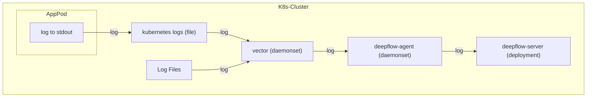

> This document was translated by ChatGPT

# Data Flow



# Configure Vector

## Collect Logs

After installing Vector, we can use the [Kubernetes_Log](https://vector.dev/docs/reference/configuration/sources/kubernetes_logs/) module to collect logs from Pods deployed in Kubernetes. Since DeepFlow has already learned the relevant Labels and Annotations of Pods in Kubernetes through the AutoTagging mechanism, the log stream can be sent without this part to reduce transmission volume. Here is an example configuration:

```yaml
sources:
  kubernetes_logs:
    type: kubernetes_logs
    namespace_annotation_fields:
      namespace_labels: ''
    node_annotation_fields:
      node_labels: ''
    pod_annotation_fields:
      pod_annotations: ''
      pod_labels: ''
```

If you deploy Vector as a process on a cloud server, you can use the [File](https://vector.dev/docs/reference/configuration/sources/file) module to collect logs from a specified path. Here is an example configuration for the `/var/log/` path:

```yaml
sources:
  files_logs:
    type: file
    include:
      - /var/log/*.log
      - /var/log/**/*.log
    exclude:
      # FIXME: If both kubernetes_logs and file modules are configured, remove the k8s log folders to avoid duplicate log monitoring
      - /var/log/pods/**
      - /var/log/containers/**
    fingerprint:
      strategy: 'device_and_inode'
```

## Inject Tags

Next, we can use the [Remap](https://vector.dev/docs/reference/configuration/transforms/remap/) module in Transforms to add necessary tags to the logs being sent. Currently, we require these two tags: `_df_log_type` and `level`. Here is an example configuration:

```yaml
transforms:
  remap_kubernetes_logs:
    type: remap
    inputs:
      - kubernetes_logs
      - files_logs
    source: |-
      # try to parse json
      if is_string(.message) && is_json(string!(.message)) {
          tags = parse_json(.message) ?? {}
          .message = tags.message # FIXME: the log content key inside json
          del(tags.message)
          .json = tags
      }

      if !exists(.level) {
         if exists(.json) {
          .level = .json.level
          del(.json.level)
         } else {
          # match log levels surround by `[]` or `<>` with ignore case
          level_tags = parse_regex(.message, r'[\[\\<](?<level>(?i)INFOR?(MATION)?|WARN(ING)?|DEBUG?|ERROR?|TRACE|FATAL|CRIT(ICAL)?)[\]\\>]') ?? {}
          if !exists(level_tags.level) {
            # match log levels surround by whitespace, required uppercase strictly in case mismatching
            level_tags = parse_regex(.message, r'[\s](?<level>INFOR?(MATION)?|WARN(ING)?|DEBUG?|ERROR?|TRACE|FATAL|CRIT(ICAL)?)[\s]') ?? {}
          }
          if exists(level_tags.level) {
            level_tags.level = upcase(string!(level_tags.level))
            .level = level_tags.level
          }
        }
      }

      if !exists(._df_log_type) {
          # default log type
          ._df_log_type = "user"
      }

      if !exists(.app_serivce) {
          # FIXME: files module does not have this field, please inject the application name through the log content
          .app_serivce = .kubernetes.container_name
      }
```

In this code snippet, we assume that we might get both JSON formatted and non-JSON formatted log content. For both types of logs, we attempt to extract their log level `level`. For JSON formatted logs, we extract their content to the outer `message` field and put all remaining JSON keys into a field named `json`. At the end of this code, we add the tags `_df_log_type=user` and `app_service=kubernetes.container_name` to both types of logs.

If you need to match more complex log formats in actual use, you can refer to the [Vrl](https://vector.dev/docs/reference/vrl/) syntax rules to customize your log extraction rules.

## Common Configurations

In addition to the above configurations, the Transforms module can implement many features to help us get more precise information from logs. Here are some common configurations:

### Merge Multi-line Logs

Usage suggestion: Use regex to match the "start pattern" of the log. Before encountering the next "start pattern", aggregate all logs into one log message and retain the newline character. To reduce mismatches, use a date-time format like `yyyy-MM-dd HH:mm:ss` to match the beginning of a log line.

```yaml
transforms:
  # The configuration comes from https://vector.dev/docs/reference/configuration/transforms/reduce/
  multiline_kubernetes_logs:
    type: reduce
    inputs:
      - kubernetes_logs
    group_by:
      - file
      - stream
    merge_strategies:
      message: concat_newline
    starts_when: match(string!(.message), r'^(\[|\[?\u001B\[[0-9;]*m|\{\".+\"|(::ffff:)?([0-9]{1,3}.){3}[0-9]{1,3}[\s\-]+(\[)?)?\d{4}[-\/\.]?\d{2}[-\/\.]?\d{2}[T\s]?\d{2}:\d{2}:\d{2}')
    expire_after_ms: 2000 # unit: ms, aggregate logs max waiting timeout
    flush_period_ms: 500 # unit: ms, flush expire events
```

### Filter Color Control Characters

Usage suggestion: Use regex to filter color control characters in logs to increase log readability.

```yaml
transforms:
  # The configuration comes from https://vector.dev/docs/reference/configuration/transforms/remap/
  flush_kubernetes_logs:
    type: remap
    inputs:
      - multiline_kubernetes_logs
    source: |-
      .message = replace(string!(.message), r'\u001B\[([0-9]{1,3}(;[0-9]{1,3})*)?m', "")
```

### Extract Log Levels

Usage suggestion: Use regex to try to match the log levels appearing in the logs. To reduce mismatches, symbols like `[]` can be added around the log levels.

```yaml
transforms:
  # The configuration comes from https://vector.dev/docs/reference/configuration/transforms/remap/
  remap_kubernetes_logs:
    type: remap
    inputs:
      - flush_kubernetes_logs
    source: |-
      # match log levels surround by `[]` or `<>` with ignore case
      level_tags = parse_regex(.message, r'[\[\\<](?<level>(?i)INFOR?(MATION)?|WARN(ING)?|DEBUG?|ERROR?|TRACE|FATAL|CRIT(ICAL)?)[\]\\>]') ?? {}
      if !exists(level_tags.level) {
        # match log levels surround by whitespace, required uppercase strictly in case mismatching
        level_tags = parse_regex(.message, r'[\s](?<level>INFOR?(MATION)?|WARN(ING)?|DEBUG?|ERROR?|TRACE|FATAL|CRIT(ICAL)?)[\s]') ?? {}
      }
      if exists(level_tags.level) {
        level_tags.level = upcase(string!(level_tags.level))
        .level = level_tags.level
      }
```

## Send

Finally, we use the [HTTP](https://vector.dev/docs/reference/configuration/sinks/http/) module to send logs to the DeepFlow Agent.

```yaml
sinks:
  http:
    encoding:
      codec: json
    inputs:
      - remap_kubernetes_logs # NOTE: Note that the data source here is the key of the transform module
    type: http
    uri: http://deepflow-agent.deepflow/api/v1/log
```

Combining these three modules allows us to collect logs, inject tags, and finally send them to DeepFlow.

# Configure DeepFlow

To enable the DeepFlow Agent to receive this data, please refer to the [Configure DeepFlow](../tracing/opentelemetry/#配置-deepflow) section to complete the DeepFlow Agent configuration.