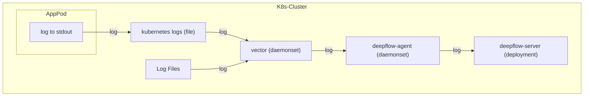

> This document was translated by ChatGPT

# Data Flow



# Configure Vector

## Collect Logs

After installing Vector, we can use the [Kubernetes_Log](https://vector.dev/docs/reference/configuration/sources/kubernetes_logs/) module to collect logs from Pods deployed in Kubernetes. Since DeepFlow has already learned the relevant Labels and Annotations of Pods in Kubernetes through the AutoTagging mechanism, the log stream can be sent without this part to reduce transmission volume. The sample configuration is as follows:

```yaml
sources:
  kubernetes_logs:
    type: kubernetes_logs
    namespace_annotation_fields:
      namespace_labels: ''
    node_annotation_fields:
      node_labels: ''
    pod_annotation_fields:
      pod_annotations: ''
      pod_labels: ''
```

If you deploy Vector as a process on a cloud server, you can use the [File](https://vector.dev/docs/reference/configuration/sources/file) module to collect logs from a specified path. Taking the `/var/log/` path as an example, the sample configuration is as follows:

```yaml
sources:
  files_logs:
    type: file
    include:
      - /var/log/*.log
      - /var/log/**/*.log
    exclude:
      # FIXME: If both kubernetes_logs and file modules are configured, to avoid duplicate log content, the k8s log folder needs to be excluded
      - /var/log/pods/**
      - /var/log/containers/**
    fingerprint:
      strategy: 'device_and_inode'
```

## Inject Tags

Next, we can use the [Remap](https://vector.dev/docs/reference/configuration/transforms/remap/) module in Transforms to add necessary tags to the sent logs. Currently, we require these two tags: `_df_log_type` and `level`. Below is a sample configuration:

```yaml
transforms:
  remap_kubernetes_logs:
    type: remap
    inputs:
      - kubernetes_logs
      - files_logs
    source: |-
      # try to parse json
      if is_string(.message) && is_json(string!(.message)) {
          tags = parse_json(.message) ?? {}
          .message = tags.message # FIXME: the log content key inside json
          del(tags.message)
          .json = tags
      }

      if !exists(.level) {
         if exists(.json) {
            .level = .json.level
            del(.json.level)
         } else {
           level_tags = parse_regex(.message, r'[\s\[](?<level>INFO|WARN|WARNING|DEBUG|ERROR|TRACE|FATAL)[\s\]]') ?? {}
              .level = level_tags.level
           }
      }

      if !exists(._df_log_type) {
          # default log type
          ._df_log_type = "user"
      }

      if !exists(.app_serivce) {
          # FIXME: files module does not have this field, please inject the application name through the log content
          .app_serivce = .kubernetes.container_name
      }
```

In this code snippet, we assume that we might get both JSON formatted logs and non-JSON formatted logs. For both types of logs, we try to extract their log level `level`. For JSON formatted logs, we extract their content to the outer `message` field and put all remaining JSON keys into a field named `json`. At the end of this code, we add the tags `_df_log_type=user` and `app_service=kubernetes.container_name` to both types of logs.

If you need to match richer log formats in actual use, you can refer to the [Vrl](https://vector.dev/docs/reference/vrl/) syntax rules to customize your log extraction rules.

## Send

Finally, we use the [HTTP](https://vector.dev/docs/reference/configuration/sinks/http/) module to send logs to the DeepFlow Agent.

```yaml
sinks:
  http:
    encoding:
      codec: json
    inputs:
      - remap_kubernetes_logs # NOTE: Note that the data source here is the key of the transform module
    type: http
    uri: http://deepflow-agent.deepflow/api/v1/log
```

By combining these three modules, you can collect logs, inject tags, and finally send them to DeepFlow.

# Configure DeepFlow

To allow the DeepFlow Agent to receive this data, please refer to the [Configure DeepFlow](../tracing/opentelemetry/#配置-deepflow) section to complete the DeepFlow Agent configuration.
