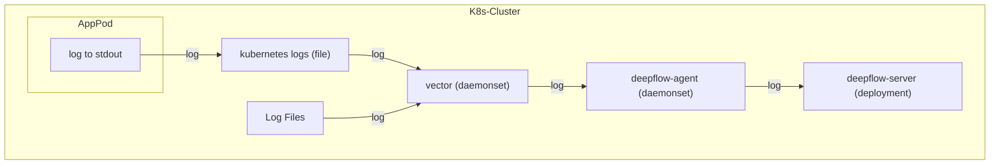
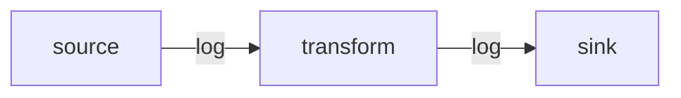

> This document was translated by ChatGPT

# Data Flow



# Configure Vector

## Install Vector

You can learn the relevant background knowledge in the [Vector documentation](https://vector.dev/docs/).
If your cluster does not have Vector, you can deploy Vector using the following steps:

::: code-tabs#shell

@tab APT Deployment

```bash
## Add Vector repo
bash -c "$(curl -L https://setup.vector.dev)"
apt-get install vector -y
vector --version
### config file /etc/vector/vector.yaml
systemctl start vector
systemctl enable vector
```

@tab YUM Deployment

```bash
## Add Vector repo
bash -c "$(curl -L https://setup.vector.dev)"
yum install vector -y
vector --version

### config file /etc/vector/vector.yaml
systemctl start vector
systemctl enable vector
```

@tab K8s Cluster Deployment

```bash
helm repo add vector https://helm.vector.dev
helm repo update

cat << EOF > vector-values-custom.yaml
role: Agent
# FIXME: add nodeSelector here for deepflow
#nodeSelector:
#  allow/vector: "false"

# resources -- Set Vector resource requests and limits.
resources:
  requests:
    cpu: 200m
    memory: 256Mi
  limits:
    cpu: 200m
    memory: 256Mi
image:
  repository: timberio/vector
  tag: 0.37.1-distroless-libc
podLabels:
  vector.dev/exclude: "true"
  app: deepflow
# extraVolumes -- Additional Volumes to use with Vector Pods.
  # extraVolumes:
  # - name: opt-log
  #   hostPath:
  #     path: "/opt/log/"
# extraVolumeMounts -- Additional Volume to mount into Vector Containers.
  # extraVolumeMounts:
  # - name: opt-log
  #   mountPath: "/opt/log/"
  #   readOnly: true
customConfig:
  ## The configuration comes from https://vector.dev/docs/reference/configuration/global-options/#data_dir
  data_dir: /vector-data-dir
  api:
    enabled: true
    address: 127.0.0.1:8686
    playground: false
  sources:
    kubernetes_logs:
      type: kubernetes_logs
      namespace_annotation_fields:
        namespace_labels: ""
      node_annotation_fields:
        node_labels: ""
      pod_annotation_fields:
        pod_annotations: ""
        pod_labels: ""

  transforms:
    remap_kubernetes_logs:
      type: remap
      inputs:
      - kubernetes_logs
      source: |-
        # try to parse json
        if is_string(.message) && is_json(string!(.message)) {
            tags = parse_json(.message) ?? {}
            .message = tags.message # FIXME: the log content key inside json
            del(tags.message)
            .json = tags
        }

        if !exists(.level) {
           if exists(.json) {
            .level = .json.level
            del(.json.level)
           } else {
            # match log levels surround by ``[]`` or ``<>`` with ignore case
            level_tags = parse_regex(.message, r'[\[\\\<](?<level>(?i)INFOR?(MATION)?|WARN(ING)?|DEBUG?|ERROR?|TRACE|FATAL|CRIT(ICAL)?)[\]\\\>]') ?? {}
            if !exists(level_tags.level) {
              # match log levels surround by whitespace, required uppercase strictly in case mismatching
              level_tags = parse_regex(.message, r'[\s](?<level>INFOR?(MATION)?|WARN(ING)?|DEBUG?|ERROR?|TRACE|FATAL|CRIT(ICAL)?)[\s]') ?? {}
            }
            if exists(level_tags.level) {
              level_tags.level = upcase(string!(level_tags.level))
              .level = level_tags.level
            }
          }
        }

        if !exists(._df_log_type) {
            # default log type
            ._df_log_type = "user"
        }

        if !exists(.app_service) {
            .app_service = .kubernetes.container_name
        }
  sinks:
    http:
      encoding:
        codec: json
      inputs:
      - remap_kubernetes_logs
      type: http
      uri: http://deepflow-agent.deepflow/api/v1/log
EOF
helm install vector vector/vector \
  --namespace vector \
  --create-namespace \
  -f vector-values-custom.yaml
```

:::

Before configuring, you can first understand the [Vector workflow](https://vector.dev/docs/about/under-the-hood/architecture/pipeline-model/), where data flows through the following modules in sequence, from the source to the destination:



## Collect Logs

After installing Vector, we can use the [Kubernetes_Log](https://vector.dev/docs/reference/configuration/sources/kubernetes_logs/) module to collect logs from Pods deployed in Kubernetes. Since DeepFlow has already actively learned the labels and annotations related to Pods in Kubernetes through the AutoTagging mechanism, the log stream can be sent without this part to reduce transmission volume. The sample configuration is as follows:

```yaml
sources:
  kubernetes_logs:
    type: kubernetes_logs
    namespace_annotation_fields:
      namespace_labels: ''
    node_annotation_fields:
      node_labels: ''
    pod_annotation_fields:
      pod_annotations: ''
      pod_labels: ''
```

If you deploy Vector as a process on a cloud server, you can use the [File](https://vector.dev/docs/reference/configuration/sources/file) module to collect logs from a specified path. Taking the `/var/log/` path as an example, the sample configuration is as follows:

```yaml
sources:
  files_logs:
    type: file
    include:
      - /var/log/*.log
      - /var/log/**/*.log
    exclude:
      # FIXME: If both kubernetes_logs and file modules are configured, to avoid duplicate log content, remove the k8s log folder
      - /var/log/pods/**
      - /var/log/containers/**
    fingerprint:
      strategy: 'device_and_inode'
```

## Inject Tags

Then, we can use the [Remap](https://vector.dev/docs/reference/configuration/transforms/remap/) module in Transforms to add necessary tags to the sent logs. Currently, we require these two tags: `_df_log_type` and `level`. Below is a sample configuration:

```yaml
transforms:
  remap_kubernetes_logs:
    type: remap
    inputs:
      - kubernetes_logs
      - files_logs
    source: |-
      # try to parse json
      if is_string(.message) && is_json(string!(.message)) {
          tags = parse_json(.message) ?? {}
          .message = tags.message # FIXME: the log content key inside json
          del(tags.message)
          .json = tags
      }

      if !exists(.level) {
         if exists(.json) {
          .level = .json.level
          del(.json.level)
         } else {
          # match log levels surround by `[]` or `<>` with ignore case
          level_tags = parse_regex(.message, r'[\[\\<](?<level>(?i)INFOR?(MATION)?|WARN(ING)?|DEBUG?|ERROR?|TRACE|FATAL|CRIT(ICAL)?)[\]\\>]') ?? {}
          if !exists(level_tags.level) {
            # match log levels surround by whitespace, required uppercase strictly in case mismatching
            level_tags = parse_regex(.message, r'[\s](?<level>INFOR?(MATION)?|WARN(ING)?|DEBUG?|ERROR?|TRACE|FATAL|CRIT(ICAL)?)[\s]') ?? {}
          }
          if exists(level_tags.level) {
            level_tags.level = upcase(string!(level_tags.level))
            .level = level_tags.level
          }
        }
      }

      if !exists(._df_log_type) {
          # default log type
          ._df_log_type = "user"
      }

      if !exists(.app_service) {
          # FIXME: files module does not have this field, please inject the application name through the log content
          .app_service = .kubernetes.container_name
      }
```

In this code snippet, we assume that we may get both JSON formatted log content and non-JSON formatted log content. For both types of logs, we try to extract their log level `level`. For JSON formatted logs, we extract their content to the outer `message` field and put all remaining JSON keys into a field named `json`. At the end of this code, we tag both types of logs with `_df_log_type=user` and `app_service=kubernetes.container_name`.

If there are richer log formats that need to be matched in actual use, you can refer to the [Vrl](https://vector.dev/docs/reference/vrl/) syntax rules to customize your log extraction rules.

## Common Configurations

In addition to the above configurations, the Transforms module can also implement many features to help us get more accurate information from the logs. Here are some common configurations:

### Merge Multi-line Logs

Usage suggestion: Use regex to match the "start pattern" of the log. Before encountering the next "start pattern", all logs are aggregated into one log message and retain the newline character. To reduce mismatches, use a date-time format like `yyyy-MM-dd HH:mm:ss` to match the beginning of a log line.

```yaml
transforms:
  # The configuration comes from https://vector.dev/docs/reference/configuration/transforms/reduce/
  multiline_kubernetes_logs:
    type: reduce
    inputs:
      - kubernetes_logs
    group_by:
      - file
      - stream
    merge_strategies:
      message: concat_newline
    starts_when: match(string!(.message), r'^(\[|\[?\u001B\[[0-9;]*m|\{\".+\"|(::ffff:)?([0-9]{1,3}.){3}[0-9]{1,3}[\s\-]+(\[)?)?\d{4}[-\/\.]?\d{2}[-\/\.]?\d{2}[T\s]?\d{2}:\d{2}:\d{2}')
    expire_after_ms: 2000 # unit: ms, aggregate logs max waiting timeout
    flush_period_ms: 500 # unit: ms, flush expire events
```

### Filter Color Control Characters

Usage suggestion: Use regex to filter color control characters in the log to increase log readability.

```yaml
transforms:
  # The configuration comes from https://vector.dev/docs/reference/configuration/transforms/remap/
  flush_kubernetes_logs:
    type: remap
    inputs:
      - multiline_kubernetes_logs
    source: |-
      .message = replace(string!(.message), r'\u001B\[([0-9]{1,3}(;[0-9]{1,3})*)?m', "")
```

### Extract Log Levels

Usage suggestion: Use regex to try to match the log levels that appear in the log. To reduce mismatches, symbols like `[]` can be added around the log level.

```yaml
transforms:
  # The configuration comes from https://vector.dev/docs/reference/configuration/transforms/remap/
  remap_kubernetes_logs:
    type: remap
    inputs:
      - flush_kubernetes_logs
    source: |-
      # match log levels surround by `[]` or `<>` with ignore case
      level_tags = parse_regex(.message, r'[\[\\<](?<level>(?i)INFOR?(MATION)?|WARN(ING)?|DEBUG?|ERROR?|TRACE|FATAL|CRIT(ICAL)?)[\]\\>]') ?? {}
      if !exists(level_tags.level) {
        # match log levels surround by whitespace, required uppercase strictly in case mismatching
        level_tags = parse_regex(.message, r'[\s](?<level>INFOR?(MATION)?|WARN(ING)?|DEBUG?|ERROR?|TRACE|FATAL|CRIT(ICAL)?)[\s]') ?? {}
      }
      if exists(level_tags.level) {
        level_tags.level = upcase(string!(level_tags.level))
        .level = level_tags.level
      }
```

### Extract Custom Tags

If the application needs to inject some custom tags for filtering logs, similarly, you can use the Remap module of Transforms to write a piece of code to inject tags. We require custom tags to be written into the `.json` structure to be stored and queried. The example is as follows:

```yaml
transforms:
  # The configuration comes from https://vector.dev/docs/reference/configuration/transforms/remap/
  inject_json_tags:
    type: remap
    inputs:
      - remap_kubernetes_logs
    source: |-
      .json = {
        "cluster": "Production",
        "extra_user_tag": "xxxxx" # FIXME: Customize the tags you need to add
      }
```

Then, when using the [SQL API](../../output/query/sql) for querying, you can use the following statement to filter the injected tags:

```bash
curl -XPOST "http://${deepflow_server_node_ip}:${port}/v1/query/" \
    --data-urlencode "db=application_log" \
    --data-urlencode "sql=select attribute.cluster, body from log where attribute.cluster='Production'"
```

## Send

Finally, we use the [HTTP](https://vector.dev/docs/reference/configuration/sinks/http/) module to send logs to the DeepFlow Agent.

```yaml
sinks:
  http:
    encoding:
      codec: json
    inputs:
      - remap_kubernetes_logs # NOTE: The data source here is the key of the transform module
    type: http
    uri: http://deepflow-agent.deepflow/api/v1/log
```

Combining these three modules together, you can collect logs, inject tags, and finally send them to DeepFlow.

## Complete Example

Based on the above explanation, we provide a complete example. Assuming the collection target is an **nginx application deployed on a cloud server**, you can collect its logs and send them to DeepFlow with the following configuration:

```yaml
sources:
  nginx_logs:
    type: file
    include:
      - /var/log/nginx/*.log
    fingerprint:
      strategy: 'device_and_inode'
transforms:
  tag_nginx_log:
    type: remap
    inputs:
      - nginx_logs
    source: |-
      source = parse_regex(.file, r'\/var\/log\/(?<file_source>.+)\.log') ?? {}
      source.file_source = replace!(source.file_source, "/", "-")
      hostname, _ = get_hostname()
      .app_service = hostname + "-" + source.file_source
      .json = {
        "cluster": "Production",
        "module": "nginx"
      }
sinks:
  http:
    encoding:
      codec: json
    inputs:
      - tag_nginx_log
    uri: http://${deepflow-agent-host}:${port}/api/v1/log # FIXME: Fill in the target DeepFlow Agent address that can receive data here
    type: http
```

# Configure DeepFlow

To allow the DeepFlow Agent to receive this part of the data, please refer to the [Configure DeepFlow](../tracing/opentelemetry/#配置-deepflow) section to complete the DeepFlow Agent configuration.