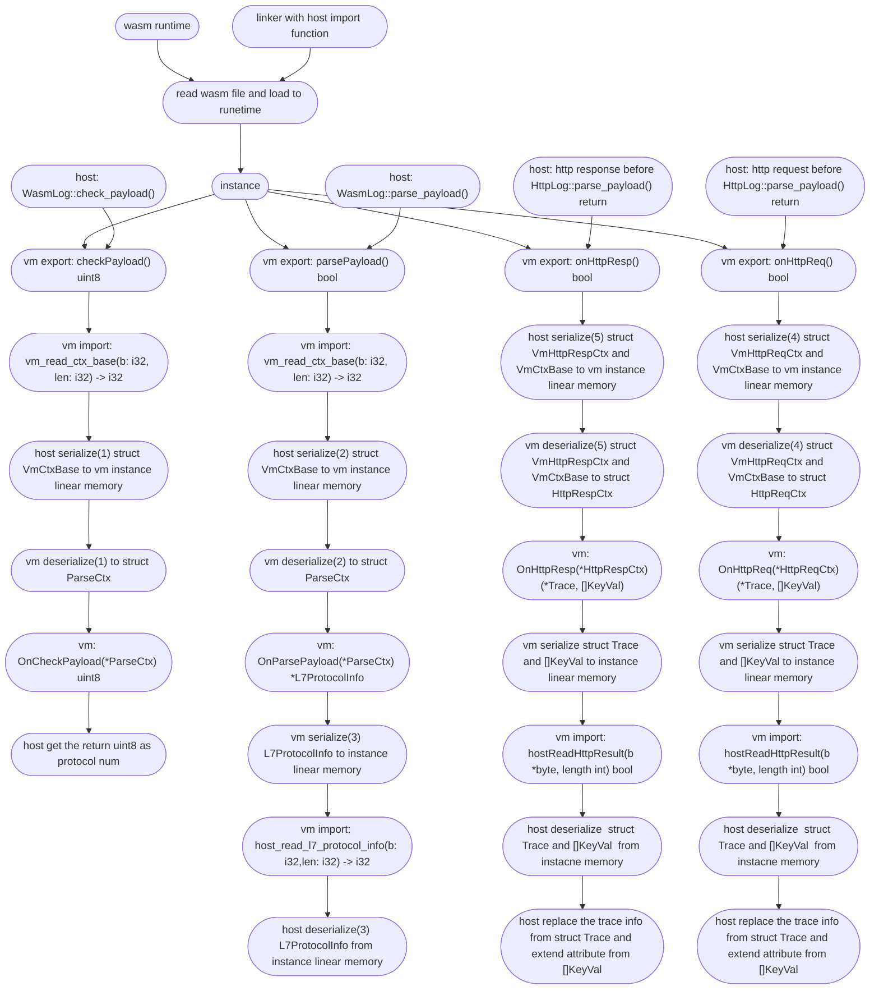

> This document was translated by ChatGPT

# About the Wasm Plugin System

The Wasm plugin system implements user-defined functions by invoking Wasi Export Functions at fixed points. We provide some examples in [this repository](https://github.com/deepflowio/deepflow-wasm-go-sdk/tree/main/example), which can help you understand the current capabilities of the DeepFlow Wasm Plugin:

| Category       | Directory           | Description                        |
| -------------- | ------------------- | ----------------------------------- |
| Enhance known protocols | http                | Parse JSON over HTTP/HTTP2/gRPC    |
|                | http_status_rewrite | Parse JSON over HTTP/HTTP2/gRPC    |
|                | dubbo               | Parse JSON over Dubbo              |
|                | nats                | Parse Protobuf (nRPC) over NATS    |
|                | zmtp                | Parse Protobuf over ZMTP           |
| Treat as new protocol | krpc                | Parse Protobuf over TCP            |
|                | go_http2_uprobe     | Parse Protobuf over HTTP2          |
|                | dns                 | Demonstrate how to parse DNS as a new protocol |

For developing Wasm Plugins, you can also refer to this blog post: [使用 DeepFlow Wasm 插件实现业务可观测性](https://www.deepflow.io/blog/zh/035-deepflow-enabling-zero-code-observability-for-applications-by-webAssembly/).

For HTTP2 and gRPC protocols, deepflow-agent already has built-in full header field parsing capabilities, and you can configure deepflow-agent to collect specific header fields via agent-group-config. Therefore, the HTTP2/gRPC Wasm Plugin only needs to parse the Payload. Note that there are two collection methods: cBPF/eBPF-kprobe (compressed Header + raw Payload) and eBPF-uprobe (raw Header + raw Payload), and the plugin writing method differs:

- For data collected via cBPF/eBPF-kprobe, write the plugin by referring to the `http` plugin in the table above to parse the Payload.
- For data collected via eBPF-uprobe, currently only supported as a new protocol to be re-parsed in the Plugin, refer to the `go_http2_uprobe` plugin in the table above (enhancement support is still under development).

# Golang SDK Instructions

Currently, only the Golang SDK is provided, with more languages to be supported in the future. The Golang SDK requires tinygo for compilation. Below is a brief guide on how to quickly develop a plugin in Golang.

```go
package main

import (
	"github.com/deepflowio/deepflow-wasm-go-sdk/sdk"
	_ "github.com/wasilibs/nottinygc" // Use nottinygc as an alternative memory allocator for TinyGo WASI compilation; the default allocator may have performance issues with large data volumes
)

// Define a struct that implements the sdk.Parser interface
type plugin struct {
}

/*
    The returned array indicates the hook points where the agent should invoke the plugin's corresponding Export function. Currently, there are 3 hook points:
        HOOK_POINT_HTTP_REQ       Before returning after HTTP request parsing is complete
        HOOK_POINT_HTTP_RESP      Before returning after HTTP response parsing is complete
        HOOK_POINT_PAYLOAD_PARSE  Protocol detection and parsing
*/
func (p plugin) HookIn() []sdk.HookBitmap {
	return []sdk.HookBitmap{
		sdk.HOOK_POINT_HTTP_REQ,
		sdk.HOOK_POINT_HTTP_RESP,
        sdk.HOOK_POINT_PAYLOAD_PARSE,
	}
}

// When HookIn() includes HOOK_POINT_HTTP_REQ, it will be called before returning after HTTP request parsing is complete.
// HttpReqCtx contains BaseCtx and some already parsed HTTP headers
func (p plugin) OnHttpReq(ctx *sdk.HttpReqCtx) sdk.Action {
    // baseCtx includes IP, port, L4 protocol, packet direction, etc.
    baseCtx := &ctx.BaseCtx

    // Optional port and path filtering
	if baseCtx.DstPort != 8080 || !strings.HasPrefix(ctx.Path, "/user_info?") {
		return sdk.ActionNext()
	}

    // payload is the application layer data, which may be truncated
	payload, err := baseCtx.GetPayload()
    if err != nil {
		return sdk.ActionAbortWithErr(err)
	}

    var(
        trace = &sdk.Trace{}
        attr = []sdk.KeyVal{}
    )

    // some logic here
    //...

    // Return result
    return sdk.HttpReqActionAbortWithResult(nil, trace, attr)
}


/*
    When HookIn() includes HOOK_POINT_HTTP_RESP, it will be called before returning after HTTP response parsing is complete.
    HttpRespCtx contains BaseCtx and the response code.
    The rest of the processing is basically the same as OnHttpReq.
*/
func (p plugin) OnHttpResp(ctx *sdk.HttpRespCtx) sdk.Action {
    return sdk.ActionNext()
}

/*
    When HookIn() includes HOOK_POINT_PAYLOAD_PARSE, it will be called during protocol detection.
    You need to return a unique protocol number and protocol name; returning 0 as the protocol number indicates failure.
*/
func (p plugin) OnCheckPayload(baseCtx *sdk.ParseCtx) (uint8, string) {
	return 0, ""
}

func (p plugin) OnParsePayload(baseCtx *sdk.ParseCtx) sdk.ParseAction {
    // ctx.L7 is the protocol number returned by OnCheckPayload; you can filter based on L4 protocol or protocol number first.
    if ctx.L4 != sdk.TCP || ctx.L7 != 1 {
		return sdk.ActionNext()
	}

	payload, err := ctx.GetPayload()
	if err != nil {
		return sdk.ActionAbortWithErr(err)
	}
    // the parse logic here
    // ...

    /*
        About the L7ProtocolInfo structure:
            type L7ProtocolInfo struct {
                ReqLen    *int       // Request length, e.g., HTTP content-length
                RespLen   *int       // Response length, e.g., HTTP content-length
                RequestID *uint32    // Substream ID, e.g., HTTP2 stream ID, DNS transaction ID
                Req       *Request
                Resp      *Response
                Trace     *Trace     // Tracing information
                Kv        []KeyVal   // Corresponding attributes
            }

            type Request struct {
                ReqType  string  // Request type
                Domain   string  // Request domain
                Resource string  // Request resource
                Endpoint string  // Endpoint
            }

            type Response struct {
                Status    RespStatus // Response status
                Code      *int32     // Response code
                Result    string     // Response result
                Exception string     // Response exception
            }
    */
    return sdk.ParseActionAbortWithL7Info([]*sdk.L7ProtocolInfo{})
}


// main needs to register the parser
func main() {
    sdk.SetParser(plugin{})
	sdk.Warn("xxx wasm plugin registered")
}
// About return values
/*
    The agent can load multiple wasm plugins and will iterate through all plugins to call the corresponding Export functions, but the iteration behavior can be controlled via return values.

    Return values include:
        sdk.ActionNext()                 Stop current plugin and execute the next plugin
        sdk.ActionAbort()                Stop current plugin and stop iteration
        sdk.ActionAbortWithErr(err)      Stop current plugin, log the error, and stop iteration

        sdk.HttpActionAbortWithResult()
        sdk.ParseActionAbortWithL7Info()  Agent stops iteration and extracts the corresponding return result
*/
```

# Compiling and Loading the Plugin

## Compile the plugin

Use the following command to compile the Wasm program:

```sh
# To replace TinyGo's default memory allocator with nottinygc, add the compile parameters: -gc=custom and -tags=custommalloc
tinygo build -o wasm.wasm -gc=custom -tags=custommalloc -target=wasi -panic=trap -scheduler=none -no-debug ./main.go
```

## Upload the plugin

Upload the wasm file to the corresponding node and execute:

```sh
deepflow-ctl plugin create  --type wasm --image wasm.wasm --name wasm
```

## Load the plugin

Add the following in the [agent-group configuration](../../best-practice/agent-advanced-config/#agent-group-config-常用操作):

```
wasm_plugins:
  - wasm // Corresponds to the name of the plugin uploaded via deepflow-ctl
```

# Related Issues and Limitations

- Cannot use `go func()`. You can remove the `-scheduler=none` parameter to compile, but it will not produce the desired effect.
- Cannot use `time.Sleep()`, as this will prevent the Wasm plugin from loading.
- If the plugin execution time is too long, it will block the agent for a long time; if it enters an infinite loop, the agent will remain blocked.
- tinygo has certain limitations for Go's standard library and third-party libraries; not all Go code or libraries can be used. For standard library support, refer to [tinygo package supported](https://tinygo.org/docs/reference/lang-support/stdlib/). Note that this list is for reference only; "Passes tests" showing "no" does not mean it cannot be used at all. For example, `fmt.Sprintf()` works, but `fmt.Println()` does not.
- Since Go 1.21 supports wasi, if you need to use built-in serialization-related libraries (json, yaml, xml, etc.), you need Go version >= 1.21 and tinygo version >= 0.29.
- Structures returned from Parser (L7ProtocolInfo, Trace, []KeyVal) are serialized into linear memory. Currently, each structure's serialization allocates a fixed 1 page (65536 bytes) of memory; if the returned structure is too large, serialization will fail.
- The agent determines a stream's application layer protocol by iterating through all supported protocols. The current order is HTTP -> Wasm Hook -> DNS -> ... . Wasm's priority is second only to HTTP, so user-defined protocol detection and parsing can override the agent's existing protocol detection and parsing (except HTTP/HTTP2). For example, in [this example](https://github.com/deepflowio/deepflow-wasm-go-sdk/blob/5393818adf94f2f9b296de82e20f614ba3b2336a/example/dns/dns.go), DNS parsing is overridden, and the agent will not execute the default DNS parsing logic.
- Due to network environment and protocol complexity, incomplete application layer data frames may be received (e.g., IP fragmentation due to MTU limits, TCP receive window or flow control congestion window shrinkage, small MSS, etc.), making it impossible to obtain complete application layer data frames. Transport layer connection tracking is not yet implemented. Additionally, overly long application layer data will be truncated.

# Wasm Plugin Execution Flow

Before understanding the Wasm plugin execution flow, you should have a general understanding of deepflow's protocol parsing. You can refer to [DeepFlow Protocol Development Documentation](https://github.com/deepflowio/deepflow/blob/main/docs/HOW_TO_SUPPORT_YOUR_PROTOCOL_CN.MD).

The Wasm plugin execution flow is as follows:



The serialized/deserialized structures include 6 types:

- VmCtxBase
  - In all current Export function calls, the host serializes VmCtxBase into linear memory. The serialization format can be found [here](https://github.com/deepflowio/deepflow/blob/0da738106f710cad9bbce6632384105b1b868e59/agent/src/plugin/wasm/vm.rs#L199)
  - Similarly, the instance will deserialize it; see the code [here](https://github.com/deepflowio/deepflow-wasm-go-sdk/blob/5393818adf94f2f9b296de82e20f614ba3b2336a/sdk/serde.go#L73).
- L7ProtocolInfo
  - At the end of the parse_payload Export function, the instance serializes L7ProtocolInfo into linear memory. The serialization format and code can be found [here](https://github.com/deepflowio/deepflow-wasm-go-sdk/blob/5393818adf94f2f9b296de82e20f614ba3b2336a/sdk/serde.go#L335)
  - The host will also deserialize it; see the code [here](https://github.com/deepflowio/deepflow/blob/0da738106f710cad9bbce6632384105b1b868e59/agent/src/plugin/mod.rs#L152).
- VmHttpReqCtx
  - Before returning after HTTP request parsing is complete, the Export function on_http_req is called, and the host serializes VmCtxBase and VmHttpReqCtx into the instance's linear memory.
  - The serialization code and format for VmHttpReqCtx can be found [here](https://github.com/deepflowio/deepflow/blob/0da738106f710cad9bbce6632384105b1b868e59/agent/src/plugin/wasm/vm.rs#L328)
  - The instance deserialization code can be found [here](https://github.com/deepflowio/deepflow-wasm-go-sdk/blob/5393818adf94f2f9b296de82e20f614ba3b2336a/sdk/serde.go#L173).
- VmHttpRespCtx
  - Before returning after HTTP response parsing is complete, the Export function on_http_resp is called, and the host serializes VmCtxBase and VmHttpRespCtx into the instance's linear memory.
  - The serialization format for VmHttpRespCtx can be found [here](https://github.com/deepflowio/deepflow/blob/0da738106f710cad9bbce6632384105b1b868e59/agent/src/plugin/wasm/vm.rs#L395)
  - The instance deserialization code can be found [here](https://github.com/deepflowio/deepflow-wasm-go-sdk/blob/5393818adf94f2f9b296de82e20f614ba3b2336a/sdk/serde.go#L232).
- Trace, []KeyVal
  - Before returning from the Export functions on_http_req/on_http_resp, the instance serializes Trace and []KeyVal into linear memory.
  - The serialization code can be found [here](https://github.com/deepflowio/deepflow-wasm-go-sdk/blob/5393818adf94f2f9b296de82e20f614ba3b2336a/sdk/serde.go#L515)
  - The deserialization code and format can be found [here](https://github.com/deepflowio/deepflow/blob/0da738106f710cad9bbce6632384105b1b868e59/agent/src/plugin/wasm/abi_import.rs#L376).