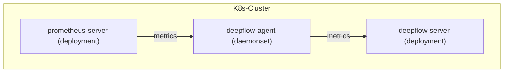
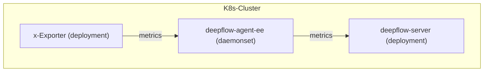

> This document was translated by ChatGPT

# Data Flow



# Configure Prometheus

## Install Prometheus

You can learn the relevant background information in the [Prometheus documentation](https://prometheus.io/docs/introduction/overview/).  
If your cluster does not have Prometheus, you can quickly deploy one in the `deepflow-prometheus-demo` namespace using the following steps:

```bash
# add helm chart
helm repo add prometheus-community https://prometheus-community.github.io/helm-charts
helm repo update

# install prometheus
helm install prometheus prometheus-community/prometheus -n deepflow-prometheus-demo --create-namespace
```

## Configure remote_write

We need to configure Prometheus `remote_write` to send data to the DeepFlow Agent.

First, determine the address of the data listening service started by the DeepFlow Agent. After [installing DeepFlow Agent](../../../ce-install/single-k8s/), the DeepFlow Agent Service address will be displayed. Its default value is `deepflow-agent.default`. Please fill in the actual service name and namespace in the configuration.

Run the following command to modify the default Prometheus configuration (assuming it is in `deepflow-prometheus-demo`):

```bash
kubectl edit cm -n deepflow-prometheus-demo prometheus-server
```

Configure the `remote_write` address (replace `DEEPFLOW_AGENT_SVC` with the service name of deepflow-agent):

```yaml
remote_write:
  - url: http://${DEEPFLOW_AGENT_SVC}/api/v1/prometheus
```

## Configure remote_read

If you want Prometheus to query data from DeepFlow, you need to configure Prometheus `remote_read` (replace `DEEPFLOW_SERVER_SVC` with the service name of deepflow-server):

```yaml
remote_read:
  - url: http://${DEEPFLOW_SERVER_SVC}/api/v1/prom/read
    read_recent: true
```

# Configure DeepFlow (deprecated in v6.5 and later)

Refer to the section [Configure DeepFlow](../tracing/opentelemetry/#配置-deepflow) and add the `prometheus targets api` address configuration (not required for v6.2 and earlier) to complete the DeepFlow Agent configuration.  
The purpose is to synchronize prometheus activeTargets.labels and config to deepflow-server to improve storage and query performance.

Add the following configuration to the Group where the Agent resides (replace `PROMETHEUS_HTTP_API_ADDRESSES`):

```yaml
prometheus_http_api_addresses: # Required when integrating Prometheus metrics
  - { PROMETHEUS_HTTP_API_ADDRESSES }
```

# Integrating xExporter Data

In the enterprise edition of DeepFlow-Agent, it supports directly pulling metrics from any xExporter compatible with the Prometheus ecosystem and pushing them into DeepFlow.

## Data Flow



## Configure DeepFlow (available in DeepFlow-Agent v6.6 and later)

Add the following configuration to the Group where the Agent resides:

```yaml
inputs:
  vector:
    config:
      sources:
        x_exporter:
          type: prometheus_scrape
          endpoints:
            - http://${HOST:PORT}/metrics
          scrape_interval_secs: 10
          scrape_timeout_secs: 10
          honor_labels: true
          instance_tag: instance
          endpoint_tag: metrics_endpoint
      sinks:
        prometheus_remote_write:
          type: prometheus_remote_write
          inputs:
            - x_exporter
          endpoint: http://127.0.0.1:38086/api/v1/prometheus
          healthcheck:
            enabled: false
```

# Viewing Prometheus Data

Metrics from Prometheus will be stored in the `prometheus` database of DeepFlow.  
Original Prometheus labels can be referenced via `tag.XXX`, and metric values via `value`.  
At the same time, DeepFlow will automatically inject a large number of Meta Tags and Custom Tags, enabling Prometheus-collected data to be seamlessly correlated with other data sources.

When using Grafana and selecting the `DeepFlow` data source for search, the display is as shown below:


# Notes

1. When calculating the `Derivative` operator through the DeepFlow data source, you must select an outer operator (such as `Avg`).
2. When calculating the `Derivative` operator, since the calculation process first applies the `Derivative` operator to multiple time series of the same metric and then applies the outer operator, if the query interval is shorter than the data collection interval, using relative time queries such as now-xx, and multiple time series of the same metric are continuously writing new data, the results of multiple queries may be inconsistent.