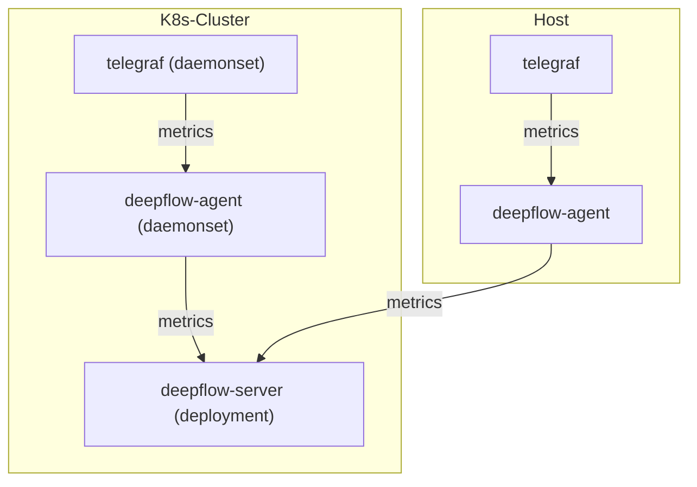

> This document was translated by ChatGPT

# Data Flow



# Configure Telegraf

## Install Telegraf

Refer to the [Telegraf documentation](https://www.influxdata.com/time-series-platform/telegraf/) for background information.  
If Telegraf is not installed in your cluster, you can quickly deploy it as a DaemonSet using the following steps:

```bash
# add helm chart
helm repo add influxdata https://helm.influxdata.com/

# install telegraf
helm upgrade --install telegraf influxdata/telegraf -n deepflow-telegraf-demo --create-namespace

# switch from deployment to daemonset
kubectl apply -f https://raw.githubusercontent.com/deepflowio/deepflow-demo/main/DeepFlow-Telegraf-Demo/deepflow-telegraf-demo.yaml
```

## Configure Telegraf Data Output

We need to modify Telegraf’s configuration so that it sends data to the DeepFlow Agent.

First, determine the address of the data listening service started by the DeepFlow Agent.  
After [installing the DeepFlow Agent](../../../ce-install/single-k8s/),  
the DeepFlow Agent Service address will be displayed, with the default value being `deepflow-agent.default`.  
If you have changed it, update the configuration with the actual service name and namespace.

Next, modify Telegraf’s default configuration (assuming it is in the `deepflow-telegraf-demo` namespace):

```bash
kubectl edit cm -n deepflow-telegraf-demo telegraf
```

In `telegraf.conf`, add the following configuration (replace `DEEPFLOW_AGENT_SVC` with the service name of deepflow-agent):

```toml
[[outputs.http]]
  url = "http://${DEEPFLOW_AGENT_SVC}/api/v1/telegraf"
  data_format = "influx"
```

# Configure DeepFlow

Refer to the section [Configure DeepFlow](../tracing/opentelemetry/#配置-deepflow) to complete the DeepFlow Agent configuration.

# View Telegraf Data

Metrics from Telegraf will be stored in DeepFlow’s `ext_metrics` database.  
To reduce the number of tables, DeepFlow stores all Measurements in a single ClickHouse table.  
When queried, users will still see a series of tables corresponding to Telegraf’s original Measurements.  
The original tags of Telegraf metrics can be referenced via `tag.XXX`, and metric values via `metrics.YYY`.  
At the same time, DeepFlow automatically injects a large number of Meta Tags and Custom Tags,  
allowing Telegraf-collected data to be seamlessly correlated with other data sources.

When using Grafana, selecting the `DeepFlow` data source for queries will display results as shown below:

