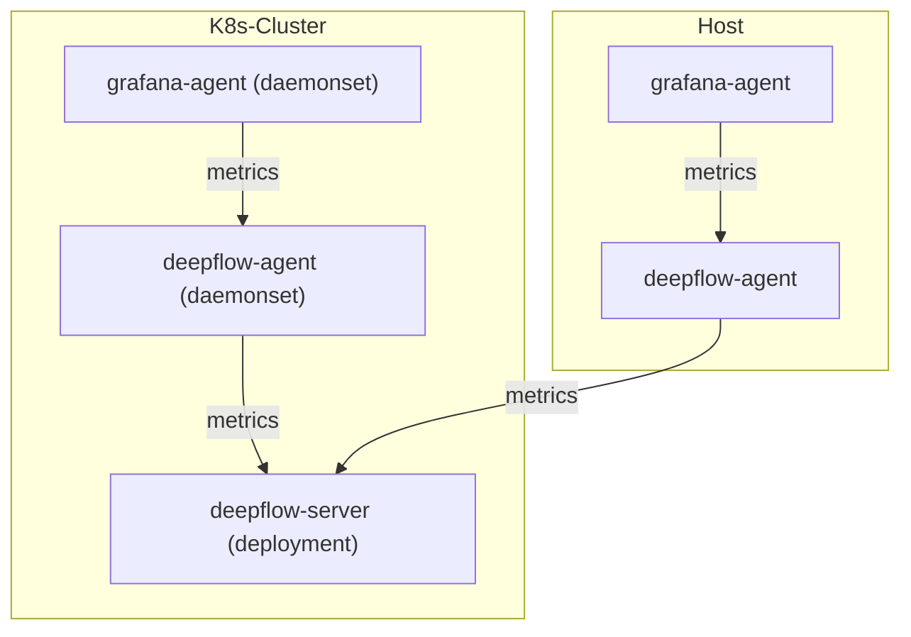

> This document was translated by ChatGPT

# Data Flow



# Configure Grafana Agent

## Grafana Agent

Refer to the [Grafana Agent documentation](https://grafana.com/docs/agent/latest/) for background information.
If Grafana Agent is not available in your environment, you can deploy it using the following steps:

::: code-tabs#shell

@tab APT Deployment

```bash
mkdir -p /etc/apt/keyrings/
wget -q -O - https://apt.grafana.com/gpg.key | gpg --dearmor | sudo tee /etc/apt/keyrings/grafana.gpg > /dev/null
echo "deb [signed-by=/etc/apt/keyrings/grafana.gpg] https://apt.grafana.com stable main" | sudo tee /etc/apt/sources.list.d/grafana.list
apt-get update
apt-get -y install grafana-agent
cat << EOF > /etc/grafana-agent.yaml
server:
  log_level: warn

metrics:
  global:
    scrape_interval: 1m
    remote_write:
    - url: http://127.0.0.1:38086/api/v1/prometheus
  wal_directory: '/var/lib/grafana-agent'
integrations:
  agent:
    enabled: true
  node_exporter:
    enabled: true
    relabel_configs:
    - source_labels: [__address__]
      regex: (.*)
      target_label: instance
      replacement: \$1
EOF
DEFAULT_INTERFACE=$(ip route | grep default | awk '{print $5}')
DEFAULT_IP=$(ip -4 addr show $DEFAULT_INTERFACE | grep -oP '(?<=inet\s)\d+(\.\d+){3}')
sed -i "s|127.0.0.1|$DEFAULT_IP|g" /etc/sysconfig/grafana-agent
systemctl start grafana-agent
systemctl enable grafana-agent
```

@tab YUM Deployment

```bash
wget -q -O gpg.key https://rpm.grafana.com/gpg.key
rpm --import gpg.key
cat << EOF > /etc/yum.repos.d/grafana.repo
[grafana]
name=grafana
baseurl=https://rpm.grafana.com
repo_gpgcheck=1
enabled=1
gpgcheck=1
gpgkey=https://rpm.grafana.com/gpg.key
sslverify=1
sslcacert=/etc/pki/tls/certs/ca-bundle.crt
EOF
yum -y install grafana-agent
cat << EOF > /etc/grafana-agent.yaml
server:
  log_level: warn

metrics:
  global:
    scrape_interval: 1m
    remote_write:
    - url: http://127.0.0.1:38086/api/v1/prometheus
  wal_directory: '/var/lib/grafana-agent'
integrations:
  agent:
    enabled: true
  node_exporter:
    enabled: true
    relabel_configs:
    - source_labels: [__address__]
      regex: (.*)
      target_label: instance
      replacement: \$1
EOF
DEFAULT_INTERFACE=$(ip route | grep default | awk '{print $5}')
DEFAULT_IP=$(ip -4 addr show $DEFAULT_INTERFACE | grep -oP '(?<=inet\s)\d+(\.\d+){3}')
sed -i "s|127.0.0.1|$DEFAULT_IP|g" /etc/sysconfig/grafana-agent
systemctl start grafana-agent
systemctl enable grafana-agent
```

@tab K8s Cluster Deployment

```bash
helm repo add prometheus-community https://prometheus-community.github.io/helm-charts
helm repo update
cat << EOF > kube-state-metrics-values-custom.yaml
selfMonitor:
  enabled: true
EOF
helm install  kube-state-metrics prometheus-community/kube-state-metrics \
  --namespace grafana-agent \
  --create-namespace \
  -f kube-state-metrics-values-custom.yaml
helm repo add grafana https://grafana.github.io/helm-charts
helm repo update

cat << EOF > grafana-agent-values-custom.yaml
agent:
  # -- Address to listen for traffic on. 0.0.0.0 exposes the UI to other
  # containers.
  # -- Address to listen for traffic on. 0.0.0.0 exposes the UI to other
  # containers.
  listenAddr: \$(HOSTIP)

  # -- Port to listen for traffic on.
  listenPort: 9100

  # --  Base path where the UI is exposed.
  uiPathPrefix: /

  # -- Enables sending Grafana Labs anonymous usage stats to help improve Grafana
  # Agent.
  enableReporting: true

  # -- Extra environment variables to pass to the agent container.
  extraEnv:
  - name: HOSTIP
    valueFrom:
      fieldRef:
        fieldPath: status.hostIP

  mode: 'static'
  configMap:
    # -- Create a new ConfigMap for the config file.
    create: true
    content: |
      server:
        log_level: info
        log_format: json
      metrics:
        wal_directory: /tmp/wal
        global:
          remote_write:
          - url: http://deepflow-agent.deepflow.svc.cluster.local/api/v1/prometheus
        configs:
        - name: deepflow
          scrape_configs:
          - bearer_token_file: /var/run/secrets/kubernetes.io/serviceaccount/token
            honor_labels: true
            honor_timestamps: false
            job_name: deepflow/kube-state-metrics/0
            kubernetes_sd_configs:
              - namespaces:
                  names:
                  - {{ $.Release.Namespace }}
                role: endpoints
            metric_relabel_configs:
              - action: drop
                regex: kube_endpoint_address_not_ready|kube_endpoint_address_available
                source_labels:
                  - __name__
            relabel_configs:
              - source_labels:
                  - job
                target_label: __tmp_prometheus_job_name
              - action: keep
                regex: kube-state-metrics
                source_labels:
                  - __meta_kubernetes_service_label_app_kubernetes_io_name
              - action: keep
                regex: http
                source_labels:
                  - __meta_kubernetes_endpoint_port_name
              - regex: Node;(.*)
                replacement: \$1
                separator: ;
                source_labels:
                  - __meta_kubernetes_endpoint_address_target_kind
                  - __meta_kubernetes_endpoint_address_target_name
                target_label: node
              - regex: Pod;(.*)
                replacement: \$1
                separator: ;
                source_labels:
                  - __meta_kubernetes_endpoint_address_target_kind
                  - __meta_kubernetes_endpoint_address_target_name
                target_label: pod
              - source_labels:
                  - __meta_kubernetes_namespace
                target_label: namespace
              - source_labels:
                  - __meta_kubernetes_service_name
                target_label: service
              - source_labels:
                  - __meta_kubernetes_pod_name
                target_label: pod
              - source_labels:
                  - __meta_kubernetes_pod_container_name
                target_label: container
              - replacement: \$1
                source_labels:
                  - __meta_kubernetes_service_name
                target_label: job
              - regex: (.+)
                replacement: \$1
                source_labels:
                  - __meta_kubernetes_service_label_app_kubernetes_io_name
                target_label: job
              - replacement: http
                target_label: endpoint
              - action: labeldrop
                regex: (pod|service|endpoint|namespace)
              - action: hashmod
                modulus: 1
                source_labels:
                  - __address__
                target_label: __tmp_hash
              - action: keep
                regex: 0
                source_labels:
                  - __tmp_hash
            scheme: http
            scrape_interval: 25s
            scrape_timeout: 25s
            tls_config:
              insecure_skip_verify: true
          - bearer_token_file: /var/run/secrets/kubernetes.io/serviceaccount/token
            honor_labels: true
            honor_timestamps: false
            job_name: deepflow/kube-state-metrics/1
            kubernetes_sd_configs:
              - namespaces:
                  names:
                  - {{ $.Release.Namespace }}
                role: endpoints
            relabel_configs:
              - source_labels:
                  - job
                target_label: __tmp_prometheus_job_name
              - action: keep
                regex: kube-state-metrics
                source_labels:
                  - __meta_kubernetes_service_label_app_kubernetes_io_name
              - action: keep
                regex: metrics
                source_labels:
                  - __meta_kubernetes_endpoint_port_name
              - regex: Node;(.*)
                replacement: \$1
                separator: ;
                source_labels:
                  - __meta_kubernetes_endpoint_address_target_kind
                  - __meta_kubernetes_endpoint_address_target_name
                target_label: node
              - regex: Pod;(.*)
                replacement: \$1
                separator: ;
                source_labels:
                  - __meta_kubernetes_endpoint_address_target_kind
                  - __meta_kubernetes_endpoint_address_target_name
                target_label: pod
              - source_labels:
                  - __meta_kubernetes_namespace
                target_label: namespace
              - source_labels:
                  - __meta_kubernetes_service_name
                target_label: service
              - source_labels:
                  - __meta_kubernetes_pod_name
                target_label: pod
              - source_labels:
                  - __meta_kubernetes_pod_container_name
                target_label: container
              - replacement: \$1
                source_labels:
                  - __meta_kubernetes_service_name
                target_label: job
              - regex: (.+)
                replacement: \$1
                source_labels:
                  - __meta_kubernetes_service_label_app_kubernetes_io_name
                target_label: job
              - replacement: metrics
                target_label: endpoint
              - action: hashmod
                modulus: 1
                source_labels:
                  - __address__
                target_label: __tmp_hash
              - action: keep
                regex: 0
                source_labels:
                  - __tmp_hash
            scheme: http
            scrape_interval: 25s
            tls_config:
              insecure_skip_verify: true
          - bearer_token_file: /var/run/secrets/kubernetes.io/serviceaccount/token
            honor_labels: true
            honor_timestamps: false
            job_name: deepflow/cadvisor-monitor/0
            static_configs:
            - targets: ['127.0.0.1:10250']
            metric_relabel_configs:
              - action: keep
                regex: kubelet_cgroup_manager_duration_seconds_count|go_goroutines|kubelet_pod_start_duration_seconds_count|kubelet_runtime_operations_total|kubelet_pleg_relist_duration_seconds_bucket|volume_manager_total_volumes|kubelet_volume_stats_capacity_bytes|container_cpu_usage_seconds_total|container_network_transmit_bytes_total|kubelet_runtime_operations_errors_total|container_network_receive_bytes_total|container_memory_swap|container_network_receive_packets_total|container_cpu_cfs_periods_total|container_cpu_cfs_throttled_periods_total|kubelet_running_pod_count|node_namespace_pod_container:container_cpu_usage_seconds_total:sum_rate|container_memory_working_set_bytes|storage_operation_errors_total|kubelet_pleg_relist_duration_seconds_count|kubelet_running_pods|rest_client_request_duration_seconds_bucket|process_resident_memory_bytes|storage_operation_duration_seconds_count|kubelet_running_containers|kubelet_runtime_operations_duration_seconds_bucket|kubelet_node_config_error|kubelet_cgroup_manager_duration_seconds_bucket|kubelet_running_container_count|kubelet_volume_stats_available_bytes|kubelet_volume_stats_inodes|container_memory_rss|kubelet_pod_worker_duration_seconds_count|kubelet_node_name|kubelet_pleg_relist_interval_seconds_bucket|container_network_receive_packets_dropped_total|kubelet_pod_worker_duration_seconds_bucket|container_start_time_seconds|container_network_transmit_packets_dropped_total|process_cpu_seconds_total|storage_operation_duration_seconds_bucket|container_memory_cache|container_network_transmit_packets_total|kubelet_volume_stats_inodes_used|up|rest_client_requests_total
                source_labels:
                  - __name__
            metrics_path: /metrics/cadvisor
            relabel_configs:
              - source_labels:
                  - job
                target_label: __tmp_prometheus_job_name
              - regex: Node;(.*)
                replacement: \$1
                separator: ;
                source_labels:
                  - __meta_kubernetes_endpoint_address_target_kind
                  - __meta_kubernetes_endpoint_address_target_name
                target_label: node
              - regex: Pod;(.*)
                replacement: \$1
                separator: ;
                source_labels:
                  - __meta_kubernetes_endpoint_address_target_kind
                  - __meta_kubernetes_endpoint_address_target_name
                target_label: pod
              - source_labels:
                  - __meta_kubernetes_namespace
                target_label: namespace
              - source_labels:
                  - __meta_kubernetes_service_name
                target_label: service
              - source_labels:
                  - __meta_kubernetes_pod_name
                target_label: pod
              - source_labels:
                  - __meta_kubernetes_pod_container_name
                target_label: container
              - replacement: \$1
                source_labels:
                  - __meta_kubernetes_service_name
                target_label: job
              - replacement: https-metrics
                target_label: endpoint
              - action: replace
                source_labels:
                  - __metrics_path__
                target_label: metrics_path
              - action: replace
                replacement: integrations/kubernetes/cadvisor
                target_label: job
              - action: hashmod
                modulus: 1
                source_labels:
                  - __address__
                target_label: __tmp_hash
              - action: keep
                regex: 0
                source_labels:
                  - __tmp_hash
            scheme: https
            scrape_interval: 25s
            tls_config:
              insecure_skip_verify: true
          - bearer_token_file: /var/run/secrets/kubernetes.io/serviceaccount/token
            honor_labels: true
            honor_timestamps: false
            job_name: deepflow/kubelet-monitor/0
            static_configs:
            - targets: ['127.0.0.1:10250']
            metric_relabel_configs:
              - action: keep
                regex: kubelet_cgroup_manager_duration_seconds_count|go_goroutines|kubelet_pod_start_duration_seconds_count|kubelet_runtime_operations_total|kubelet_pleg_relist_duration_seconds_bucket|volume_manager_total_volumes|kubelet_volume_stats_capacity_bytes|container_cpu_usage_seconds_total|container_network_transmit_bytes_total|kubelet_runtime_operations_errors_total|container_network_receive_bytes_total|container_memory_swap|container_network_receive_packets_total|container_cpu_cfs_periods_total|container_cpu_cfs_throttled_periods_total|kubelet_running_pod_count|node_namespace_pod_container:container_cpu_usage_seconds_total:sum_rate|container_memory_working_set_bytes|storage_operation_errors_total|kubelet_pleg_relist_duration_seconds_count|kubelet_running_pods|rest_client_request_duration_seconds_bucket|process_resident_memory_bytes|storage_operation_duration_seconds_count|kubelet_running_containers|kubelet_runtime_operations_duration_seconds_bucket|kubelet_node_config_error|kubelet_cgroup_manager_duration_seconds_bucket|kubelet_running_container_count|kubelet_volume_stats_available_bytes|kubelet_volume_stats_inodes|container_memory_rss|kubelet_pod_worker_duration_seconds_count|kubelet_node_name|kubelet_pleg_relist_interval_seconds_bucket|container_network_receive_packets_dropped_total|kubelet_pod_worker_duration_seconds_bucket|container_start_time_seconds|container_network_transmit_packets_dropped_total|process_cpu_seconds_total|storage_operation_duration_seconds_bucket|container_memory_cache|container_network_transmit_packets_total|kubelet_volume_stats_inodes_used|up|rest_client_requests_total
                source_labels:
                  - __name__
            relabel_configs:
              - source_labels:
                  - job
                target_label: __tmp_prometheus_job_name
              - regex: Node;(.*)
                replacement: \$1
                separator: ;
                source_labels:
                  - __meta_kubernetes_endpoint_address_target_kind
                  - __meta_kubernetes_endpoint_address_target_name
                target_label: node
              - regex: Pod;(.*)
                replacement: \$1
                separator: ;
                source_labels:
                  - __meta_kubernetes_endpoint_address_target_kind
                  - __meta_kubernetes_endpoint_address_target_name
                target_label: pod
              - source_labels:
                  - __meta_kubernetes_namespace
                target_label: namespace
              - source_labels:
                  - __meta_kubernetes_service_name
                target_label: service
              - source_labels:
                  - __meta_kubernetes_pod_name
                target_label: pod
              - source_labels:
                  - __meta_kubernetes_pod_container_name
                target_label: container
              - replacement: \$1
                source_labels:
                  - __meta_kubernetes_service_name
                target_label: job
              - replacement: https-metrics
                target_label: endpoint
              - action: replace
                source_labels:
                  - __metrics_path__
                target_label: metrics_path
              - action: replace
                replacement: integrations/kubernetes/kubelet
                target_label: job
              - action: hashmod
                modulus: 1
                source_labels:
                  - __address__
                target_label: __tmp_hash
              - action: keep
                regex: 0
                source_labels:
                  - __tmp_hash
            scheme: https
            scrape_interval: 25s
            tls_config:
              insecure_skip_verify: true
      integrations:
        agent:
          enabled: true
        node_exporter:
          enabled: true
          relabel_configs:
          - source_labels: [__address__]
            regex: (.*)
            target_label: instance
            replacement: \$1

controller:
  # -- Type of controller to use for deploying Grafana Agent in the cluster.
  # Must be one of 'daemonset', 'deployment', or 'statefulset'.
  type: 'daemonset'

  # -- Number of pods to deploy. Ignored when controller.type is 'daemonset'.
  replicas: 1

  # -- Annotations to add to controller.
  extraAnnotations: {}

  # -- Whether to deploy pods in parallel. Only used when controller.type is
  # 'statefulset'.
  parallelRollout: true

  # -- Configures Pods to use the host network. When set to true, the ports that will be used must be specified.
  ## The value must be set to hostnet; otherwise, network metrics cannot be captured https://github.com/grafana/alloy/issues/250
  hostNetwork: true

  # -- Configures Pods to use the host PID namespace.
  hostPID: false

  # -- Configures the DNS policy for the pod. https://kubernetes.io/docs/concepts/services-networking/dns-pod-service/#pod-s-dns-policy
  dnsPolicy: ClusterFirstWithHostNet
EOF
helm install grafana-agent grafana/grafana-agent \
  --namespace grafana-agent \
  --create-namespace \
  -f grafana-agent-values-custom.yaml
```

:::

# Configure DeepFlow

Please refer to the section [Configure DeepFlow](../tracing/opentelemetry/#配置-deepflow) to complete the DeepFlow Agent configuration.

Metrics from Grafana Agent will be stored in DeepFlow’s `Grafana Agent` database.
The original labels from Grafana Agent can be referenced via `tag.XXX`, and metric values can be referenced via `value`.
At the same time, DeepFlow will automatically inject a large number of Meta Tags and Custom Tags, enabling Grafana Agent’s collected data to be seamlessly correlated with other data sources.

When using Grafana and selecting the `DeepFlow` data source for queries, the display will look like the following:


