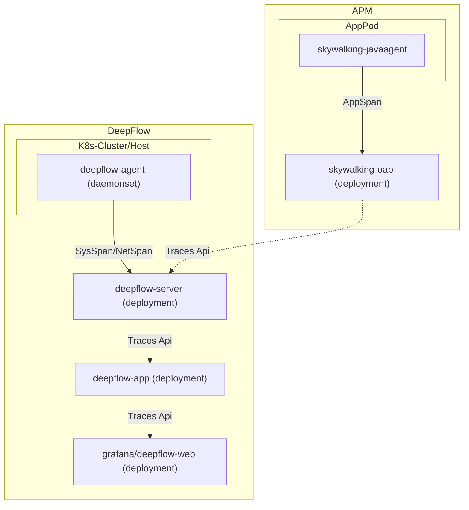

> This document was translated by ChatGPT

# Introduction

DeepFlow has the capability to retrieve APP Spans from external APMs and associate them with tracing data collected by DeepFlow. Currently, only SkyWalking is supported as an external APM storage. Applications require no modifications—simply update the DeepFlow configuration to gain DeepFlow’s full-link, zero-instrumentation tracing capability.

# Data Flow



# Configuration

Modify the [configuration](https://github.com/deepflowio/deepflow/blob/main/server/server.yaml) of the DeepFlow Server and add the following content:

```yaml
querier:
  external-apm:
    - name: skywalking
      addr: 127.0.0.1:12800 # FIXME: Replace with the address of the SkyWalking OAP Server; port 12800 is the default HTTP service port
```

At the same time, modify the [configuration](https://github.com/deepflowio/deepflow-app/blob/main/app/app.yaml) of the DeepFlow App and set the following value to `true`:

```yaml
app:
  spec:
    call_apm_api_to_supplement_trace: true
```

The mapping from SkyWalking APM’s [skywalking-query-protocol](https://github.com/apache/skywalking-query-protocol/blob/master/trace.graphqls) to DeepFlow flame graph is as follows:

| Name            | Chinese          | SkyWalking Data Structure                                                                                       | Description                                                                                           |
| --------------- | ---------------- | --------------------------------------------------------------------------------------------------------------- | ----------------------------------------------------------------------------------------------------- |
| startTimeUs     | 开始时间         | span.startTime                                                                                                  | --                                                                                                    |
| endTimeUs       | 结束时间         | span.endTime                                                                                                    | --                                                                                                    |
| tapSide         | 观测点           | span.spanType.Exit: Client App (C-APP), span.spanType.Entry: Server App (S-APP), span.spanType.Local: App (APP) | Observation point, i.e., observation_point, converted to the corresponding enum value                |
| traceID         | TraceID          | span.traceID                                                                                                    | --                                                                                                    |
| spanID          | SpanID           | span.segmentID-span.spanID                                                                                      | --                                                                                                    |
| parentSpanID    | ParentSpanID     | span.segmentID-span.parentSpanID/span.ref.parentSegmentID/span.ref.parentSpanID                                 | When span.parentSpanID = -1, attempt to get span.ref as the parentSpan                                |
| spanKind        | span 类型        | span.type=Exit: SPAN_KIND_CLIENT, span.type=Entry: SPAN_KIND_SERVER, span.type=Local: SPAN_KIND_INTERNAL        | Converted to the corresponding enum value                                                             |
| endpoint        | 请求端点         | span.endpointName                                                                                               | Specific resource requested; in HTTP protocol, usually the request route                              |
| appService      | 应用服务         | span.serviceCode                                                                                                | --                                                                                                    |
| appInstance     | 应用服务实例     | span.serviceInstance                                                                                            | --                                                                                                    |
| serviceUname    | 服务名称         | span.serviceCode                                                                                                | --                                                                                                    |
| requestType     | 请求类型         | span.tags.[http.method/cache.cmd/db.operation/rpc.method]                                                       | Get the value from tag according to the protocol                                                       |
| requestResource | 请求资源         | span.endpointName/span.tags.[db.statement/cache.key/url/http.url]                                               | When span.endpointName does not exist, try to extract from http.url, only keeping the request info after the domain |
| responseCode    | 响应码           | span.tags.[http.status.code/http.status_code/http.status]                                                       | --                                                                                                    |
| reponseStatus   | 响应状态         | --                                                                                                              | Converted from responseCode: 2xx~3xx: STATUS_OK, 4xx: STATUS_CLIENT_ERROR, 5xx: STATUS_SERVER_ERROR   |
| signalSource    | 信号源           | OTEL(4)                                                                                                         | Fixed enum value                                                                                       |
| l7Protocol      | 应用协议         | span.layer=Http: HTTP, span.tags.[db.type/db.system/http.scheme/rpc.system/messaging.system/messaging.protocol] | If span.layer is not Http, try to get from span.tags; if any tag starts with `http.`, treat as HTTP   |
| l7ProtocolStr   | 应用协议（名称） | --                                                                                                              | Get the specific name according to the enum value of l7Protocol                                       |
| attribute       | 标签             | span.tags                                                                                                       | --                                                                                                    |