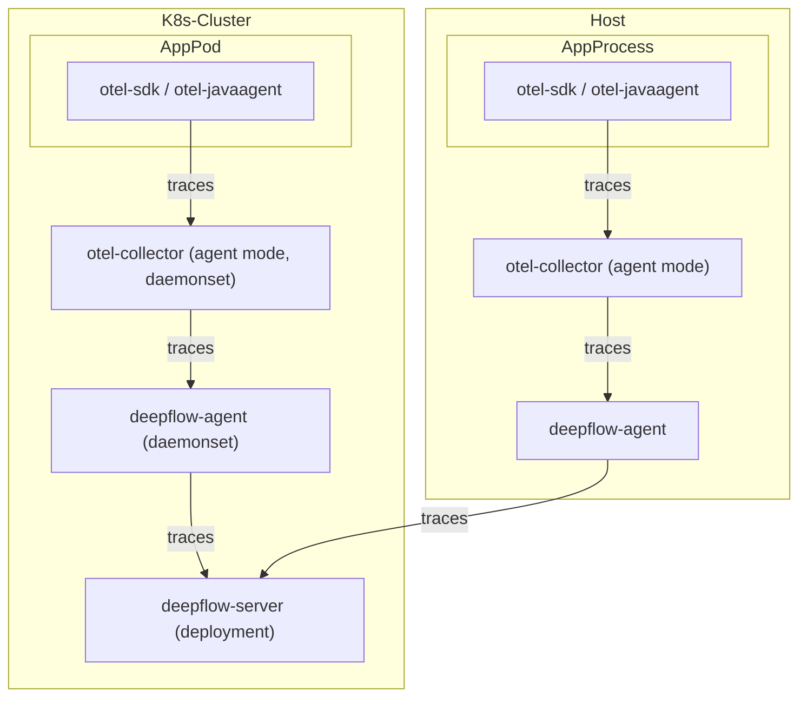
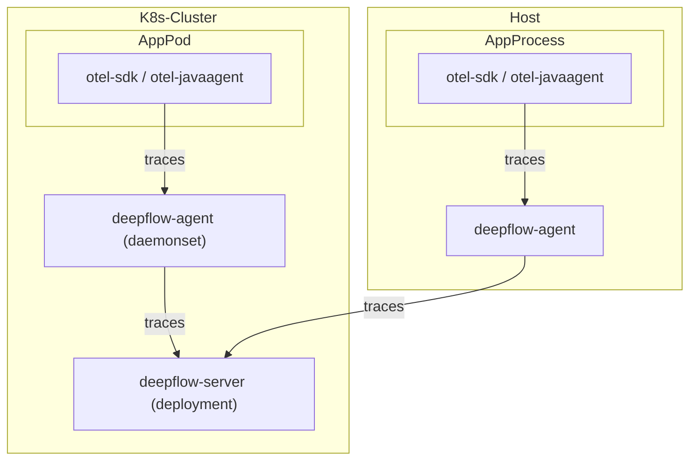
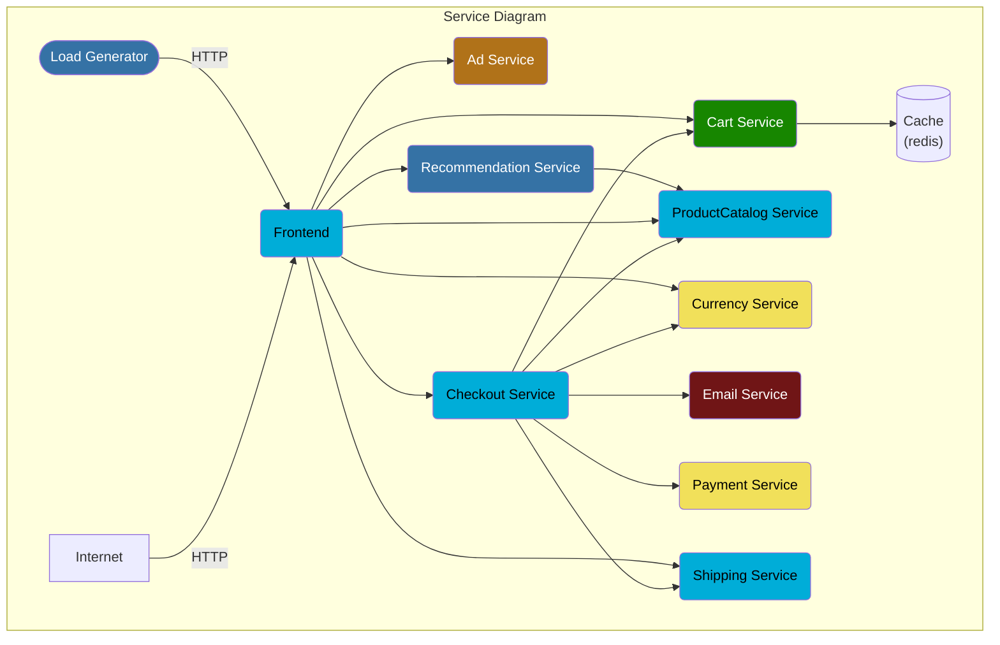

> This document was translated by ChatGPT

# Data Flow

Sending via otel-collector to deepflow-agent:



Sending directly to deepflow-agent:



# Configure OpenTelemetry

We recommend using the agent mode of otel-collector to send trace data to deepflow-agent to avoid data transmission across K8s nodes. Of course, using the gateway mode of otel-collector is also completely feasible. The following document introduces the deployment and configuration methods using otel-agent as an example.

## Install otel-agent

Refer to the [OpenTelemetry documentation](https://opentelemetry.io/docs/) for relevant background knowledge. If OpenTelemetry is not yet available in your environment, you can quickly deploy an otel-agent DaemonSet in the `open-telemetry` namespace using the following command:

```bash
kubectl apply -n open-telemetry -f https://raw.githubusercontent.com/deepflowio/deepflow-demo/main/open-telemetry/open-telemetry.yaml
```

After installation, you can see a list of components in the environment:

```bash
kubectl get all -n open-telemetry
```

| Type      | Component  |
| --------- | ---------- |
| Daemonset | otel-agent |
| Service   | otel-agent |
| ConfigMap | otel-agent |

If you need to use other versions or updated opentelemetry-collector-contrib, find the desired image version in the [otel-docker](https://hub.docker.com/r/otel/opentelemetry-collector-contrib/tags) repository, and then update the image using the following command:

```bash
LATEST_TAG="xxx"  # FIXME

kubectl set image -n open-telemetry daemonset/otel-agent otel-agent=otel/opentelemetry-collector-contrib:${LATEST_TAG}
```

## Configure otel-agent

We need to configure `otel-agent-config.exporters.otlphttp` in the otel-agent ConfigMap to send traces to DeepFlow. First, query the current configuration:

```bash
kubectl get cm -n open-telemetry otel-agent-conf -o custom-columns=DATA:.data | \
    grep -A 5 otlphttp:
```

deepflow-agent uses ClusterIP Service to receive traces, modify the otel-agent configuration as follows:

```yaml
otlphttp:
  traces_endpoint: 'http://deepflow-agent.deepflow/api/v1/otel/trace'
  tls:
    insecure: true
  retry_on_failure:
    enabled: true
```

Additionally, to ensure the IP on the Span sending side is passed to DeepFlow, add the following configuration:

```yaml
processors:
  k8sattributes:
  resource:
    attributes:
      - key: app.host.ip
        from_attribute: k8s.pod.ip
        action: insert
```

Finally, in the service.pipeline, add the following to the `traces` section:

```yaml
service:
  pipelines:
    traces:
      processors: [k8sattributes, resource] # Ensure k8sattributes processor is processed first
      exporters: [otlphttp]
```

# Configure DeepFlow

Next, we need to enable the data receiving service of deepflow-agent.

First, determine the collector group ID where deepflow-agent is located, usually the ID of the group named default:

```bash
deepflow-ctl agent-group list
```

Check if the collector group already has a configuration:

```bash
deepflow-ctl agent-group-config list
```

If there is already a configuration, export it to a yaml file for modification:

```bash
deepflow-ctl agent-group-config list <your-agent-group-id> -o yaml > your-agent-group-config.yaml
```

Modify the yaml file to ensure it contains the following configuration items:

```bash
vtap_group_id: <your-agent-group-id>
external_agent_http_proxy_enabled: 1   # required
external_agent_http_proxy_port: 38086  # optional, default 38086
```

Update the collector group's configuration:

```
deepflow-ctl agent-group-config update <your-agent-group-id> -f your-agent-group-config.yaml
```

If the collector group does not yet have a configuration, create a new configuration based on the your-agent-group-config.yaml file using the following command:

```bash
deepflow-ctl agent-group-config create -f your-agent-group-config.yaml
```

# Experience with Spring Boot Demo

## Deploy Demo

This Demo is from [this GitHub repository](https://github.com/liuzhibin-cn/my-demo), which is a Spring Boot-based WebShop application composed of five microservices. Its architecture is as follows:


Deploy this Demo with one command:

```bash
kubectl apply -n deepflow-otel-spring-demo -f https://raw.githubusercontent.com/deepflowio/deepflow-demo/main/DeepFlow-Otel-Spring-Demo/deepflow-otel-spring-demo.yaml
```

## View Tracing Data

Go to Grafana, open the `Distributed Tracing` Dashboard, select `namespace = deepflow-otel-spring-demo`, and then choose a call to trace. DeepFlow can correlate tracing data obtained from OpenTelemetry, eBPF, and BPF in a single Trace flame graph, covering the full-stack call path of a Spring Boot application from business code, system functions, to network interfaces, achieving true end-to-end distributed tracing, as shown below:


You can also visit [DeepFlow Online Demo](https://ce-demo.deepflow.yunshan.net/d/Distributed_Tracing/distributed-tracing?var-namespace=deepflow-otel-spring-demo&from=deepflow-doc) to see the effect.

Summary of this tracing Demo:

- End-to-end: Integrated OTel, eBPF, and BPF, automatically traced 100 Spans of this Trace, including 20 eBPF Spans and 34 BPF Spans
- End-to-end: For services without OTel instrumentation, supports automatic tracing completion through eBPF, such as Spans 1-6 (loadgenerator)
- End-to-end: For services where OTel cannot be instrumented, supports automatic tracing completion through eBPF, such as eBPF Spans 67 and 100 depicting the start and end of MySQL Transactions (SET autocommit, commit)
- Full-stack: Supports tracing the network path between two Pods on the same K8s Node, such as Spans 91-92
- Full-stack: Supports tracing the network path between two Pods across K8s Nodes, even if it passes through tunnel encapsulation, such as Spans 2-5 (IPIP tunnel encapsulation)
- Full-stack: eBPF and BPF Spans interspersed among OTel Spans, connecting applications, systems, and networks, such as eBPF Spans 12, 27, 41, 53 with their parent Spans (OTel) showing significant time differences that can be used to identify real performance bottlenecks, avoiding confusion among upstream and downstream application development teams

# Experience with OpenTelemetry WebStore Demo

## Deploy Demo

This Demo is from [opentelemetry-webstore-demo](https://github.com/open-telemetry/opentelemetry-demo-webstore), which is a WebStore application composed of more than ten microservices implemented in languages such as Go, C#, Node.js, Python, and Java. Its application architecture is as follows:



Deploy this Demo with one command:

```bash
kubectl apply -n deepflow-otel-grpc-demo -f https://raw.githubusercontent.com/deepflowio/deepflow-demo/main/DeepFlow-Otel-Grpc-Demo/deepflow-otel-grpc-demo.yaml
```

## View Tracing Data

Go to Grafana, open the `Distributed Tracing` Dashboard, select `namespace = deepflow-otel-grpc-demo`, and then choose a call to trace. DeepFlow can correlate tracing data obtained from OpenTelemetry, eBPF, and BPF in a single Trace flame graph, covering the full-stack call path of a multi-language application from business code, system functions, to network interfaces, achieving true end-to-end distributed tracing, as shown below:


You can also visit [DeepFlow Online Demo](https://ce-demo.deepflow.yunshan.net/d/Distributed_Tracing/distributed-tracing?var-namespace=deepflow-otel-grpc-demo&var-request_resource=*Order*&from=deepflow-doc) to see the effect.