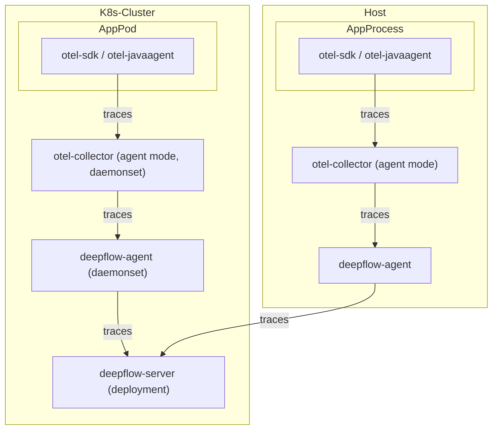
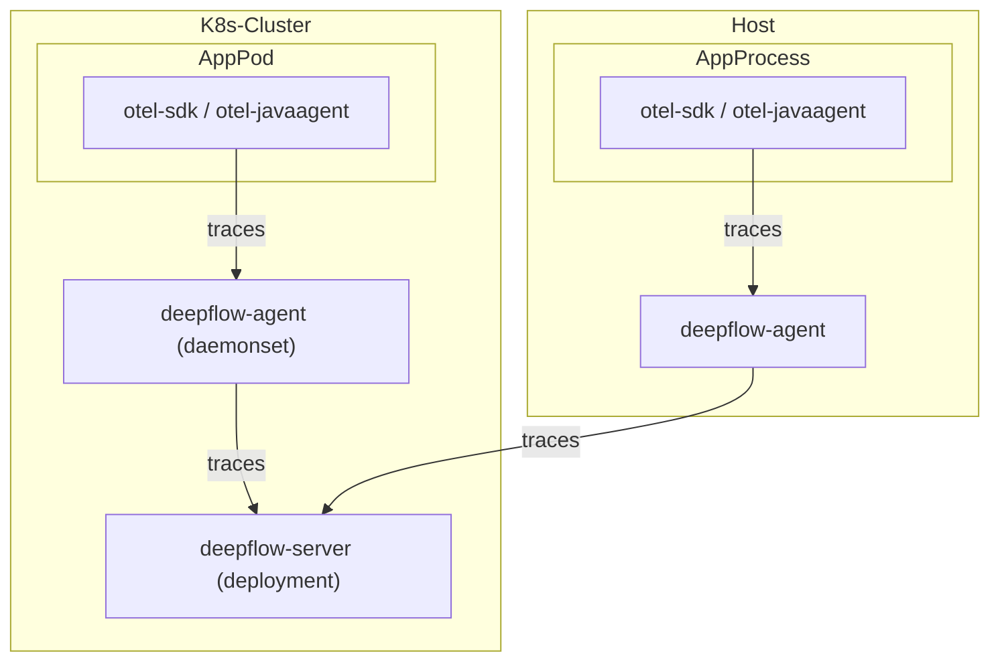

> This document was translated by ChatGPT

# Data Flow

Send via otel-collector to deepflow-agent:



Send directly to deepflow-agent:



# Configure OpenTelemetry

We recommend using otel-collector in agent mode to send trace data to deepflow-agent to avoid cross-node data transfer in K8s.  
Of course, using otel-collector in gateway mode is also fully supported. The following documentation uses otel-agent as an example to describe deployment and configuration.

## Install otel-agent

Refer to the [OpenTelemetry documentation](https://opentelemetry.io/docs/) for background information.  
If OpenTelemetry is not yet installed in your environment, you can quickly deploy an otel-agent DaemonSet in the `open-telemetry` namespace with the following command:

```bash
kubectl apply -n open-telemetry -f https://raw.githubusercontent.com/deepflowio/deepflow-demo/main/open-telemetry/open-telemetry.yaml
```

After installation, you should see the following components in your environment:

```bash
kubectl get all -n open-telemetry
```

| Type      | Component  |
| --------- | ---------- |
| Daemonset | otel-agent |
| Service   | otel-agent |
| ConfigMap | otel-agent |

If you need another version or a newer opentelemetry-collector-contrib,  
visit the [otel-docker](https://hub.docker.com/r/otel/opentelemetry-collector-contrib/tags) repository to find the desired image version, then update the image with:

```bash
LATEST_TAG="xxx"  # FIXME

kubectl set image -n open-telemetry daemonset/otel-agent otel-agent=otel/opentelemetry-collector-contrib:${LATEST_TAG}
```

## Configure otel-agent

We need to configure `otel-agent-config.exporters.otlphttp` in the otel-agent ConfigMap to send traces to DeepFlow. First, check the current configuration:

```bash
kubectl get cm -n open-telemetry otel-agent-conf -o custom-columns=DATA:.data | \
    grep -A 5 otlphttp:
```

deepflow-agent uses a ClusterIP Service to receive traces, so modify the otel-agent configuration as follows:

```yaml
otlphttp:
  traces_endpoint: 'http://deepflow-agent.deepflow/api/v1/otel/trace'
  tls:
    insecure: true
  retry_on_failure:
    enabled: true
```

Additionally, to ensure the sender's IP of the Span is passed to DeepFlow, add the following configuration:

```yaml
processors:
  k8sattributes:
  resource:
    attributes:
      - key: app.host.ip
        from_attribute: k8s.pod.ip
        action: insert
```

Finally, in the `service.pipeline` section, add the following under `traces`:

```yaml
service:
  pipelines:
    traces:
      processors: [k8sattributes, resource] # Ensure k8sattributes processor runs first
      exporters: [otlphttp]
```

# Configure DeepFlow

Next, we need to enable the data receiving service of deepflow-agent.

First, determine the collector group ID where deepflow-agent resides, usually the ID of the group named `default`:

```bash
deepflow-ctl agent-group list
```

Check whether this collector group already has a configuration:

```bash
deepflow-ctl agent-group-config list
```

If a configuration exists, export it to a yaml file for modification:

```bash
deepflow-ctl agent-group-config list <your-agent-group-id> -o yaml > your-agent-group-config.yaml
```

Edit the yaml file to ensure it contains the following:

```bash
vtap_group_id: <your-agent-group-id>
external_agent_http_proxy_enabled: 1   # required
external_agent_http_proxy_port: 38086  # optional, default 38086
```

Update the collector group configuration:

```
deepflow-ctl agent-group-config update <your-agent-group-id> -f your-agent-group-config.yaml
```

If the collector group has no configuration, create one based on your-agent-group-config.yaml:

```bash
deepflow-ctl agent-group-config create -f your-agent-group-config.yaml
```

# Experience with Spring Boot Demo

## Deploy the Demo

This demo comes from [this GitHub repository](https://github.com/liuzhibin-cn/my-demo).  
It is a Spring Boot-based WebShop application composed of five microservices, with the following architecture:


Deploy the demo with one command:

```bash
kubectl apply -n deepflow-otel-spring-demo -f https://raw.githubusercontent.com/deepflowio/deepflow-demo/main/DeepFlow-Otel-Spring-Demo/deepflow-otel-spring-demo.yaml
```

## View Tracing Data

Go to Grafana, open the `Distributed Tracing` Dashboard, select `namespace = deepflow-otel-spring-demo`, and choose a request to trace.  
DeepFlow can correlate tracing data from OpenTelemetry, eBPF, and BPF into a single trace flame graph,  
covering the full-stack call path of a Spring Boot application from business code, system functions, to network interfaces, achieving true end-to-end distributed tracing, as shown below:


You can also visit the [DeepFlow Online Demo](https://ce-demo.deepflow.yunshan.net/d/Distributed_Tracing/distributed-tracing?var-namespace=deepflow-otel-spring-demo&from=deepflow-doc) to see the results.

Summary of this tracing demo:

- End-to-end: Integrated OTel, eBPF, and BPF, automatically traced 100 Spans in this trace, including 20 eBPF Spans and 34 BPF Spans
- End-to-end: For services without OTel instrumentation, supports automatic tracing completion via eBPF, e.g., Spans 1-6 (loadgenerator)
- End-to-end: For services where OTel instrumentation is not possible, supports automatic tracing completion via eBPF, e.g., eBPF Spans 67 and 100 depict the start and end of a MySQL transaction (SET autocommit, commit)
- Full-stack: Supports tracing network paths between two Pods on the same K8s Node, e.g., Spans 91-92
- Full-stack: Supports tracing network paths between Pods on different K8s Nodes, even when passing through tunnel encapsulation, e.g., Spans 2-5 (IPIP tunnel encapsulation)
- Full-stack: eBPF and BPF Spans interleave with OTel Spans, bridging application, system, and network. Significant time differences between eBPF Spans 12, 27, 41, 53 and their parent OTel Spans can help pinpoint real performance bottlenecks, avoiding confusion between upstream and downstream development teams

# Experience with OpenTelemetry WebStore Demo

## Deploy the Demo

This demo comes from [opentelemetry-webstore-demo](https://github.com/open-telemetry/opentelemetry-demo-webstore).  
It consists of more than ten microservices implemented in Go, C#, Node.js, Python, Java, etc., with the following architecture:


Deploy the demo with one command:

```bash
kubectl apply -n deepflow-otel-grpc-demo -f https://raw.githubusercontent.com/deepflowio/deepflow-demo/main/DeepFlow-Otel-Grpc-Demo/deepflow-otel-grpc-demo.yaml
```

## View Tracing Data

Go to Grafana, open the `Distributed Tracing` Dashboard, select `namespace = deepflow-otel-grpc-demo`, and choose a request to trace.  
DeepFlow can correlate tracing data from OpenTelemetry, eBPF, and BPF into a single trace flame graph,  
covering the full-stack call path of a multi-language application from business code, system functions, to network interfaces, achieving true end-to-end distributed tracing, as shown below:


You can also visit the [DeepFlow Online Demo](https://ce-demo.deepflow.yunshan.net/d/Distributed_Tracing/distributed-tracing?var-namespace=deepflow-otel-grpc-demo&var-request_resource=*Order*&from=deepflow-doc) to see the results.