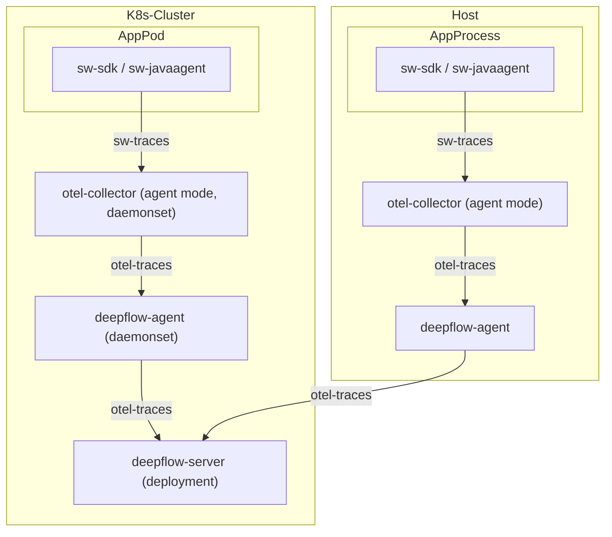
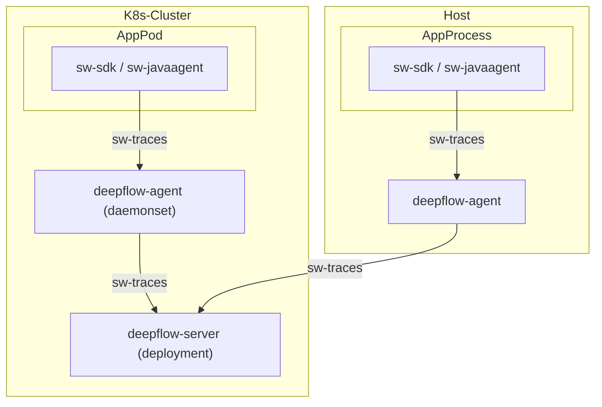

> This document was translated by ChatGPT

# Data Flow

## DeepFlow Community Edition



## DeepFlow Enterprise Edition



# Trace Collection

## Collecting via DeepFlow Agent

Starting from DeepFlow Enterprise Edition v6.6, DeepFlow Agent supports directly receiving and sending SkyWalking data without additional configuration.

## Collecting via OpenTelemetry Collector

### Background Knowledge

You can refer to the [OpenTelemetry documentation](https://opentelemetry.io/docs/) to learn more about OpenTelemetry, and follow the [OpenTelemetry Installation](../tracing/opentelemetry/#配置-opentelemetry) section in the previous chapter to quickly install OpenTelemetry.

You can refer to the [SkyWalking documentation](https://skywalking.apache.org/docs/) to learn more about SkyWalking. For this demo, you do not need to install the full SkyWalking stack — we will use OpenTelemetry to integrate SkyWalking trace data.

### Confirm OpenTelemetry Version

First, you need to enable OpenTelemetry’s ability to receive SkyWalking data, process it using the OpenTelemetry standard protocol, and then send it to the DeepFlow Agent.

There is a bug in OpenTelemetry’s SkyWalking data receiver, which we have recently fixed in PRs [#11562](https://github.com/open-telemetry/opentelemetry-collector-contrib/pull/11562) and [#12651](https://github.com/open-telemetry/opentelemetry-collector-contrib/pull/12651). For the following demo, we require the OpenTelemetry [Collector image](https://hub.docker.com/r/otel/opentelemetry-collector-contrib) version `>= 0.57.0`. Please check the otel-agent image version in your environment and ensure it meets the requirement. You can refer to the [OpenTelemetry Installation](../tracing/opentelemetry/#配置-otel-agent) section in the previous chapter to update the otel-agent version in your environment.

### Configure OpenTelemetry to Receive SkyWalking Data

As described in the [Background Knowledge](#背景知识) section, after installing OpenTelemetry, you can configure it to receive SkyWalking data using the following steps:

Assume the namespace for OpenTelemetry is `open-telemetry`, and the ConfigMap used by otel-agent is named `otel-agent-conf`. Modify the otel-agent configuration with the following command:

```bash
kubectl -n open-telemetry edit cm otel-agent-conf
```

In the `receivers` section, add the following:

```yaml
receivers:
  # add the following config
  skywalking:
    protocols:
      grpc:
        endpoint: 0.0.0.0:11800
      http:
        endpoint: 0.0.0.0:12800
```

In the `service.pipelines.traces` section, add the following:

```yaml
service:
  pipelines:
    traces:
      # add receiver `skywalking`
      receivers: [skywalking]
```

Also, make sure that `otel-agent-conf` has been configured according to the [Configure otel-agent](../tracing/opentelemetry/#配置-otel-agent) section.

Next, modify the otel-agent Service to open the corresponding ports:

```bash
kubectl -n open-telemetry patch service otel-agent -p '{"spec":{"ports":[{"name":"sw-http","port":12800,"protocol":"TCP","targetPort":12800},{"name":"sw-grpc","port":11800,"protocol":"TCP","targetPort":11800}]}}'
```

Finally, restart the otel-agent to apply the update:

```bash
kubectl rollout restart -n open-telemetry daemonset/otel-agent
```

# Modify SkyWalking Sending Configuration

Finally, check the configured [SkyWalking OAP Server](https://skywalking.apache.org/docs/main/next/en/setup/backend/backend-setup/#requirements-and-default-settings) address in your application, and change it to the Otel Agent Service address: `otel-agent.open-telemetry`. For example, change the environment variable `SW_AGENT_COLLECTOR_BACKEND_SERVICES=oap-server:11800` to `SW_AGENT_COLLECTOR_BACKEND_SERVICES=otel-agent.open-telemetry:11800`. If you are using DeepFlow Agent to receive data directly, change it to `deepflow-agent.deepflow`.

Of course, the reporting address in the application configuration may take various forms. Please modify it according to the actual application startup command. For `Java` applications, you only need to ensure that the injected address in the startup command is modified, for example: `-Dskywalking.collector.backend_service=otel-agent.open-telemetry:11800`.

# Configure DeepFlow

Please refer to the [Configure DeepFlow](../tracing/opentelemetry/#配置-deepflow) section to complete the DeepFlow Agent configuration.

# Experience with WebShop Demo

## Deploy the Demo

This demo comes from [this GitHub repository](https://github.com/liuzhibin-cn/my-demo). It is a WebShop application built with Spring Boot, consisting of five microservices. Its architecture is as follows:


You can deploy this demo with a single command. The reporting address has already been configured, so no further modification is needed.

```bash
kubectl apply -f https://raw.githubusercontent.com/deepflowio/deepflow-demo/main/DeepFlow-Otel-SkyWalking-Demo/deepflow-otel-skywalking-demo.yaml
```

## View Tracing Data

Go to Grafana, open the `Distributed Tracing` dashboard, select `namespace = deepflow-otel-skywalking-demo`, and then choose a call to trace.  
DeepFlow can correlate and display tracing data from SkyWalking, eBPF, and BPF in a single trace flame graph,  
covering the full-stack call path of a Spring Boot application from business code, system functions, to network interfaces, achieving true end-to-end distributed tracing. The result looks like this:


You can also visit the [DeepFlow Online Demo](https://ce-demo.deepflow.yunshan.net/d/Distributed_Tracing/distributed-tracing?var-namespace=deepflow-otel-skywalking-demo&from=deepflow-doc) to see the effect.