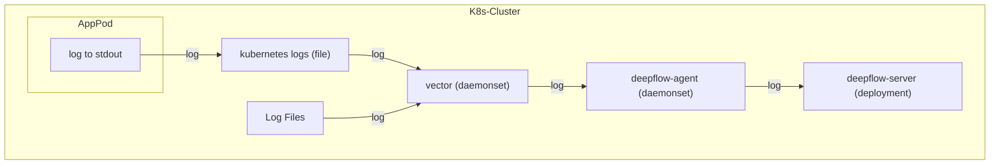
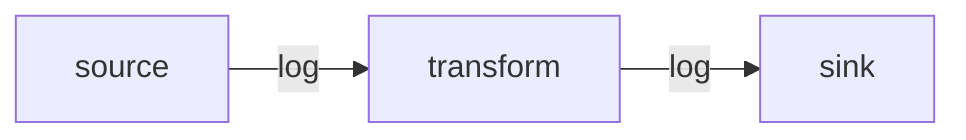
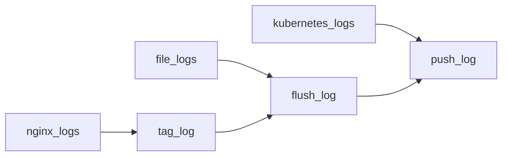

> This document was translated by ChatGPT

# Data Flow



# Configure Vector

## Install Vector

You can learn the relevant background knowledge in the [Vector documentation](https://vector.dev/docs/).  
If your cluster does not have Vector, you can deploy it using the following steps:

::: code-tabs#shell

@tab APT Deployment

```bash
## Add Vector repo
bash -c "$(curl -L https://setup.vector.dev)"
apt-get install vector -y
vector --version
### config file /etc/vector/vector.yaml
systemctl start vector
systemctl enable vector
```

@tab YUM Deployment

```bash
## Add Vector repo
bash -c "$(curl -L https://setup.vector.dev)"
yum install vector -y
vector --version

### config file /etc/vector/vector.yaml
systemctl start vector
systemctl enable vector
```

@tab K8s Cluster Deployment

```bash
helm repo add vector https://helm.vector.dev
helm repo update

cat << EOF > vector-values-custom.yaml
role: Agent
# FIXME: add nodeSelector here for deepflow
#nodeSelector:
#  allow/vector: "false"

# resources -- Set Vector resource requests and limits.
resources:
  requests:
    cpu: 200m
    memory: 256Mi
  limits:
    cpu: 200m
    memory: 256Mi
image:
  repository: timberio/vector
  tag: 0.37.1-distroless-libc
podLabels:
  vector.dev/exclude: "true"
  app: deepflow
# extraVolumes -- Additional Volumes to use with Vector Pods.
  # extraVolumes:
  # - name: opt-log
  #   hostPath:
  #     path: "/opt/log/"
# extraVolumeMounts -- Additional Volume to mount into Vector Containers.
  # extraVolumeMounts:
  # - name: opt-log
  #   mountPath: "/opt/log/"
  #   readOnly: true
customConfig:
  ## The configuration comes from https://vector.dev/docs/reference/configuration/global-options/#data_dir
  data_dir: /vector-data-dir
  api:
    enabled: true
    address: 127.0.0.1:8686
    playground: false
  sources:
    kubernetes_logs:
      type: kubernetes_logs
      namespace_annotation_fields:
        namespace_labels: ""
      node_annotation_fields:
        node_labels: ""
      pod_annotation_fields:
        pod_annotations: ""
        pod_labels: ""

  transforms:
    remap_kubernetes_logs:
      type: remap
      inputs:
      - kubernetes_logs
      source: |-
        # try to parse json
        if is_string(.message) && is_json(string!(.message)) {
            tags = parse_json(.message) ?? {}
            .message = tags.message # FIXME: the log content key inside json
            del(tags.message)
            .json = tags
        }

        if !exists(.level) {
           if exists(.json) {
            .level = to_string!(.json.level)
            del(.json.level)
           } else {
            # match log levels surround by ``[]`` or ``<>`` with ignore case
            level_tags = parse_regex(.message, r'[\[\\\<](?<level>(?i)INFOR?(MATION)?|WARN(ING)?|DEBUG?|ERROR?|TRACE|FATAL|CRIT(ICAL)?)[\]\\\>]') ?? {}
            if !exists(level_tags.level) {
              # match log levels surround by whitespace, required uppercase strictly in case mismatching
              level_tags = parse_regex(.message, r'[\s](?<level>INFOR?(MATION)?|WARN(ING)?|DEBUG?|ERROR?|TRACE|FATAL|CRIT(ICAL)?)[\s]') ?? {}
            }
            if exists(level_tags.level) {
              level_tags.level = upcase(string!(level_tags.level))
              .level = level_tags.level
            }
          }
        }

        if !exists(._df_log_type) {
            # default log type
            ._df_log_type = "user"
        }

        if !exists(.app_service) {
            .app_service = .kubernetes.container_name
        }
  sinks:
    http:
      encoding:
        codec: json
      inputs:
      - remap_kubernetes_logs
      type: http
      uri: http://deepflow-agent.deepflow/api/v1/log
EOF
helm install vector vector/vector \
  --namespace vector \
  --create-namespace \
  -f vector-values-custom.yaml
```

:::

Before configuration, you can first learn about the [Vector workflow](https://vector.dev/docs/about/under-the-hood/architecture/pipeline-model/). Data flows in the following module order, from the source to the destination:



Generally, a Vector configuration contains at least the `sources` module and the `sinks` module. If additional data processing is required, you must add the `transforms` module to clean the data into the final desired content. A typical Vector configuration looks like this:

```yaml
# Data sources
sources:
  nginx_logs:
    # ...
  file_logs:
    # ...
  kubernetes_logs:
    # ...

# Data processing
transforms:
  tag_log:
    # inputs refers to the data source; here you can configure the key from sources or from other transforms
    inputs:
      - nginx_logs
    # ...
  flush_log:
    # tag_log comes from the previous transforms module, so the same data is processed sequentially by two transforms modules
    inputs:
      - tag_log
      - file_logs
    # ...

# Data output
sinks:
  push_log:
    # Similarly, inputs here can come from both sources and transforms modules
    inputs:
      - flush_log
      - kubernetes_logs
    # ...
```

In the above example, different configurations implement three different data flows:



Next, let's look at the specific configuration of each module.

## Collect Logs

After installing Vector, we can use the [Kubernetes_Log](https://vector.dev/docs/reference/configuration/sources/kubernetes_logs/) module to obtain logs from Pods deployed in Kubernetes. Since DeepFlow has already learned the relevant Labels and Annotations of Pods in Kubernetes through the AutoTagging mechanism, you can remove this part of the content when sending log streams to reduce transmission volume. Example configuration:

```yaml
sources:
  kubernetes_logs:
    type: kubernetes_logs
    namespace_annotation_fields:
      namespace_labels: ''
    node_annotation_fields:
      node_labels: ''
    pod_annotation_fields:
      pod_annotations: ''
      pod_labels: ''
```

If you deploy Vector as a process on a cloud server, you can use the [File](https://vector.dev/docs/reference/configuration/sources/file) module to obtain logs from a specified path. Using `/var/log/` as an example:

```yaml
sources:
  files_logs:
    type: file
    include:
      - /var/log/*.log
      - /var/log/**/*.log
    exclude:
      # FIXME: If both kubernetes_logs and file modules are configured, remove k8s log folders to avoid duplicate monitoring
      - /var/log/pods/**
      - /var/log/containers/**
    fingerprint:
      strategy: 'device_and_inode'
```

## Inject Tags

We can then use the [Remap](https://vector.dev/docs/reference/configuration/transforms/remap/) module in Transforms to add necessary tags to the logs being sent. Currently, we require two tags: `_df_log_type` and `level`. Example configuration:

```yaml
transforms:
  remap_kubernetes_logs:
    type: remap
    inputs:
      - kubernetes_logs
      - files_logs
    source: |-
      # try to parse json
      if is_string(.message) && is_json(string!(.message)) {
          tags = parse_json(.message) ?? {}
          .message = tags.message # FIXME: the log content key inside json
          del(tags.message)
          .json = tags
      }

      if !exists(.level) {
         if exists(.json) {
          .level = to_string!(.json.level)
          del(.json.level)
         } else {
          # match log levels surround by `[]` or `<>` with ignore case
          level_tags = parse_regex(.message, r'[\[\\<](?<level>(?i)INFOR?(MATION)?|WARN(ING)?|DEBUG?|ERROR?|TRACE|FATAL|CRIT(ICAL)?)[\]\\>]') ?? {}
          if !exists(level_tags.level) {
            # match log levels surround by whitespace, required uppercase strictly in case mismatching
            level_tags = parse_regex(.message, r'[\s](?<level>INFOR?(MATION)?|WARN(ING)?|DEBUG?|ERROR?|TRACE|FATAL|CRIT(ICAL)?)[\s]') ?? {}
          }
          if exists(level_tags.level) {
            level_tags.level = upcase(string!(level_tags.level))
            .level = level_tags.level
          }
        }
      }

      if !exists(._df_log_type) {
          # default log type
          ._df_log_type = "user"
      }

      if !exists(.app_service) {
          # FIXME: files module does not have this field, please inject application name via log content
          .app_service = .kubernetes.container_name
      }
```

In this snippet, we assume that we may get both JSON-formatted logs and non-JSON logs. For both types, we try to extract the log level `level`. For JSON logs, we extract its content into the outer `message` field and put the remaining JSON keys into a field named `json`. At the end, we add `_df_log_type=user` and `app_service=kubernetes.container_name` tags to both types of logs.

If you have richer log formats to match in practice, refer to the [Vrl](https://vector.dev/docs/reference/vrl/) syntax rules to customize your log extraction rules.

## Common Configurations

In addition to the above, the Transforms module can implement many features to help extract more accurate information from logs. Here are some common configurations:

### Merge Multi-line Logs

Recommendation: Use regex to match the "start pattern" of a log. Before encountering the next "start pattern", aggregate all logs into one message and keep line breaks. To reduce mismatches, match a datetime format like `yyyy-MM-dd HH:mm:ss` at the start of a log line.

```yaml
transforms:
  # The configuration comes from https://vector.dev/docs/reference/configuration/transforms/reduce/
  multiline_kubernetes_logs:
    type: reduce
    inputs:
      - kubernetes_logs
    group_by:
      - file
      - stream
    merge_strategies:
      message: concat_newline
    starts_when: match(string!(.message), r'^(\[|\[?\u001B\[[0-9;]*m|\{\".+\"|(::ffff:)?([0-9]{1,3}.){3}[0-9]{1,3}[\s\-]+(\[)?)?\d{4}[-\/\.]?\d{2}[-\/\.]?\d{2}[T\s]?\d{2}:\d{2}:\d{2}')
    expire_after_ms: 2000 # unit: ms, aggregate logs max waiting timeout
    flush_period_ms: 500 # unit: ms, flush expire events
```

### Filter Color Control Characters

Recommendation: Use regex to filter color control characters in logs to improve readability.

```yaml
transforms:
  # The configuration comes from https://vector.dev/docs/reference/configuration/transforms/remap/
  flush_kubernetes_logs:
    type: remap
    inputs:
      - multiline_kubernetes_logs
    source: |-
      .message = replace(string!(.message), r'\u001B\[([0-9]{1,3}(;[0-9]{1,3})*)?m', "")
```

### Extract Log Level

Recommendation: Use regex to try to match log levels in logs. To reduce mismatches, you can enclose log levels in symbols like `[]`.

```yaml
transforms:
  # The configuration comes from https://vector.dev/docs/reference/configuration/transforms/remap/
  remap_kubernetes_logs:
    type: remap
    inputs:
      - flush_kubernetes_logs
    source: |-
      # match log levels surround by `[]` or `<>` with ignore case
      level_tags = parse_regex(.message, r'[\[\\<](?<level>(?i)INFOR?(MATION)?|WARN(ING)?|DEBUG?|ERROR?|TRACE|FATAL|CRIT(ICAL)?)[\]\\>]') ?? {}
      if !exists(level_tags.level) {
        # match log levels surround by whitespace, required uppercase strictly in case mismatching
        level_tags = parse_regex(.message, r'[\s](?<level>INFOR?(MATION)?|WARN(ING)?|DEBUG?|ERROR?|TRACE|FATAL|CRIT(ICAL)?)[\s]') ?? {}
      }
      if exists(level_tags.level) {
        level_tags.level = upcase(string!(level_tags.level))
        .level = level_tags.level
      }
```

### Extract Custom Tags

If your application needs to inject some custom tags for log filtering, you can also use the Remap module in Transforms to write code to inject tags. We require that custom tags must be written into the `.json` struct to be stored and queried. Example:

```yaml
transforms:
  # The configuration comes from https://vector.dev/docs/reference/configuration/transforms/remap/
  inject_json_tags:
    type: remap
    inputs:
      - remap_kubernetes_logs
    source: |-
      .json = {
        "cluster": "Production",
        "extra_user_tag": "xxxxx" # FIXME: customize the tags you need
      }
```

Then, when using the [SQL API](../../output/query/sql) to query, you can filter the injected tags with:

```bash
curl -XPOST "http://${deepflow_server_node_ip}:${port}/v1/query/" \
    --data-urlencode "db=application_log" \
    --data-urlencode "sql=select attribute.cluster, body from log where attribute.cluster='Production'"
```

## Send

Finally, we use the [HTTP](https://vector.dev/docs/reference/configuration/sinks/http/) module to send logs to the DeepFlow Agent.

```yaml
sinks:
  http:
    encoding:
      codec: json
    inputs:
      - remap_kubernetes_logs # NOTE: The data source here is the key of the transform module
    type: http
    uri: http://deepflow-agent.deepflow/api/v1/log
```

By combining these three modules, you can collect logs, inject tags, and finally send them to DeepFlow.

## Complete Example

Based on the above, here is a complete example. Suppose the collection target is an **nginx application deployed on a cloud server**, you can collect its logs and send them to DeepFlow with the following configuration:

```yaml
sources:
  nginx_logs:
    type: file
    include:
      - /var/log/nginx/*.log
    fingerprint:
      strategy: 'device_and_inode'
transforms:
  tag_nginx_log:
    type: remap
    inputs:
      - nginx_logs
    source: |-
      source = parse_regex(.file, r'\/var\/log\/(?<file_source>.+)\.log') ?? {}
      source.file_source = replace!(source.file_source, "/", "-")
      hostname, _ = get_hostname()
      .app_service = hostname + "-" + source.file_source
      .json = {
        "cluster": "Production",
        "module": "nginx"
      }
sinks:
  http:
    encoding:
      codec: json
    inputs:
      - tag_nginx_log
    uri: http://${deepflow-agent-host}:${port}/api/v1/log # FIXME: Fill in the address of the target DeepFlow Agent that can receive data
    type: http
```

# Configure DeepFlow

To allow the DeepFlow Agent to receive this data, please refer to the [Configure DeepFlow](../tracing/opentelemetry/#配置-deepflow) section to complete the DeepFlow Agent configuration.