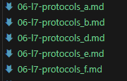

注意 gpt 目前输出的内容最大只有 4k，因此对大文本需要做下拆分，否则结果一定不对。
通过 compare.js 可以看到翻译结果和原始文本的行数差异，差异过大(自己看)时，基本就是结果不对。

手动分割最好控制在 3k token 内，且合理分块。
合并时注意每个分片都附加了 "由 gpt-4 生成"的提示，可以手动去除下再使用 combinator.js 合并。例如：



注意，链接后的新文件因为不在 map.txt 里，因此再次进行自动翻译时会被覆盖，因此需要对原始 docs 进行分片后删除该文件再执行。

`请不要随便自己自动执行，挺花钱的。多用DeepFlow Interpreter来更新文档！！`

由于原始文档中不会保存分片的文档，因此每次不同的分片会导致文件 md5 的变化，建议对于大文件，进行手动处理。

opentelemetry 的那个文档，两个巨大的 mermaid 手动剔除下，翻译后再手动加回来就行

目前手动处理的原始文件分片保存在 backup 文件夹下。

这几个文件，因为正好在分界处，就手动将丢失的部分使用[DeepFlow Interpreter](https://chat.openai.com/g/g-qNR3nwazx-deepflow-interpreter)翻译了下加进去

目前手动处理的文件如下，注意每个文件情况都不太一样，需要手动检查下，可以采样行数对比下。一般来说，只需要处理少的，多的一般是 markdown 格式的优化，比如插入空格、数组换行等。

```text
07-integration\03-output\02-export\01-opentelemetry-exporter.md: -170
05-features\04-auto-tagging\06-additional-cloud-tags.md: -114
09-release-notes\07-ce-6.1-release.md: -92
06-guide\01-ee-tenant\06-application\08-right-sliding-box.md: -65
06-guide\01-ee-tenant\02-dashboard\03-use.md: -31
```
