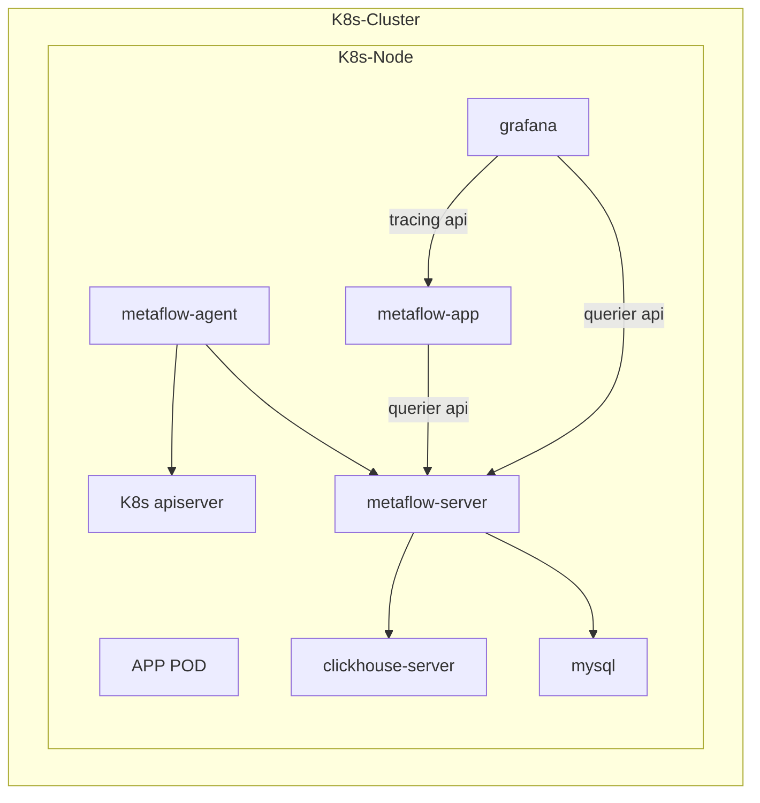

# 部署拓扑



# 部署 K8s 集群

使用[sealos](https://github.com/labring/sealos)快速启动一个All-in-One集群

```console
# 下载并安装sealos, sealos是个golang的二进制工具，直接下载拷贝到bin目录即可, release页面也可下载
wget -c https://sealyun-home.oss-cn-beijing.aliyuncs.com/sealos/latest/sealos && \
    chmod +x sealos && mv sealos /usr/bin 

# 下载离线资源包
wget -c https://sealyun.oss-cn-beijing.aliyuncs.com/05a3db657821277f5f3b92d834bbaf98-v1.22.0/kube1.22.0.tar.gz

# 安装一个All-in-One的kubernetes集群
sealos init --passwd '<Your passwoed>' \
	--master <Your IP address> \
	--pkg-url /root/kube1.22.0.tar.gz \
	--version v1.22.0
```

下载并安装[Helm](https://helm.sh/)

```console
curl -fsSL -o get_helm.sh https://raw.githubusercontent.com/helm/helm/main/scripts/get-helm-3
chmod 700 get_helm.sh
./get_helm.sh
```

安装部署[OpenEBS](https://openebs.io/)

```console
kubectl apply -f https://openebs.github.io/charts/openebs-operator.yaml
```

# 部署 MetaFlow

使用Helm安装一个All-in-One MetaFlow

```console
helm repo add metaflow https://metaflowys.github.io/metaflow
helm repo udpate metaflow
helm install metaflow -n metaflow metaflow/metaflow --create-namespace
```

