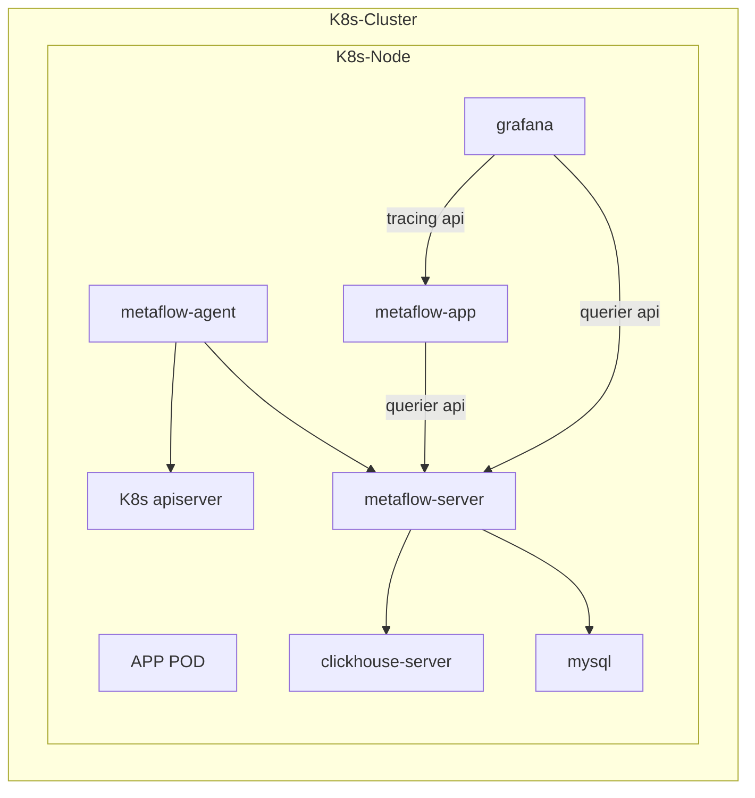

# 部署拓扑

```mermaid
flowchart TD

subgraph K8s-Cluster
  subgraph K8s-Node
    AppPod[APP POD]
    APIServer[K8s apiserver]
    MetaFlowAgent[metaflow-agent]
    MetaFlowServer[metaflow-server]
    MetaFlowApp[metaflow-app]
    ClickHouse[clickhouse-server]
    MySQL[mysql]
    Grafana[grafana]

    MetaFlowAgent --> APIServer
    MetaFlowAgent --> MetaFlowServer
    MetaFlowServer --> ClickHouse
    MetaFlowServer --> MySQL
    MetaFlowApp -->|"querier api"| MetaFlowServer
    Grafana -->|"tracing api"| MetaFlowApp
    Grafana -->|"querier api"| MetaFlowServer
  end
end
```

# 部署 K8s 集群

TODO

# 部署 MetaFlow

TODO
