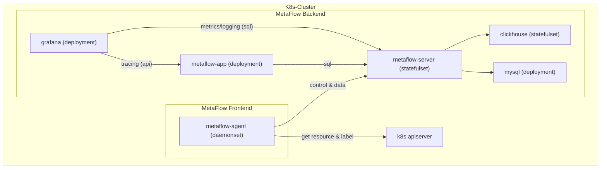

# 简介

假设您在一个 K8s 集群中部署了应用，本章介绍如何使用 MetaFlow 进行监控。

# 准备工作

## 部署拓扑



## Storage Class

我们建议使用 Persistent Volumes 来保存 mysql 和 clickhouse 的数据，以避免不必要的维护成本。
你可以提供默认 Storage Class 或配置 `mysql.storageConfig.persistence.storageClass` 及 `clickhouse.storageConfig.persistence[].storageClass` 来选择 Storage Class 以创建 PVC。

可选择 [OpenEBS](https://openebs.io/) 用于创建 PVC：
```console
kubectl apply -f https://openebs.github.io/charts/openebs-operator.yaml
```

## metaflow-agent 权限需求

metaflow-agent 需要的容器节点权限如下：
- `hostNetwork`
- `hostPID`
- `privileged`
- Write `/sys/kernel/debug`

metaflow-agent 需要的容器节点配置如下：
- `selinux` = `Permissive` OR `disabled`
  
metaflow-agent 需要以下 Kubernetes 资源的 get/list/watch 权限：
- `nodes`
- `namespaces`
- `configmaps`
- `services`
- `pods`
- `replicationcontrollers`
- `daemonsets`
- `deployments`
- `replicasets`
- `statefulsets`
- `ingresses`
- `routes`

# 部署 MetaFlow

使用 Helm 安装 MetaFlow：
```console
helm repo add metaflow https://metaflowys.github.io/metaflow
helm repo update metaflow
helm install metaflow -n metaflow metaflow/metaflow --create-namespace
```

# 下载 metaflow-ctl

metaflow-ctl 是管理 MetaFlow 的一个命令行工具，建议下载至 metaflow-server 所在的 K8s Node 上：
```console
curl -o /usr/bin/metaflow-ctl https://metaflow.oss-cn-beijing.aliyuncs.com/bin/ctl/latest/linux/amd64/metaflow-ctl
chmod a+x /usr/bin/metaflow-ctl
```

# 下一步

- [自动分布式追踪 - 体验 MetaFlow 基于 eBPF 的 AutoTracing 能力](../auto-tracing/overview.html)
- [微服务全景图 - 体验 MetaFlow 基于 BPF 的 AutoMetrics 能力](../auto-metrics/overview.html)
- [消除数据孤岛 - 了解 MetaFlow 的 AutoTagging 和 SmartEncoding 能力](../auto-tagging/elimilate-data-silos.html)
- [无缝分布式追踪 - 集成 OpenTelemetry 等追踪数据](../integration/tracing/overview.html)
- [告别高基烦恼 - 集成 Promethes 等指标数据](../integration/metrics/overview.html)
