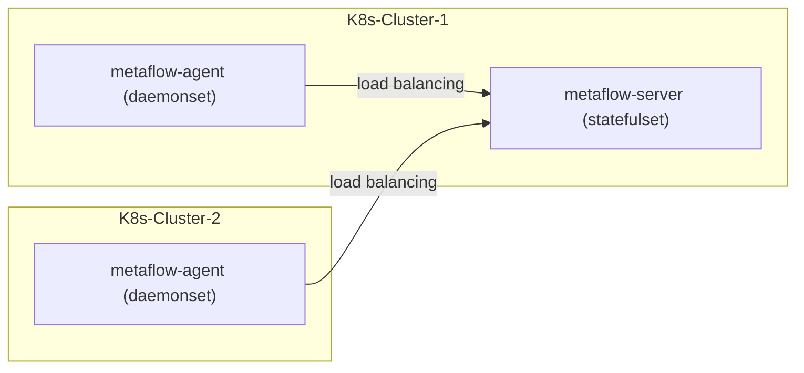

# 简介

假设您在一个 K8s 集群中部署好了 MetaFlow Server，本章介绍如何监控其他的 K8s 集群。

# 部署拓扑



# 部署 metaflow-agent

metaflow-agent 需要的容器节点权限：
- `hostNetwork`
- `hostPID`
- `privileged`
- Write `/sys/kernel/debug`

metaflow-agent 需要的容器节点配置：
- `selinux` = `Permissive` OR `disabled`
  
metaflow-agent 需要以下 Kubernetes 资源的 get、list、watch 权限：
- `nodes`
- `namespaces`
- `configmaps`
- `services`
- `pods`
- `replicationcontrollers`
- `daemonsets`
- `deployments`
- `replicasets`
- `statefulsets`
- `ingresses`
- `routes`


使用 Helm 安装 metaflow-agent：
```console
helm repo add metaflow https://metaflowys.github.io/metaflow
helm repo update metaflow
METAFLOW_SERVER_NODE_IPS="10.1.2.3, 10.4.5.6"  # FIXME
helm install metaflow-agent -n metaflow metaflow/metaflow-agent --create-namespace \
    --set metaflowServerNodeIPS={$METAFLOW_SERVER_NODE_IPS}
```

注意： 
- MetaFlow Server 的 service `externalTrafficPolicy=Local`，所以 metaflow-agent 的 `metaflowServerNodeIps` 需要配置为所有 MetaFlow Server 的 Node IP。
- MetaFlow 识别不同的 Kubernetes 集群依赖的是 metaflow-agent Pod 中 `/run/secrets/kubernetes.io/serviceaccount/ca.crt` 文件的MD5，如果你的多个集群使用的同一个CA文件，请使用 `metaflow-ctl` 手动创建Kubernetes集群并配置 metaflow-agent 的 `kubernetesClusterId` 。
  ```console
  METAFLOW_SERVER_NODE_IPS="10.1.2.3, 10.4.5.6"  # FIXME
  METAFLOW_K8S_CLUSTER_ID="fffffff"  # FIXME
  helm install metaflow-agent -n metaflow metaflow/metaflow-agent --create-namespace \
      --set metaflowServerNodeIPS={$METAFLOW_SERVER_NODE_IPS} \
      --set metaflowK8sClusterID=$METAFLOW_K8S_CLUSTER_ID
  ```

# 下一步

- [自动分布式追踪 - 体验 MetaFlow 基于 eBPF 的 AutoTracing 能力](../auto-tracing/overview.html)
- [微服务全景图 - 体验 MetaFlow 基于 BPF 的 AutoMetrics 能力](../auto-metrics/overview.html)
- [消除数据孤岛 - 了解 MetaFlow 的 AutoTagging 和 SmartEncoding 能力](../auto-tagging/elimilate-data-silos.html)
- [无缝分布式追踪 - 集成 OpenTelemetry 等追踪数据](../integration/tracing/overview.html)
- [告别高基烦恼 - 集成 Promethes 等指标数据](../integration/metrics/overview.html)
