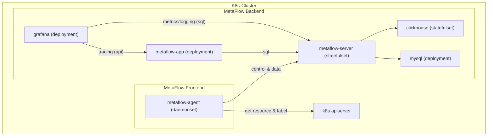

# 简介

假如你在一个 K8s 集群中部署了应用，本章介绍如何使用 MetaFlow 进行监控。
MetaFlow 能够自动采集所有 Pod 的应用和网络观测数据（AutoMetrics、AutoTracing），
并基于调用 apiserver 获取的信息自动为所有观测数据注入`K8s 资源`和`K8s 自定义 Label`标签（AutoTagging）。

# 准备工作

## 部署拓扑



## Storage Class

我们建议使用 Persistent Volumes 来保存 MySQL 和 Clickhouse 的数据，以避免不必要的维护成本。
你可以提供默认 Storage Class 或添加 `--set global.storageClass=<your storageClass>` 参数来选择 Storage Class 以创建 PVC。

可选择 [OpenEBS](https://openebs.io/) 用于创建 PVC：
```bash
kubectl apply -f https://openebs.github.io/charts/openebs-operator.yaml
```

## metaflow-agent 权限需求

metaflow-agent 要求所在容器节点的配置如下：
- `selinux` = `Permissive` OR `disabled`

metaflow-agent 作为 DaemonSet 部署时将会打开它的如下权限：
- `hostNetwork`
- `hostPID`
- `privileged`
- Write `/sys/kernel/debug`

metaflow-agent 同步 K8s 资源和 Label 信息时需要以下资源的 get/list/watch 权限：
- `nodes`
- `namespaces`
- `configmaps`
- `services`
- `pods`
- `replicationcontrollers`
- `daemonsets`
- `deployments`
- `replicasets`
- `statefulsets`
- `ingresses`
- `routes`

# 部署 MetaFlow

使用 Helm 安装 MetaFlow：
```bash
helm repo add metaflow https://metaflowys.github.io/metaflow
helm repo update metaflow ## use `helm repo update` when helm < 3.7.0
helm install metaflow -n metaflow metaflow/metaflow --create-namespace
```

注意：
- 虽然你可以使用 helm `--set` 参数来定义部分配置，但我们建议将自定义的配置保存一个独立的 yaml 文件中。
  例如 `values-custom.yaml` ：
  ```yaml
  global:
    storageClass: "<your storageClass>"
    replicas: 1  ## replicas for metaflow-server and clickhouse
  ```
  后续更新可以使用 `-f values-custom.yaml` 参数使用自定义配置：
  ```bash
  helm upgrade metaflow -n metaflow -f values-custom.yaml metaflow/metaflow
  ```

# 下载 metaflow-ctl

metaflow-ctl 是管理 MetaFlow 的一个命令行工具，建议下载至 metaflow-server 所在的 K8s Node 上，用于后续使用：
```bash
curl -o /usr/bin/metaflow-ctl https://metaflow.oss-cn-beijing.aliyuncs.com/bin/ctl/latest/linux/amd64/metaflow-ctl
chmod a+x /usr/bin/metaflow-ctl
```

# 访问 Grafana 页面

执行 helm 部署 metaflow 时输出的命令，获取访问 Grafana 的 URL 和密码，输出示例：

```bash
NODE_PORT=$(kubectl get --namespace metaflow -o jsonpath="{.spec.ports[0].nodePort}" services metaflow-grafana)
NODE_IP=$(kubectl get nodes -o jsonpath="{.items[0].status.addresses[0].address}")
echo -e "Grafana URL: http://$NODE_IP:$NODE_PORT  \nGrafana auth: metaflow"
```
执行命令输出示例：
```text
Grafana URL: http://10.1.2.3:31999
Grafana auth: admin:metaflow
```

# 下一步

- [自动分布式追踪 - 体验 MetaFlow 基于 eBPF 的 AutoTracing 能力](../auto-tracing/overview/)
- [微服务全景图 - 体验 MetaFlow 基于 BPF 的 AutoMetrics 能力](../auto-metrics/overview/)
- [消除数据孤岛 - 了解 MetaFlow 的 AutoTagging 和 SmartEncoding 能力](../auto-tagging/elimilate-data-silos/)
- [无缝分布式追踪 - 集成 OpenTelemetry 等追踪数据](../agent-integration/tracing/overview/)
- [告别高基烦恼 - 集成 Promethes 等指标数据](../agent-integration/metrics/overview/)
