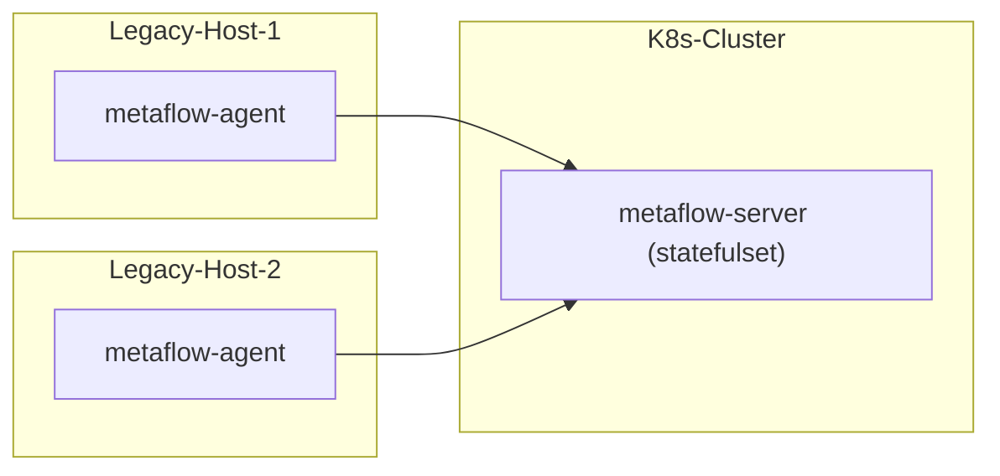

# 简介

MetaFlow 支持监控传统服务器。注意 MetaFlow Server 必须运行在 K8s 之上，如果你没有 K8s 集群，可参考 [All-in-One 快速部署](./all-in-one.html)章节先部署 MetaFlow Server。

# 部署拓扑

# 部署 MetaFlow Agent

TODO

# 下一步

- [自动分布式追踪 - 体验 MetaFlow 基于 eBPF 的 AutoTracing 能力](../auto-tracing/overview.html)
- [微服务全景图 - 体验 MetaFlow 基于 BPF 的 AutoMetrics 能力](../auto-metrics/overview.html)
- [消除数据孤岛 - 了解 MetaFlow 的 AutoTagging 和 SmartEncoding 能力](../auto-tagging/elimilate-data-silos.html)
- [无缝分布式追踪 - 集成 OpenTelemetry 等追踪数据](../integration/tracing/overview.html)
- [告别高基烦恼 - 集成 Promethes 等指标数据](../integration/metrics/overview.html)
