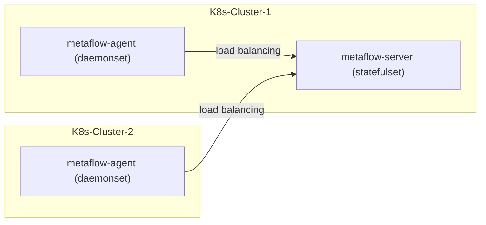

# 简介

MetaFlow Server 可服务于多个 K8s 集群中的 MetaFlow Agent。假设你在一个 K8s 集群中已经部署好了 Metaflow Server，本章介绍如何监控其他的 K8s 集群。

# 准备工作

## 部署拓扑



## 确保不同 K8s 集群可区分

MetaFlow 使用 K8s 的 CA 文件 MD5 值区分不同的集群，请在不同 K8s 集群的 Pod 中查看 `/run/secrets/kubernetes.io/serviceaccount/ca.crt` 文件，确保不同集群的 CA 文件不同。

假如你的不同 K8s 集群使用了相同的 CA 文件，在多个集群中部署 metaflow-agent 之前，需要利用 `metaflow-ctl domain create` 获取一个 `K8sClusterID`：
```bash
unset CLUSTER_NAME
CLUSTER_NAME="k8s-1"  # FIXME: K8s cluster name
cat << EOF | metaflow-ctl domain create -f -
name: $CLUSTER_NAME
type: kubernetes
EOF
metaflow-ctl domain list $CLUSTER_NAME  # Get K8sClusterID
```

# 部署 metaflow-agent

使用 Helm 安装 metaflow-agent：
```bash
METAFLOW_SERVER_NODE_IPS="10.1.2.3,10.4.5.6"  # FIXME: K8s Node IPs of metaflow-server

helm repo add metaflow https://metaflowys.github.io/metaflow
helm repo update metaflow # use `helm repo update` when helm < 3.7.0
helm install metaflow-agent -n metaflow metaflow/metaflow-agent --create-namespace \
    --set metaflowServerNodeIPS={$METAFLOW_SERVER_NODE_IPS}
```

我们为 metaflow-server 的 service 设置了 `externalTrafficPolicy=Local` 以优化流量路径，
因此上述部署过程中需要将 metaflow-agent 的 `metaflowServerNodeIps` 配置为 metaflow-server Pod 所在的 Node IP。

注意：
- 若不同 K8s 集群的 CA 文件一样，部署时需要传入使用 `metaflow-ctl` 获取到的 `kubernetesClusterId`：
  ```bash
  METAFLOW_K8S_CLUSTER_ID="fffffff"              # FIXME: Generate by `metaflow-ctl domain create`
  helm upgrade metaflow-agent -n metaflow metaflow/metaflow-agent  \
      --set metaflowK8sClusterID=$METAFLOW_K8S_CLUSTER_ID
      --reuse-values
  ```
- 虽然你可以使用 helm `--set` 参数来定义部分配置，但我们建议将自定义的配置保存一个独立的 yaml 文件中。
  例如 `values-custom.yaml` ：
  ```yaml
  metaflowServerNodeIPS:
  - 10.1.2.3 # FIXME: K8s Node IPs of 
  - 10.4.5.6 # FIXME: K8s Node IPs of 
  metaflowK8sClusterID: "fffffff" # FIXME: Generate by `metaflow-ctl domain create`
  ```
  后续更新可以使用 `-f values-custom.yaml` 参数使用自定义配置：
  ```bash
  helm upgrade metaflow-agent -n metaflow -f values-custom.yaml metaflow/metaflow-agent
  ```

# 下一步

- [自动分布式追踪 - 体验 MetaFlow 基于 eBPF 的 AutoTracing 能力](../auto-tracing/overview/)
- [微服务全景图 - 体验 MetaFlow 基于 BPF 的 AutoMetrics 能力](../auto-metrics/overview/)
- [消除数据孤岛 - 了解 MetaFlow 的 AutoTagging 和 SmartEncoding 能力](../auto-tagging/elimilate-data-silos/)
- [无缝分布式追踪 - 集成 OpenTelemetry 等追踪数据](../agent-integration/tracing/overview/)
- [告别高基烦恼 - 集成 Promethes 等指标数据](../agent-integration/metrics/overview/)
