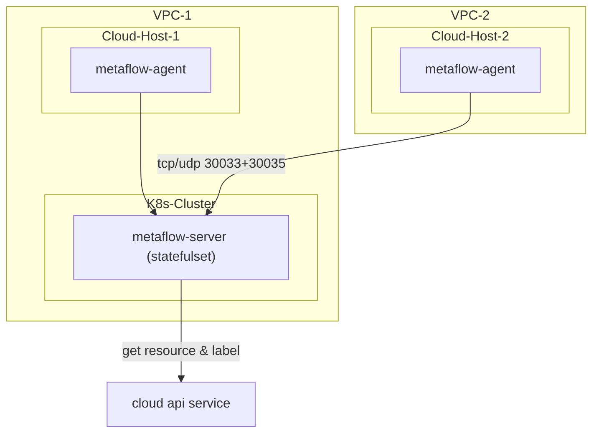

# 简介

MetaFlow 支持监控云服务器，并通过调用云厂商 API 获取资源信息和标签，自动注入到所有观测数据中（AutoTagging）。

# 部署拓扑



# 支持的公有云

| 云服务商（英文） | 云服务商（中文） | MetaFlow中使用的类型标识 |
| ---------------  | ---------------  | ------------------------ |
| AWS              | AWS              | aws                      |
| Aliyun           | 阿里云           | aliyun                   |
| Baidu Cloud      | 百度云           | baidu                    |
| Huawei Cloud     | 华为云           | huawei                   |
| Microsoft Azure  | 微软云           | azure                    |
| QingCloud        | 青云             | qingcloud                |
| Tencent Cloud    | 腾讯云           | tencentcloud             |

# 配置 MetaFlow Server

通过 `metaflow-ctl domain example <domain_type>` 命令获取创建云平台的配置文件模板。
支持的公有云对应的 domain_type ：
- 阿里云：aliyun
- 百度云：baidu_bce
- 青云：qingcloud

以阿里云为例：
```console
metaflow-ctl domain example aliyun > aliyun.yaml
```
修改配置文件模板中的字段；
使用修改好的配置文件创建云平台：
```console
metaflow-ctl domain create -f aliyun.yaml
```

# 部署 MetaFlow Agent

下载包含 metaflow-agent rpm 的 zip 包
```console
curl -O https://metaflow.oss-cn-beijing.aliyuncs.com/rpm/agent/latest/linux/amd64/metaflow-agent-rpm.zip
unzip metaflow-agent-rpm.zip
yum -y localinstall x86_64/metaflow-agent-1.0*.rpm
```

修改 metaflow-agent 的配置文件 `/etc/metaflow-agent.yaml` ：
```yaml
controller-ips:
  - 10.1.2.3  # FIXME: K8s Node IPs of metaflow-server
```

启动 metaflow-agent ：

```console
systemctl enable metaflow-agent
systemctl restart metaflow-agent
```

# 下一步

- [自动分布式追踪 - 体验 MetaFlow 基于 eBPF 的 AutoTracing 能力](../auto-tracing/overview.html)
- [微服务全景图 - 体验 MetaFlow 基于 BPF 的 AutoMetrics 能力](../auto-metrics/overview.html)
- [消除数据孤岛 - 了解 MetaFlow 的 AutoTagging 和 SmartEncoding 能力](../auto-tagging/elimilate-data-silos.html)
- [无缝分布式追踪 - 集成 OpenTelemetry 等追踪数据](../agent-integration/tracing/overview.html)
- [告别高基烦恼 - 集成 Promethes 等指标数据](../agent-integration/metrics/overview.html)
