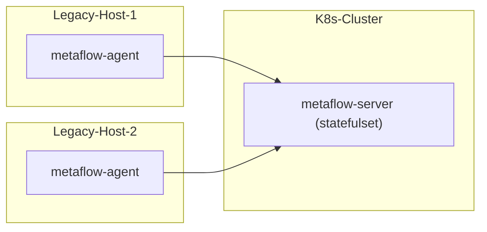

# 简介

MetaFlow 支持监控传统服务器。注意 MetaFlow Server 必须运行在 K8s 之上，如果你没有 K8s 集群，可参考 [All-in-One 快速部署](./all-in-one/)章节先部署 MetaFlow Server。

# 部署拓扑



# 配置 MetaFlow Server

## 创建 Host Domain

```bash
unset DOMAIN_NAME
DOMAIN_NAME="legacy-host"  # FIXME: domain name

cat << EOF | metaflow-ctl domain create -f -
name: $DOMAIN_NAME
type: agent_sync
EOF
```

## 创建采集器组

创建采集器组：
```bash
unset AGENT_GROUP
AGENT_GROUP="legacy-host"  # FIXME: domain name

metaflow-ctl agent-group create $AGENT_GROUP
metaflow-ctl agent-group list $AGENT_GROUP # Get agent-group ID
```

创建采集器组配置文件 `agent-group-config.yaml`：
```yaml
vtap_group_id: g-ffffff # FIXME: agent-group ID
platform_enabled: 1
```

创建采集器组配置：
```bash
metaflow-ctl agent-group-config create -f agent-group-config.yaml
```

# 部署 MetaFlow Agent

下载包含 metaflow-agent rpm 的 zip 包
```bash
curl -O https://metaflow.oss-cn-beijing.aliyuncs.com/rpm/agent/latest/linux/amd64/metaflow-agent-rpm.zip
unzip metaflow-agent-rpm.zip
yum -y localinstall x86_64/metaflow-agent-1.0*.rpm
```

修改 metaflow-agent 的配置文件 `/etc/metaflow-agent.yaml` ：
```yaml
controller-ips:
  - 10.1.2.3  # FIXME: K8s Node IPs of metaflow-server
vtap-group-id-request: "g-fffffff"  # FIXME: agent-group ID
```

启动 metaflow-agent ：

```bash
systemctl enable metaflow-agent
systemctl restart metaflow-agent
```

# 下一步

- [微服务全景图 - 体验 MetaFlow 基于 BPF 的 AutoMetrics 能力](../auto-metrics/metrics-without-instrumentation/)
- [自动分布式追踪 - 体验 MetaFlow 基于 eBPF 的 AutoTracing 能力](../auto-tracing/tracing-without-instrumentation/)
- [消除数据孤岛 - 了解 MetaFlow 的 AutoTagging 和 SmartEncoding 能力](../auto-tagging/elimilate-data-silos/)
- [告别高基烦恼 - 集成 Promethes 等指标数据](../agent-integration/metrics/metrics-auto-tagging/)
- [无缝分布式追踪 - 集成 OpenTelemetry 等追踪数据](../agent-integration/tracing/tracing-without-blind-spot/)
