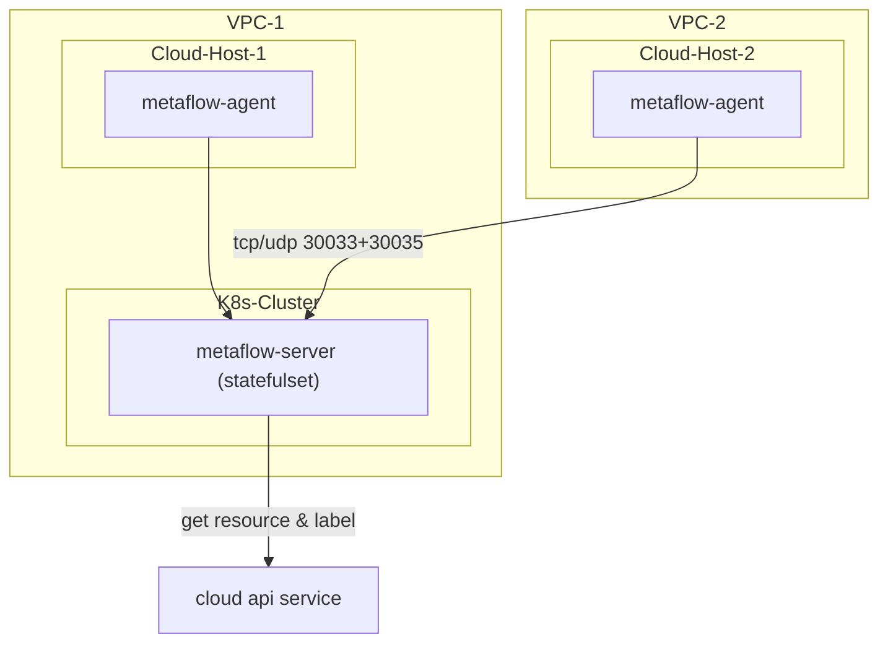

# 简介

MetaFlow 支持监控云服务器，并通过调用云厂商 API 获取云资源信息，自动注入到所有观测数据中（AutoTagging）。
注意 MetaFlow Server 必须运行在 K8s 之上，如果你没有 K8s 集群，可参考 [All-in-One 快速部署](./all-in-one/)章节先部署 MetaFlow Server。

# 部署拓扑



# 创建公有云 Domain

MetaFlow 目前支持如下公有云的资源信息同步（标记为 `TBD` 的正在整理代码中）：
| 云服务商（英文） | 云服务商（中文） | MetaFlow中使用的类型标识 |
| ---------------- | ---------------- | ------------------------ |
| AWS              | AWS              | `TBD`                    |
| Aliyun           | 阿里云           | aliyun                   |
| Baidu Cloud      | 百度云           | baidu\_bce               |
| Huawei Cloud     | 华为云           | `TBD`                    |
| Microsoft Azure  | 微软云           | `TBD`                    |
| QingCloud        | 青云             | qingcloud                |
| Tencent Cloud    | 腾讯云           | `TBD`                    |

可通过 `metaflow-ctl domain example <domain_type>` 命令获取创建公有云 Domain 的配置文件模板。
以阿里云为例：
```bash
metaflow-ctl domain example aliyun > aliyun.yaml
```

修改配置文件 `aliyun.yaml`，填写 AK/SK（需要云资源的只读权限）和资源所在的 Region 信息：
```yaml
name: aliyun
type: aliyun
config:
  # AccessKey Id
  secret_id: xxxxxxxx ## FIXME: your secret_id
  # AccessKey Secret
  secret_key: xxxxxxx ## FIXME: your secret_key
  include_regions: 华北2（北京） ## The region where metaflow is docked, if it is empty, it means all regions, and the regions are separated by commas
```

使用修改好的配置文件创建公有云 Domain：
```bash
metaflow-ctl domain create -f aliyun.yaml
```

# 部署 MetaFlow Agent

下载包含 metaflow-agent rpm 的 zip 包
```bash
curl -O https://metaflow.oss-cn-beijing.aliyuncs.com/rpm/agent/latest/linux/amd64/metaflow-agent-rpm.zip
unzip metaflow-agent-rpm.zip
yum -y localinstall x86_64/metaflow-agent-1.0*.rpm
```

修改 metaflow-agent 的配置文件 `/etc/metaflow-agent.yaml` ：
```yaml
controller-ips:
  - 10.1.2.3  # FIXME: K8s Node IPs of metaflow-server
```

启动 metaflow-agent ：
```bash
systemctl enable metaflow-agent
systemctl restart metaflow-agent
```

# 下一步

- [自动分布式追踪 - 体验 MetaFlow 基于 eBPF 的 AutoTracing 能力](../auto-tracing/overview/)
- [微服务全景图 - 体验 MetaFlow 基于 BPF 的 AutoMetrics 能力](../auto-metrics/overview/)
- [消除数据孤岛 - 了解 MetaFlow 的 AutoTagging 和 SmartEncoding 能力](../auto-tagging/elimilate-data-silos/)
- [无缝分布式追踪 - 集成 OpenTelemetry 等追踪数据](../agent-integration/tracing/overview/)
- [告别高基烦恼 - 集成 Promethes 等指标数据](../agent-integration/metrics/overview/)
