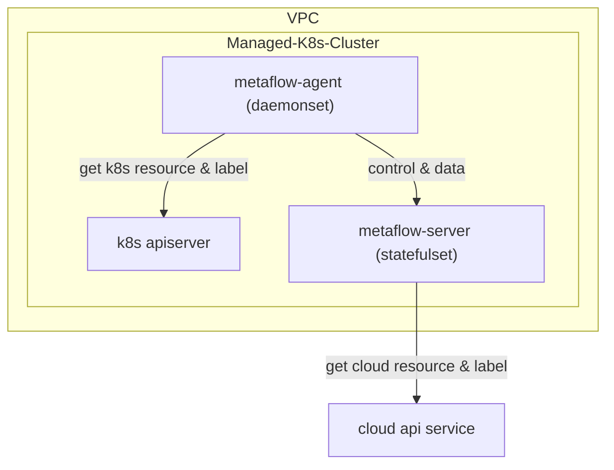

# 简介

MetaFlow 支持监控云服务商的托管 K8s 集群。与[直接监控 K8s 集群](./single-k8s/)的唯一区别是，通过调用云厂商 API，可自动向观测数据中注入云资源的标签（AutoTagging）。

# 部署拓扑

# 配置 MetaFlow Server

TODO

# 部署 MetaFlow Agent

TODO

# 下一步

- [自动分布式追踪 - 体验 MetaFlow 基于 eBPF 的 AutoTracing 能力](../auto-tracing/overview/)
- [微服务全景图 - 体验 MetaFlow 基于 BPF 的 AutoMetrics 能力](../auto-metrics/overview/)
- [消除数据孤岛 - 了解 MetaFlow 的 AutoTagging 和 SmartEncoding 能力](../auto-tagging/elimilate-data-silos/)
- [无缝分布式追踪 - 集成 OpenTelemetry 等追踪数据](../agent-integration/tracing/overview/)
- [告别高基烦恼 - 集成 Promethes 等指标数据](../agent-integration/metrics/overview/)
