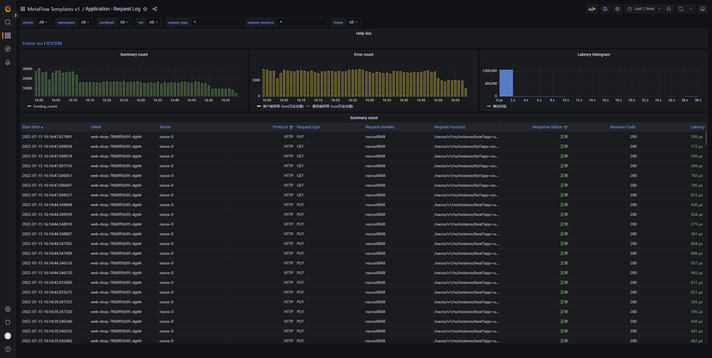

无需向应用中插入任何代码，MetaFlow 自动生成所有服务的应用请求日志：
- 数据库表名：`flow_log.l7_flow_log`
- 自动注入的 Tag 列表：[IP、协议、端口、请求/响应字段、采集位置、进程信息、云资源、K8s 资源](https://github.com/metaflowys/metaflow/blob/main/server/querier/db_descriptions/clickhouse/tag/flow_log/l7_flow_log)、K8s 自定义 Label
  - 支持的应用协议列表：[L7 Protocol List](https://github.com/metaflowys/metaflow/blob/main/server/querier/db_descriptions/clickhouse/tag/enum/l7_protocol)
- Metrics 列表：[吞吐、时延、异常](https://github.com/metaflowys/metaflow/blob/main/server/querier/db_descriptions/clickhouse/metrics/flow_log/l7_flow_log)

基于上述数据可通过 Grafana 构建丰富的 Dashboard。我们在 Grafana 中预置了一个 `Application - Request Log` Dashboard，效果图如下：

你也可以访问 [MetaFlow Online Demo](https://demo.metaflow.yunshan.net/d/JimNq_67z/application-request-log?from=metaflow-doc) 查看效果。
