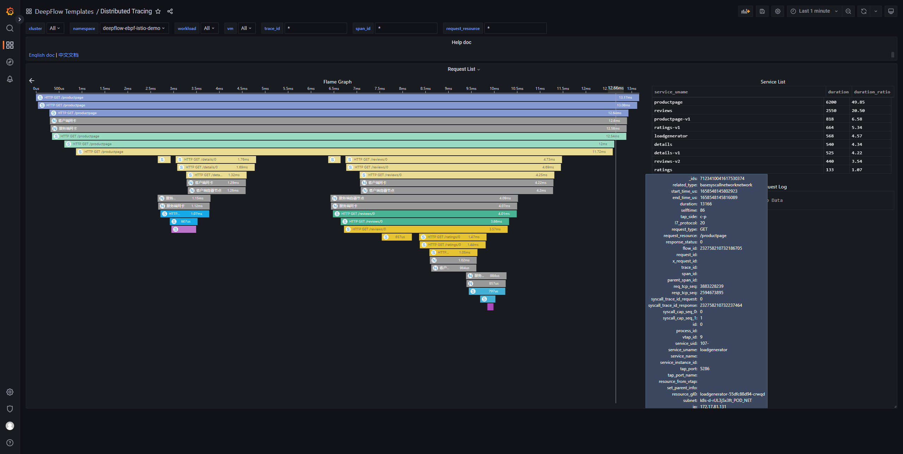

# 简介

本章以一个由 Java、Python、Ruby、Node.js 四种语言实现的微服务应用为例，展示 MetaFlow 在多语言、Istio 服务网格下的 AutoTracing 能力。

# 部署 Istio Bookinfo Demo

## 部署 Istio

你可参考 [Istio 官方文档](https://istio.io/latest/zh/docs/setup/getting-started/)部署 Istio。

也可以使用如下命令部署 Istio:
```bash
curl -L https://istio.io/downloadIstio | sh -
cd istio-*
export PATH=$PWD/bin:$PATH
istioctl install --set profile=demo -y
```

关闭 Istio 流量加密:
```bash
kubectl apply -f - <<EOF
apiVersion: security.istio.io/v1beta1
kind: PeerAuthentication
metadata:
  name: "default"
  namespace: "istio-system"
spec:
  mtls:
    mode: DISABLE
EOF
```

## 部署 Bookinfo Demo

我们使用的 Demo 源自[这个 GitHub 仓库](https://github.com/istio/istio/tree/master/samples/bookinfo)，它的应用架构如下 [link](https://istio.io/latest/docs/examples/bookinfo/withistio.svg)：


使用如下命令可在 K8s 中快速部署 Demo：
```bash
kubectl apply -f https://raw.githubusercontent.com/metaflowys/metaflow-demo/main/Istio-Bookinfo/bookinfo.yaml
```

这个 Demo 原始的 GitHub 代码仓库中使用 Jaeger 进行了主动追踪，为了演示 AutoTracing 能力我们特意在上述部署脚本中去掉了 Jaeger。

# 查看分布式追踪

前往 Grafana，打开 `Distributed Tracing` Dashboard，选择 `namespace = metaflow-ebpf-istio-demo` 后，可选择一个调用进行追踪，效果如下图：


在 [Spring Boot Demo](./spring-boot-demo/) 的基础上，MetaFlow 通过解析 BPF/eBPF 数据中 HTTP 头部的 X-Request-ID 字段，可以实现对 Envoy 前后调用的追踪。

[访问 MetaFlow Online Demo](https://demo.metaflow.yunshan.net/d/a3x57qenk/distributed-tracing?orgId=1&var-cluster=All&var-namespace=10&var-workload=All&var-vm=All&var-trace_id=*&var-span_id=*&var-request_resource=*&from=metaflow-doc) 也可查看追踪效果。
