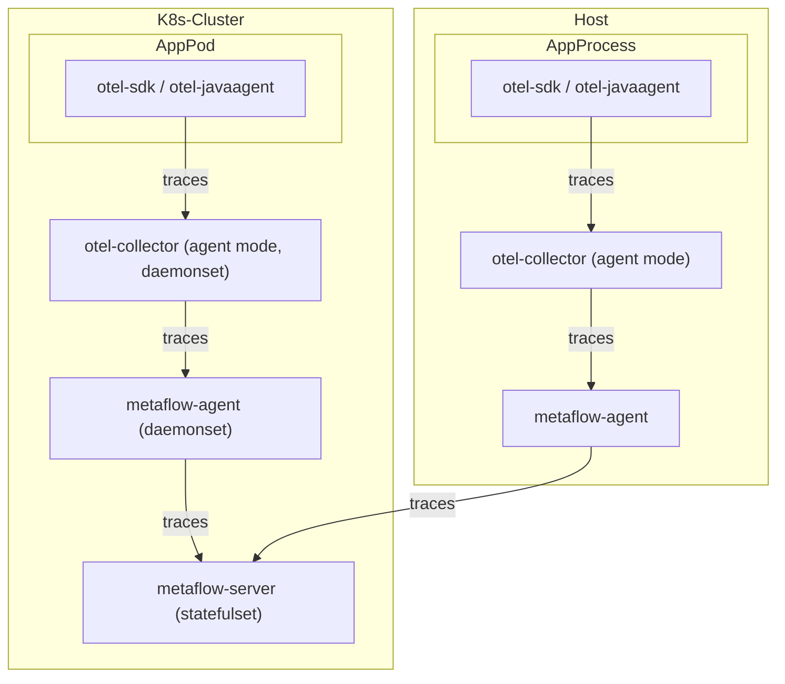
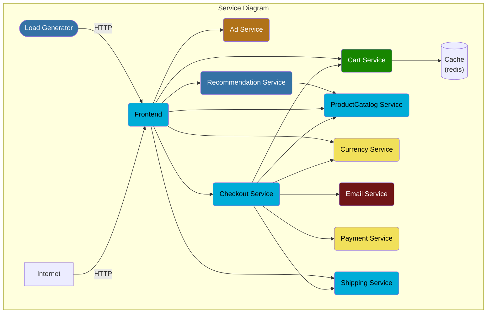

# 数据流



# 配置 OpenTelemetry

## 安装OpenTelemetry

- 了解[OpenTelemetry](https://opentelemetry.io/docs/)相关知识
- 使用MetaFlow-Demo下的部署清单，快速搭建起一个OpenTelemetry环境：
  ```sh
  $ kubectl create ns open-telemetry
  $ kubectl apply -n open-telemetry -f xxx
  ```

  - 安装完毕之后，可以在环境里看到这样一个组件清单

  ```sh
  $ kubectl get all -n open-telemetry
  ```

  | Type | Component |
  | --- | --- |
  | Daemonset | otel-agent | 
  | Service | otel-agent |
  | ConfigMap | otel-agent |

  - 其中，如果你需要使用其他版本或更新的opentelemetry-collector-contrib，请在[otel-Docker](https://hub.docker.com/r/otel/opentelemetry-collector-contrib/tags)仓库中，找到你想要的镜像版本，然后使用如下命令更新镜像
  ```sh
  $ kubectl set image -n open-telemetry daemonset/otel-agent otel-agent=otel/opentelemetry-collector-contrib:${LASTEST TAG}
  ```

- 对接MetaFlow
  - 查看对接MetaFlow的地址：
  ```sh
  $ kubectl get cm -n open-telemetry otel-agent-conf -o custom-columns=DATA:.data | grep -A 1 otlphttp
  ```
  - 可在[配置MetaFlow](#配置-metaflow)一节中，检查配置与实际监听的端口是否一致。

# 配置 MetaFlow

## 使用MetaFlow-Ctl开启数据监听服务

- 在部署了MetaFlow-Cli的宿主机上，执行

```sh
$ metaflow-cli agent-group list
```

- 获取到groupId之后，执行以下命令，可开启MetaFlow-Agent数据监听服务功能：
- 注意：VTAP_GROUP_ID = 上一步获取的ID
```sh
$ echo 'vtap_group_id: ${VTAP_GROUP_ID}
external_agent_http_proxy_enabled: 1
external_agent_http_proxy_port: 38086' >> agent.yaml

$ metaflow-ctl agent-group-config update ${VTAP_GROUP_ID} -f agent.yaml
```

# 基于 OpenTelemetry WebStore Demo 体验

## 部署OpenTelemetry WebStore Demo
```sh
$ kubectl create ns open-telemetry-demo
$ kubectl apply -n open-telemetry-demo -f https://raw.githubusercontent.com/metaflowys/metaflow-demo/main/OpenTelemetry-WebStore-Demo/otel-webstore-demo.yaml
```

## 关于Demo
此demo来源于[opentelemetry-webstore-demo](https://github.com/open-telemetry/opentelemetry-demo-webstore)，可参考应用调用架构如下：




# 基于 Spring Boot Demo 体验

## 部署Spring Boot Otel Demo
```sh
$ kubectl create ns springboot-otel-demo
$ kubectl apply -n open-telemetry-demo -f https://raw.githubusercontent.com/metaflowys/metaflow-demo/main/Spring-Boot-Demo/springboot-otel-demo.yaml
```

## 关于Demo
此Demo来源于 https://github.com/liuzhibin-cn/my-demo

可参考应用架构如下：


