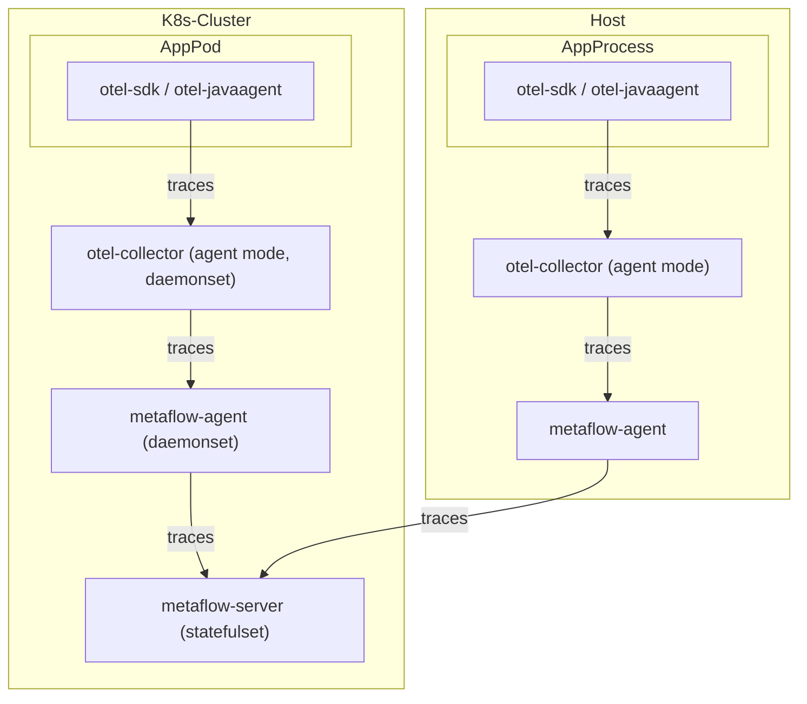

# 数据流



# 配置 OpenTelemetry

TODO @嘉炜 @建昌

# 配置 MetaFlow

TODO @嘉炜

# 基于 OpenTelemetry WebStore Demo 体验

TODO @嘉炜 @建昌

https://github.com/open-telemetry/opentelemetry-demo-webstore

# 基于 Spring Boot Demo 体验

```bash
kubectl apply -f https://raw.githubusercontent.com/metaflowys/metaflow-demo/main/sb-jaeger-tracing-demo/sb-jaeger-tracing-otel-demo.yaml
```
