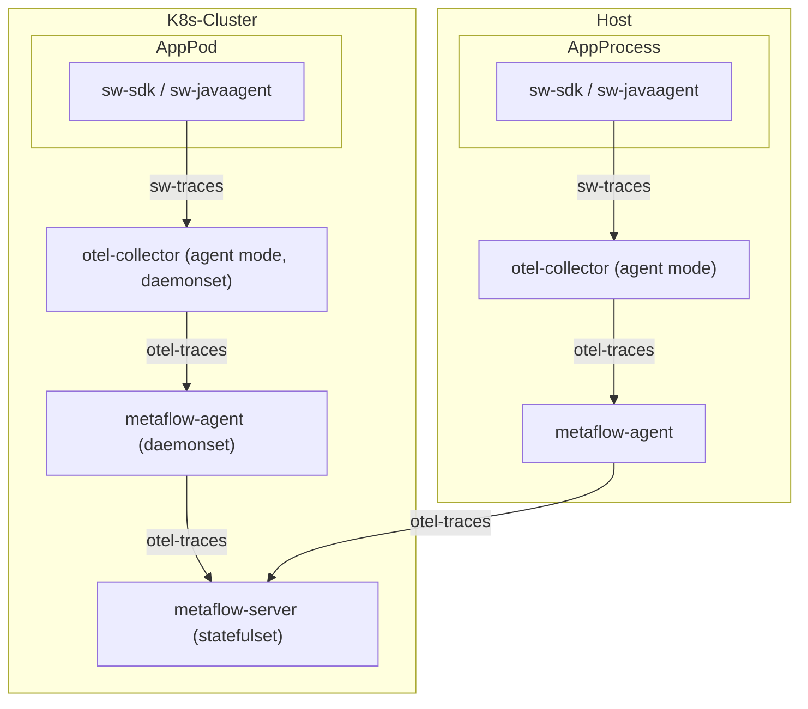

# 数据流

```mermaid
flowchart TD

subgraph K8s-Cluster
  subgraph AppPod
    SWSDK1["sw-sdk / sw-javaagent"]
  end
  OTelAgent1["otel-collector (agent mode, daemonset)"]
  MetaFlowAgent1["metaflow-agent (daemonset)"]
  MetaFlowServer["metaflow-server (statefulset)"]

  SWSDK1 -->|sw-traces| OTelAgent1
  OTelAgent1 -->|otel-traces| MetaFlowAgent1
  MetaFlowAgent1 -->|otel-traces| MetaFlowServer
end

subgraph Host
  subgraph AppProcess
    SWSDK2["sw-sdk / sw-javaagent"]
  end
  OTelAgent2["otel-collector (agent mode)"]
  MetaFlowAgent2[metaflow-agent]

  SWSDK2 -->|sw-traces| OTelAgent2
  OTelAgent2 -->|otel-traces| MetaFlowAgent2
  MetaFlowAgent2 -->|otel-traces| MetaFlowServer
end
```

# 配置 SkyWalking

TODO @嘉炜 @建昌

# 配置 MetaFlow

TODO @嘉炜

# 基于 Dubbo ShopWeb Demo 体验

TODO @嘉炜 @建昌

https://gitlab.yunshan.net/yunshan/deepflow-group/skywalking-demo
